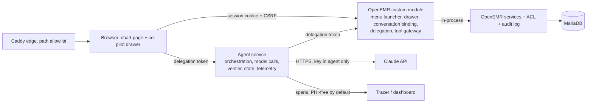
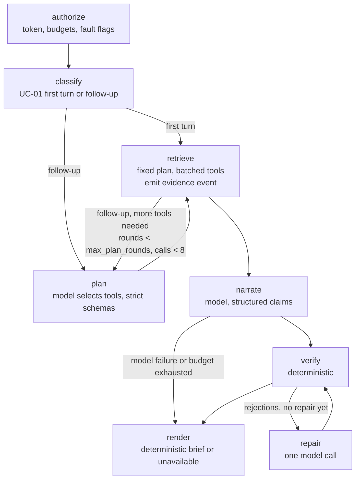

# Clinical Co-Pilot Architecture

## Summary

The Clinical Co-Pilot is a read-only assistant inside the OpenEMR patient
chart for one user: a primary-care physician with 90 seconds before the next
visit. It answers three questions about the open chart — what changed since
the last visit, which abnormal labs still look unresolved, and what the chart
says about a medication — with every statement cited to a record the physician
can open in place, and explicit wording for what is missing, conflicting,
undated or unavailable. It never diagnoses, recommends, doses or writes. Every
capability traces to CAP-01..08 in `USERS.md`; nothing else is built.

**Where it lives.** A custom OpenEMR module adds a launcher through
`PatientMenuEvent` and renders a non-modal right drawer on the patient
dashboard through `PatientDemographics\RenderEvent`. A separate agent service
— outside PHP because Apache prefork and the 60-second limit cannot hold model
calls (ARCH-MEDIUM-006) — exposes the HTTP API used by the panel and the Bruno
collection. The agent reaches clinical data only through the module's gateway
endpoints, which call OpenEMR services in process (ADR-0003). It holds no
database credentials and no session.

**Who may see what.** The audit proved OpenEMR authorizes by role and chart
section, never by patient, and that its services enforce nothing
(SEC-HIGH-001, ARCH-HIGH-002). The decision is parity with the chart
(ADR-0002): a conversation is bound server-side to (site, user, patient) at
render; each turn re-reads the live session and open patient and mints a
90-second delegation token; every tool call re-runs the chart's own section
ACL, squad and break-glass checks for the bound user and writes an audit event
before returning data. The model never receives or chooses a patient.
Limitation: any clinician can summarize any chart they could open.

**How answers are made.** Tools return normalized, deduplicated, windowed,
status-bearing records (`ok | empty | partial | unavailable`), because the
data contradicts itself and one lab path fails silently (DQ-HIGH-002/003,
PERF-MED-001). The first turn is a fixed retrieval plan whose records render
before any model call, so first evidence arrives in about two seconds and
survives a model outage; since module 0.5.0 the panel starts it on chart open
when server-side `BriefPolicy` allows (ADR-0003). A LangGraph turn graph
calling the Anthropic SDK directly (Claude Sonnet 5, ADR-0004) narrates from
that evidence pack and, on follow-ups, selects tools within bounded rounds. It
emits structured claims with typed facts and source ids. A deterministic
verifier resolves every source against that turn's records, checks the typed
fields, applies the domain rules — same-unit lab comparison only, abnormality
only from recorded flags or ranges, absence only after successful retrieval —
and withholds what fails (ADR-0006). The model cannot see or override that
decision.

**When things fail.** Denials happen before any tool or model call; a failed
tool yields a partial answer naming the missing section; a model failure
yields the deterministic brief or an explicit "unavailable"; observability
failures never block a response. Nothing is silently omitted.

**How it is observed.** One correlation ID minted at the panel runs through
module, agent API, tools, model calls, verifier, audit events, logs and
traces. By default telemetry carries identifiers, counts, latency, tokens,
cost and verification outcomes only, and PHI goes to OpenEMR's audit log,
never the tracer (ADR-0007); the synthetic-data demo captures content. The
three PRD alerts have thresholds in `KEY_METRICS.md` and reach Slack.

**Tradeoffs accepted.** Bespoke to OpenEMR rather than SMART on FHIR; parity
rather than a care-relationship policy; a single Droplet; a hosted tracer,
PHI-free by default. Each is recorded with its revisit trigger in
`docs/adr/`.

## Status and Rules

- Revised 2026-09-14 against `AUDIT.md` §8, ADR-0002, and ADR-0003, checked
  against the code on 2026-09-16, and brought up to date with the code on
  2026-09-20. The module, gateway, agent service, turn graph, verifier,
  contracts, telemetry, eval suite, and CI described here are implemented and
  deployed. What is live is commit `478f432` (deployed 2026-09-20; agent
  `0.3.0` on `/health`, module `0.5.0` as `Bootstrap::VERSION` and
  `session.php`'s `module_version`). The submission tag `week1-final` is later
  by documents and eval results only: between `478f432` and the tag nothing
  changed under the runtime directories `agent/`, `infra/`, `contracts/` and
  the co-pilot module (`README.md`, `docs/deployment/digitalocean.md`). The
  early submission was commit `e1dd331`, tag `week1`; `c7253ed` is that tag's
  object, not a commit. What remains design-only is marked **planned** where
  it appears: agent egress restriction, the within-conversation tool cache,
  the `copilot-llm-call` and `copilot-verification-result` audit events, the
  24 h purge of closed bindings and checkpoints, PHP-side JSON Schema
  validation and generated TypeScript types, the Bruno subset in CI, the
  trace-export PHI grep. No longer planned: the load tests ran on 2026-09-18
  and 2026-09-19 ("Latency and Scale"), the backup, restore and rollback
  rehearsal ran on 2026-09-18 on a throwaway Droplet, and the `alerts` compose
  service is on the host and delivers to Slack (proven 2026-09-20). Do not
  read a planned control as a deployed one.
- All decisions this document relies on are accepted: ADR-0001 to ADR-0003
  on 2026-09-14, ADR-0004 to ADR-0007 on 2026-09-15 (Stage 5 gate passed).
- Every capability, tool, and endpoint below names the `USERS.md` use case
  and capability (CAP-xx) that requires it. Anything without one is out of
  scope.
- The Weeks 1–3 syllabus (read 2026-09-14) schedules document ingestion,
  hybrid RAG, a supervisor with two workers, a PR-blocking eval gate (Week
  2), and an adversarial platform against this co-pilot (Week 3). Week 1
  builds none of that, but the graph runtime, source identifier scheme,
  claim types, gateway endpoint classes, budgets, and eval format below are
  shaped so those weeks extend rather than replace (see "Designed for Weeks
  2 and 3").

## Goals and Constraints

- Support UC-01, UC-02, UC-03 inside the open chart, for the workflow moment
  in `USERS.md` (first evidence about 2 s, complete answer about 5 s,
  p95 under 8 s; `KEY_METRICS.md`).
- Authorize before retrieval; unauthorized data never reaches a tool result,
  model context, response, log, or trace.
- Every displayed patient-specific factual claim is verified against
  retrieved records before display.
- Degrade explicitly when OpenEMR, a tool, the model, or observability fails.
- Read-only. Demo data only. The agent never queries the database.
- Small enough for one person to build in a week and defend in an interview.

## Components and Request Path



| Component | Runs in | Owns | Never does |
| --- | --- | --- | --- |
| **Module UI** (`interface/modules/custom_modules/oe-module-copilot/`) | OpenEMR PHP, user session | Launcher injected by `PatientMenuEvent`; drawer markup and JS injected by `PatientDemographics\RenderEvent`; a chat transcript per conversation with a fixed composer and follow-up chips; narrative-first rendering with citations, evidence metadata, and limitation states in one collapsed disclosure, with each answer's time and an "Earlier in this session" divider on a restored transcript; the loaded conversation stays pinned during follow-ups so only the new turn updates; live progress from the turn's node events; opening citations in the chart; starting the UC-01 brief on chart open when `session.php` says to | Compute anything clinical; decide for itself that a brief should be prepared (`BriefPolicy` decides server-side); store conversation content or identifiers in browser storage (the authenticated module resolves recent history from the server-side open chart, and any restore goes through a fresh ticket) |
| **Conversation and delegation endpoints** (module, `public/api/*.php`) | OpenEMR PHP, user session + CSRF | `conversation.start` (bind to site, user, pid; mint correlation ID), `turn.ticket` (re-check session and pid; mint delegation token), `conversation.end`, `session` (CSRF token, whether a chart is open, and the `BriefPolicy` decision for it) | Accept a `pid` from the client; return the `pid`; extend the OpenEMR session |
| **Tool gateway** (module, `public/gateway/*.php`, `$ignoreAuth` with its own token check) | OpenEMR PHP, server-to-server from the agent | Validate the delegation token; build `AuthorizedPatientContext`; per-tool section ACL, squad, break-glass; audit event; call services in process; normalize; return typed records | Trust a patient identifier from the request; return raw service rows; run without an audit row |
| **Agent service** (`agent/`, own container) | Python, FastAPI, Pydantic, LangGraph (ADR-0004) | Co-pilot HTTP API; the turn graph; evidence pack; model calls; verifier; checkpointed conversation state; budgets; telemetry; `/health`, `/ready` | Hold database credentials or the OpenEMR session; see a `pid`; render unverified text |
| **Caddy** | Edge | TLS; deny-by-default path allowlist; routes `/copilot-api/*` to the agent and allowlisted OpenEMR paths to Apache | Forward repository files (SEC-HIGH-500) |

### One turn, end to end

```mermaid
sequenceDiagram
  participant B as Browser panel
  participant M as Module (session)
  participant A as Agent service
  participant G as Gateway (module, token)
  participant O as OpenEMR services
  participant L as Claude API
  B->>M: POST turn.ticket (cookie, CSRF, conversation_id)
  M->>M: session alive? users.active? session pid == bound pid? not break-glass?
  M-->>B: delegation token (90 s) or denial (closes conversation)
  B->>A: POST /v1/conversations/{id}/turns (token, message, correlation_id)
  A->>A: validate token signature and expiry; load conversation state
  A->>G: POST gateway/tools.php, one or two batched requests (token, correlation_id, model disclosure)
  G->>G: token valid? conversation open? section ACL per tool for bound user? squad?
  G->>O: EventAuditLogger copilot-tool-read per tool (before data)
  G->>O: EncounterService etc. in process
  G->>O: EventAuditLogger copilot-model-disclosure (model-backed turn, before records leave)
  G-->>A: typed records, status, source ids
  A-->>B: evidence event (records rendered from tool output)
  A->>L: evidence pack + question, tools (follow-ups only)
  L-->>A: structured claims with source ids
  A->>A: verifier: resolve sources, check facts, domain rules
  A-->>B: verified claims, withheld count, limitations, correlation_id
```


*Swimlane view of the same turn. Lanes are colored by where the code runs:
gray for the browser panel, teal for the two PHP entry points inside OpenEMR
(session-bound module API and token-bound tool gateway), purple for the agent,
coral for the model. Dashed arrows are events streamed to the panel or a
denial. Only the first question of a conversation hits the conversation step;
later questions go ticket then turn. Plan and read could loop up to three
times when the diagram was drawn (2026-09-16); since 2026-09-18 they run once
(`max_plan_rounds` = 1). Verify and repair loop once. The diagram starts at a
typed first question; since module 0.5.0 the panel may ask it itself (next
paragraph).*

**Who starts the first turn (module 0.5.0, ADR-0003 amended 2026-09-19).**
When a chart finishes loading the panel reads `session.php`, and if it
returned `brief_on_open: true` the panel asks the UC-01 starter question
itself, so the brief is being prepared while the physician looks at the chart
(`USERS.md`, the T−30 s row of the workflow). It is UC-01's first turn started
earlier, not a new capability: CAP-01..08 are unchanged. `BriefPolicy` decides
that server-side from `COPILOT_BRIEF_ON_OPEN`: `visit_today` (the code default
when the variable is unset: the open chart has a non-cancelled appointment
dated today, with any provider), `always`, or `off`. An unknown value fails
closed to `off`, and no mode prepares a brief for a break-glass login or for a
role with no clinical section (front desk). The demo Droplet overrides the
default to `always` on purpose (`infra/digitalocean/runtime/compose.yaml`), so
the walkthrough works on a day the seeded schedule does not cover. The brief
rides the sequence above unchanged — session and CSRF, per-turn ticket,
delegation token, per-tool section ACL, audit before data, verifier — with no
new endpoint and no new authorization. A 60 s per-tab guard (a timestamp in
`sessionStorage`, nothing else) is there so a reload does not pay for a second
brief; it narrows that window, it does not close it (Known Limitations).
What is given up is the spend and audit floor: a brief nobody reads costs
about $0.011 (the live-suite average per model-backed turn at `f4f69ab`; a
brief-specific cost is not measured) and writes its `copilot-tool-read` and
`copilot-model-disclosure` rows anyway. `brief_started` against `drawer_open`
in `/metrics` measures that (`docs/operations/usage-funnel.md`); no
real-session numbers exist yet.

Denial paths leave the sequence at the first failed check: no tool call, no
model call, one `copilot-denied` audit event, a generic message to the panel.

## Identity, Authorization, and Trust Boundaries

The policy is ADR-0002 (parity) and the integration is ADR-0003 (module
gateway). This section fixes the mechanics.

### Conversation binding

`conversation.start` runs under the user's session with CSRF. It reads
`authUserID` and `PatientSessionUtil::getPid()` server-side, refuses if
either is missing, and inserts a row in the module table
`copilot_conversation (id, site_id, user_id, username, pid, correlation_id,
created_at, last_turn_at, closed_at, close_reason)`. The client receives only
the conversation ID and the correlation ID.

### Delegation token (refinement of ADR-0003)

ADR-0003 issues one delegation token at panel render. This design mints it
**per turn**, so that the ADR-0002 checks that need the live session (session
alive, user active, session pid equals bound pid, not break-glass) run in the
session on every turn rather than once. `turn.ticket` performs those checks
and returns a token: HMAC-SHA256 over `{cid, jti, iat, exp = iat + 90 s, v}`
with a secret file-mounted into both the OpenEMR and agent containers. It
carries no user or patient identifier; the gateway resolves both from the
binding row. A mismatch denies, closes the conversation with
`patient_context_changed`, and writes `copilot-denied`.

### Gateway tool call checks (in order, all required)

| Check | Source | On failure |
| --- | --- | --- |
| Signature and expiry; one ticket per turn, reused by that turn's tool calls within its 90 s | Shared secret | 403, `copilot-denied reason=bad_token`, no data |
| Conversation open and `last_turn_at` within 30 min | `copilot_conversation` | 403, `reason=conversation_closed` |
| User `active = 1` | `users` | 403, `reason=user_inactive`; conversation closed |
| Not in `Emergency Login` | ACL group membership by username | 403, `reason=breakglass`; conversation closed |
| Section ACL for the tool | `AclMain::aclCheckCore` with the bound username for demographics, encounters and notes, prescriptions, and labs; for problems, medications, and allergies the gateway reads `issue_types.aco_spec` directly and checks that spec, because `aclCheckIssue` returns true for every user outside a page context (found and fixed 2026-09-15); a missing spec denies | Tool returns `unavailable, reason=forbidden`; other tools proceed |
| Squad | `patient_data.squad` and `aclCheckCore('squads', squad, username)` as `demographics.php:1069` | 403, `reason=squad`; conversation closed |
| Audit | `EventAuditLogger::newEvent('copilot-tool-read', username, group, 1, json, pid)` before data leaves | If the audit insert fails, the tool returns `unavailable, reason=audit_unavailable` |
| Model disclosure (since 2026-09-19) | When the agent declares `{provider, model}` on a batch whose records will go to the model, `Audit::modelDisclosure` writes one `copilot-model-disclosure` row per batch (provider, model id, tool names, record count, conversation, turn and correlation ids; never content) before the batch returns: one row for a follow-up, two for a UC-01 first turn (`docs/audit/evidence/compliance/04-model-disclosure-rows-2026-09-19.md`). Nothing is declared when the turn will not call the model (none configured, model fault, budget limit, earlier model error) | Every tool in the batch returns `unavailable, reason=audit_unavailable`; this branch has not been exercised on the deployment |

The result is an immutable `AuthorizedPatientContext` (user id, username,
role group, pid, patient uuid, allowed sections, policy version) built by one
adapter class. Tools receive it and never read the session, the ACL, or a raw
`pid`. Section-to-scope mapping is one-to-one with FHIR scopes so the adapter
can be fed from a SMART token later.

### Trust boundaries

| Boundary | Crossing | Control |
| --- | --- | --- |
| Browser to module | Session cookie, CSRF token | OpenEMR `authCheckSession`; `CsrfUtils::verifyCsrfToken`; no `pid` accepted from the client |
| Browser to agent API | Delegation token in `X-Copilot-Token` (Apache strips `Authorization` for mod_php, so the gateway reads this header; `Authorization: Bearer` is accepted where it arrives) | Signature, expiry; rate limit per conversation (10 turns per minute) |
| Agent to gateway | Same delegation token; internal Docker network only | Table above; the gateway endpoint is not on the Caddy allowlist |
| Agent to Claude API | HTTPS; key as file secret in the agent container only | Minimum-necessary evidence pack; provider under the PRD's assumed BAA; no direct identifiers where avoidable (age band, initials not needed: "the patient") |
| Agent to tracer | HTTPS | Metadata allowlist (`METADATA_KEYS`). By default (`COPILOT_TRACE_CONTENT` unset) a client-side mask replaces every input and output with a digest and exception text is reduced to its class name. The demo deployment sets `COPILOT_TRACE_CONTENT=1`, which leaves the mask out: prompts, the evidence pack, raw model output and the rendered answer reach the tracer, acceptable there only because the patients are synthetic and the tracer is assumed to be inside the compliance boundary (ADR-0007 amendment 2026-09-19). An eval grep of exports for fixture PHI is **planned** |
| Model output to browser | JSON claims | Verifier; rendered as text nodes only; a CSP on module assets (SEC-MED-003) is **planned**, none is set today |
| Record text to model | Tool results | Wrapped as data with delimiters; system instruction that record text is data; verifier ignores any policy the model claims to have learned; `AF-DQ-O` eval |

### Proof obligations

Adversarial evals per role and fixture (ADR-0002 §5): denial precedes any
tool or model call, asserted on audit-event order and the absence of model
spans; a stale ticket after a two-tab patient switch closes and denies, while
recent conversations resume only for their bound chart; a tool call carrying
any patient argument is rejected by schema; `audit-frontdesk` gets
`forbidden` on every clinical tool; `AF-ACL-OTHER` is allowed, audited, and
cited. The parity limitation itself is **not** emitted in the response: there
is no parity `LimitationKind`. It is stated in ADR-0002 §4 and
`evals/fixtures/cohort/README.md`, and the conversation record is tagged with
the policy version (`policy: parity-1`,
`Gateway/AuthorizedPatientContext.php:21`, `public/api/conversation.php:95`).

## Capability Traceability

Every capability in `USERS.md` maps to the component that provides it and
the eval that proves it. Nothing outside this table is built.

| Capability (`USERS.md`) | Use cases | Provided by | Proven by |
| --- | --- | --- | --- |
| CAP-01 Chart-bound multi-turn conversation | UC-01..03 | Conversation binding; 30-minute server-side recent-history lookup; agent state store (turns, claims, tool log); per-turn delegation | Isolation evals (new conversation carries nothing; mismatched patient ticket closes; recent A/B conversations resume only with their bound chart; two users, same patient) |
| CAP-02 Dynamic tool selection and chaining | UC-01..03 | Orchestration loop: fixed plan for the UC-01 first turn, model-selected tools on follow-ups, at most one plan round (three until 2026-09-18) and 8 calls per turn; the agent's own fixed-wording follow-ups take their tools from the `KNOWN_PLANS` table instead of a plan call | Trace shows tool order per turn; UC-02 chain (labs, same-analyte, notes); UC-03 chain (meds, problems, notes) |
| CAP-03 Reference encounter and window across turns | UC-01, UC-02 | Turn context: `reference_encounter`, `window_start`, carried in conversation state and injected as data, changed only by an explicit user request | Follow-up eval on `AF-DQ-A2` keeps the −90 d window |
| CAP-04 Reference resolution within retrieved records | UC-02, UC-03 | Resolver over this conversation's retrieved medication and result names; ambiguity produces a question, never a lookup | "That medication" evals on `AF-DQ-B`, `AF-DQ-C2` |
| CAP-05 Per-claim citation opening the record in the chart | UC-01..03 | Source ids `table:id[:uuid]`; module maps them to chart URLs (encounter, issue, prescription, procedure result, note form) | Citation-correctness evals; click-through in the demo |
| CAP-06 Explicit absence, conflict, undated, truncated, unavailable states | UC-01..03 | Tool `status` and per-record flags; templated wording in the renderer; the verifier requires the matching retrieval status for each absence claim | One eval per `AF-DQ-*` patient |
| CAP-07 Deterministic verification incl. lab rules | UC-01..03 | Verifier (ADR-0006) | Unsupported-claim, altered-value, unit-mismatch, missing-range, corrected-result evals |
| CAP-08 Deterministic sourced fallback | UC-01 | The UC-01 first-turn plan renders records without the model; on model failure the brief is the grouped record list with sources | Model-outage eval: brief rendered, marked "narrative unavailable" |

## Tools

All tools are read-only, patient-bound through the context object, and
return the same envelope. Each maps to a chart section the user could open.

| Tool | OpenEMR service (audit-verified) | Section ACL | Use cases | Normalization and known defects |
| --- | --- | --- | --- | --- |
| `patient_context` | `PatientService::findByPid` | `patients/demo` | all | Age band, sex as recorded; no name, SSN, address, phone, insurance in the payload |
| `encounters` | `EncounterService::getEncountersForPatientByPid` | `encounters/notes` | UC-01, UC-02, UC-03 | Clinical date with precision; category; provider; `is_clinical_visit` derived from category for the reference-encounter choice; zero-dates become `date_unknown` (DQ-MEDIUM-006) |
| `clinical_notes` | `ClinicalNotesService::getClinicalNotesForPatient` (`form_clinical_notes` only; SOAP and other encounter forms are not read, ARCH-MEDIUM-004) | `patients/notes` | UC-01, UC-02, UC-03 | Text capped per note with `truncated`; `author_unknown` (DQ-MEDIUM-008); orphan forms omitted with `partial` (DQ-LOW-013); bounded term search parameter for UC-03 |
| `problems` | `ConditionService::getAll`, deduplicated by `condition_uuid`; activity from the `lists` row | `patients/med` via `aclCheckIssue('medical_problem')` | UC-01, UC-03 | One row per condition (DQ-MEDIUM-014); `begdate` NULL becomes `undated` (DQ-HIGH-004); code and title as written, no translation (DQ-HIGH-005) |
| `medications` | `PrescriptionService` and a direct read of `lists` joined to `lists_medication`, kept as two provenances | `patients/rx`, `aclCheckIssue('medication')` | UC-01, UC-03 | `status_basis` (`enddate`, `activity`) with `status_conflict` when they disagree (DQ-HIGH-002); no merge across sources without a code match (DQ-HIGH-003); dose option ids resolved to labels (DQ-MEDIUM-010) |
| `allergies` | `AllergyIntoleranceService` plus `lists_touch` | `aclCheckIssue('allergy')` | UC-01 | Absence state `documented / reviewed_none / not_documented` (DQ-MEDIUM-007); missing reaction or severity flagged |
| `lab_results` | `ProcedureService::search()` by patient uuid; never `getAll()` (PERF-MED-001) | `patients/lab` | UC-01, UC-02 | Value kept as text plus `numeric_value` when strictly numeric; unit, range, flag optional and flagged when missing; `corrected` results linked to the original (DQ-MEDIUM-009); orphan results omitted with `partial` |

**Envelope (every tool).**
`{status: ok|empty|partial|unavailable, reason?, records[], window, truncated,
counts, source_version, latency_ms, correlation_id}`. Every record carries
`source_id` (`table:id` plus uuid where present), a clinical date with
precision and basis, and its normalization flags. Row caps: 50 records per
tool per call, notes 20, with `truncated=true` and the count of omitted rows.

**Parameters** are the window (`since`, `until`), an optional term for note
search, an optional analyte for same-analyte lookup, and a page cursor. No
tool accepts a patient identifier; the schema rejects it.

**Budgets.** Gateway auth, policy, and audit write at most 50 ms; the six-tool
fan-out at most 300 ms p95 on `AF-HEAVY`, measured through the agent; gateway
timeout 2 s (`gateway_timeout_seconds`), which since the batched gateway
(2026-09-19) bounds each batched request rather than each tool, so a timeout
marks every tool of that batch `unavailable`; no retry on timeout (a retry
doubles the worst case; the tool reports `unavailable` instead).

**Cache.** Today the only cache is per turn: retrieved records live in an
in-memory map keyed by turn id for at most 120 s (`agent/app/state_store.py`)
so the verifier and renderer read what the tools returned; every turn
re-fetches. A within-conversation cache keyed by `(site, user, pid, tool,
tool version, parameter hash)`, at most 60 s, dropped on conversation end or
patient switch, is **planned**. Authorization is never cached; a cache hit
would still require a fresh context (`AUDIT.md` §2.2).

**Endpoint classes.** Gateway endpoints are grouped as `tools/` (read,
section ACL at view level) and a reserved, empty `actions/` class for
writes: write-level ACL, an idempotency key per action, provenance fields
(source document, extraction version, actor) on every derived record, and
its own audit event. Nothing in `actions/` is built in Week 1; `AGENTS.md`
requires an explicit ADR before any write. It exists so Week 2's
round-tripping of extracted records (syllabus: "data authority,
round-tripping derived records without duplicates") adds endpoints, not a
new boundary.

## Agent Service

**Runtime (ADR-0004).** Python 3.12, FastAPI, Pydantic v2,
LangGraph for the turn graph, the official `anthropic` SDK called directly
from nodes, SQLite checkpointer (ADR-0005). No LangChain model wrappers,
chains, or agents: nodes are plain Python functions, and timeouts, retries,
structured output, and prompt caching are our code. The graph was chosen
over a hand-written loop because Week 2 requires an explicit graph with
checkpointing and human-in-the-loop nodes; building it now makes the Week 1
turn graph the Week 2 subgraph.

**Model (ADR-0004).** `claude-sonnet-5` (owner decision 2026-09-15 on measured
latency: about 10.5 s per narration against 15 to 17 s for Opus 5) with
`output_config.effort` set per turn type: `low` for the UC-01 first-turn
narration (fixed evidence, fixed shape) and, since 2026-09-19, `low` for
follow-ups as well (`COPILOT_EFFORT_FOLLOWUP`, which also sets the plan call
and a follow-up's repair round). It was `medium`, as ADR-0004 decision 4 was
written (its status notes record the change); the fixture A/B measured 18.1 s
to 11.9 s per follow-up with kept summaries level and fewer claims per turn
(4.9 to 3.9), so the live suite's recall gate is the check
(`docs/audit/evidence/performance/followup-effort-2026-09-19.md`). Narrate and
repair calls are capped at 3,200 output tokens (`COPILOT_MAX_OUTPUT_TOKENS`;
1,800 until 2026-09-19, when Langfuse showed 10% of first-turn narrations
stopping on `max_tokens`, because adaptive-thinking tokens count toward the
cap, and paying for a second full call). Claims are returned as JSON text and
validated by the agent against the contract (the grammar-constrained
structured-output path was measured at 45 s or a timeout and is not used);
tools are declared with `strict: true` from schemas stripped of bounds. A
circuit breaker around the model client (open after 3 consecutive failures for
60 s) routes turns to the deterministic fallback. Opus 5 stays selectable by
`COPILOT_MODEL_ID` as the measured alternative.

**The turn graph.**



| Node | Does | Emits |
| --- | --- | --- |
| `authorize` | Validates the delegation token locally (signature, expiry), loads the checkpoint for the conversation, checks per-turn and per-conversation token budgets and the daily spend halt, reads fault-injection flags | denial or budget limitation |
| `classify` | First turn of a conversation with the canonical UC-01 question, or a follow-up | `turn_type` |
| `plan` | Follow-ups only: model call with the tool schemas, window and patient injected as data, resolver output for references; returns tool calls or "done". The follow-ups the agent writes itself (the two non-UC-01 starters and the three deterministic suggestions) have fixed wording, so their tool calls come from a table (`KNOWN_PLANS`) and the model call is skipped; the match is on the agent's own constants, never on a client flag | tool calls, rounds counter |
| `retrieve` | Gateway calls with the delegation token, one batched request per retrieval step (two for a UC-01 first turn: `encounters` and `patient_context`, then the five tools that need the window), each declaring the model disclosure when the turn will call the model; a planned parameter that fails its contract is dropped, which widens the retrieval, and a call whose remaining parameters also fail is `invalid_params` (since 2026-09-19); builds the evidence pack; caches records in the per-turn memory cache (never in state) | `evidence` stream event, tool log entries |
| `narrate` | Model call with structured output over the evidence pack; effort per turn type. One malformed claim in the model's JSON costs that claim, not the turn (since 2026-09-19); text that is not JSON is still refused. Skipped, with no model call, when no clinical section came back `ok` or `empty` (every section denied or unavailable; the Front Office turn records `model_calls 0`) | raw `TurnClaims` |
| `verify` | Deterministic verifier (ADR-0006) against the per-turn record cache | verification outcome |
| `repair` | One model call with the rejection list; then `verify` again | second `TurnClaims` |
| `render` | Assembles `TurnResponse`; on model failure or budget exhaustion for a UC-01 first turn, renders the grouped record list from the evidence pack with sources and the limitation `narrative_unavailable` | `claims`, `done` stream events |

**Bounds enforced by edges and the runner.** Per turn: 1 plan round
(`COPILOT_MAX_PLAN_ROUNDS`; 3 until 2026-09-18, ADR-0004 as amended, so the
`retrieve` to `plan` edge above does not fire at the default), 8 tool calls,
model calls bounded by the graph shape (at most one plan call, one narrate,
one repair; narrate and repair each re-ask once on malformed JSON), 45 s wall
clock around the graph run (`COPILOT_TURN_WALL_CLOCK_SECONDS`; the 12 s design
budget was exceeded by measured narration, see "Latency and Scale"); tokens
20K per turn and 60K per conversation; a process-wide daily token counter with
a halt flag at 2,000,000 tokens per UTC day (`agent/app/budget.py`;
`KEY_METRICS.md` cost row). Retries: one on a 429 or 5xx from the model with
jitter; none on timeouts. Every routing decision is a span attribute, so the
trace shows why each edge was taken.

**Evidence pack.** Tool records are rendered to a compact, deterministic
text form per section with source ids inline, capped at roughly 12K tokens
per turn (the five-year chart's raw payload is about 42K, PERF-MED-005).
Ordering is stable so the prefix caches. The pack, not the model, carries the
absence and conflict flags; the model is instructed to restate them, and the
verifier enforces it.

**System prompt (stable, cached).** Role, refusals (`USERS.md`), claim
schema, the rule that record text is data, the rule that every fact needs a
source id from the pack, and the wording rules for absence states. Volatile
content (window, question, pack) follows the cache breakpoint.

**Prompt injection.** Record text is delimited and labeled as data; the
model's instructions are in the system prompt only; the verifier ignores
anything the model says about policy; the renderer never executes model
output. `AF-DQ-O` is the regression fixture.

**Streaming.** The API maps graph node events to server-sent events:
`evidence` after retrieval, `progress` (node name and next route, no
content) after every node, then `claims` with the full verified turn and
`done`. The panel shows the progress as a status line inside the pending
message and renders the answer once. Token-by-token streaming of the answer
is excluded by design: nothing the model wrote leaves the agent before the
verifier has run (`AGENTS.md`).

**Fault injection.** When `COPILOT_FAULT_INJECTION=1`, the
`X-Copilot-Fault` header (`model`, `tool:<name>`, `tracer`, `budget`) sets
flags in `authorize` that the relevant node honors. Off outside the demo and
CI. Week 3's attacker uses the same switch.

## Canonical Contracts

**Source of truth (ADR-0004):** Pydantic v2 models in
`agent/app/contracts/` (`CONTRACT_VERSION` is `1.2.0`), exported as JSON
Schema into `contracts/schema/*.json` by `python -m app.contracts.export`
(`--check` fails CI on drift). Consumers today: the agent validates every
tool response and every model output against them; the PHP gateway enforces
the same parameter allowlist and formats by hand (`ToolRegistry::params`)
and rejects unknown keys such as `pid`; the eval runner checks
`contract_version` on every turn. **Planned:** PHP validation against the
exported schema (`opis/json-schema`, already a Composer dependency of
OpenEMR), generated TypeScript types for the panel JS, and Bruno assertions
against the same schema. Hand-written parallel definitions are not
permitted.

**Schemas.**

- `ToolRequest{tool, params, correlation_id}` and `ToolResponse` (envelope
  above), one `params` model per tool, `additionalProperties: false`.
- `TurnRequest{message, correlation_id?, stream?}`,
  `TurnResponse{turn_id, conversation_id, turn_type, status,
  reference_encounter_source_id?, window_since?, evidence[], summary,
  summary_basis, suggestions[], claims[], sources[], limitations[],
  withheld_count, answered_at, verification, usage, correlation_id,
  contract_version}`. `summary` is the one-paragraph answer shown above the
  claims; `summary_basis` says whether it is the model's prose (`model`,
  allowed only when no claim was withheld this turn and the prose passes the
  lexicon and cites no date or number absent from the verified claims) or
  the first verified claims restated word for word (`deterministic`).
  `suggestions` are up to three follow-up questions the panel offers as
  chips: written by the model in the same narrate call from that turn's
  records, filtered for shape and lexicon (a question, short, not already
  asked, no advice, nothing outside the open chart), and topped up from
  deterministic follow-ups when fewer than two survive. They assert nothing
  and are never rendered as facts.
- `Claim{id, type, text, facts, source_ids[], window?}` with `type` in
  `change_event | medication_status | problem_status | lab_result |
  lab_comparison | documented_reference | absence | conflict | undated |
  interpretation`.
  `facts` is typed per claim type (for example `lab_result` carries analyte,
  value, unit, date, flag, range). The enum is open by design: Week 2 adds
  a discriminated `patient_record | guideline_evidence` final-claim union under
  ADR-0012. The accepted design does **not** use the earlier reserved
  `document_extract` or `guideline_reference` names: only promoted reviewed
  records support patient claims, and guideline claims are exact excerpts.
  This remains planned rather than implemented; the exact contract is in
  `docs/specs/week2-claim-citation-verification-contracts.md`.
- `SourceId` is a URI, not a table reference: `openemr:{table}:{id}[:{uuid}]`
  in Week 1 (for example `openemr:procedure_result:9001234`); ADR-0012 accepts
  the planned Week 2 forms
  `document:{source}:record:{record}:v:{version}:field:{field}` and
  `guideline:{corpus_version}:{document}:{chunk}`. The module maps
  the `openemr:` scheme to chart URLs; the verifier resolves a source id
  through `EvidencePack.records`, a flat `source_id -> record` mapping
  (`agent/app/evidence.py:60`). A registry keyed by URI prefix is the Week 2
  extension point, not what runs today. Its typed source and citation unions
  are fixed in `docs/specs/week2-claim-citation-verification-contracts.md`.
- `Limitation{kind, section, detail, source_ids?}` with `kind` in
  `not_documented | reviewed_none | unavailable | truncated | conflict |
  undated | withheld | out_of_scope | narrative_unavailable |
  model_budget_exhausted`. Field-level absences (an allergy with no reaction
  or severity, a lab result with no unit or a text value, a note with no
  author, a medication with no documented indication, a corrected result, a
  chart with no prior clinical visit) are emitted deterministically by
  `pack_limitations` (`agent/app/graph/nodes.py`), cited to the record, so
  those states never depend on the model's wording; the evals assert the
  line.
- `Verification{outcome, rules_applied[], rejected[{claim_id, rule, detail}],
  repair_attempted}` with `outcome` in
  `passed | partial | rejected | not_run | failed_closed`.
- `ErrorEnvelope{code, message, correlation_id}` with codes
  `unauthorized | conversation_closed | patient_context_changed |
  rate_limited | dependency_unavailable | invalid_request | internal_error`.
  Messages are generic; the audit log holds the specifics.

**Versioning.** Schemas carry `contract_version` (`1.2.0`; the minor bump
added `problem_status`); tool responses carry `source_version` (tool
implementation version). Additive changes bump the minor; anything else is a
new tool name. Eval reports record both.

## Conversation State

**Decided (ADR-0005).** Two stores with different authority:

| Store | Where | Holds | TTL |
| --- | --- | --- | --- |
| Binding | OpenEMR database, module table `copilot_conversation` | site, user, pid, correlation id, timestamps, turn count, close reason | Closed on patient switch, user inactive, break-glass, or 30 min without a turn (checked at every ticket, `close_reason=idle`, and at every gateway call, `idle_timeout`). Retention is a **design target**, not a control: rows are meant to be kept 24 h for audit reconciliation then deleted. `ConversationRepository::sweep()` (`src/Conversation/ConversationRepository.php:115`) implements the delete, but it has no caller anywhere in the tree and nothing schedules it (**planned**). `sweep()` is the only such method; earlier drafts of this document named a different one that does not exist. A restored transcript is labeled "Earlier in this session" with each answer's time |
| Checkpoint | Agent container, LangGraph SQLite checkpointer on a named volume (`checkpoints.sqlite`), `thread_id` = conversation id | Graph state per conversation: user messages, verified claims and limitations, the current turn's unverified model output (`raw_claims`, `raw_summary`, `raw_suggestions`: per-turn keys, overwritten by the next turn but present in every checkpoint written after `narrate`), tool log (tool, params) and evidence summaries (tool, status, record count, truncation, absence state), reference encounter and window, usage and budget counters; never a tool record and never the delegation token | Design: 24 h, then deleted by a sweeper, and immediately when the binding closes. No sweeper exists yet (**planned**); today the volume is deleted with the deployment |

Tool records and the per-turn delegation token are **not** in graph state
and are never checkpointed; both live in per-turn memory caches keyed by
turn id (`agent/app/state_store.py`, entries expire after 120 s, the token
is dropped when the turn ends) and each turn re-fetches, so the model's
context is rebuilt from fresh tool output and stale data cannot outlive a
minute. PHI at rest in the agent is therefore limited
to claim text, and the volume is deleted with the deployment. No
process-global state, no model-side memory, and no conversation content or
identifier in browser storage. The module resolves recent history only from
the authenticated server-side open chart, and every restore goes through a
fresh ticket that re-checks that chart.

**Isolation invariants.** Two have cases that pass in every recorded run: a
new conversation for the same patient carries no prior turns
(`ISO-NEW-CONVERSATION-001`); a ticket used after a patient switch closes and
denies (`AUTH-SWITCH-001`). A third, recent conversations resume only for
their bound open chart (`ISO-RECENT-PATIENT-RESUME-001`), failed in the two
full runs of 2026-09-20 taken while a clinic timezone was set on some
containers only (`695acfa`, and three attempts of three at `6c787bd`): two
clocks in `last_turn_at` made resume return a stale transcript. It passes
again since the revert at `c37b9e6`, in the release run and in the run at the
deployed tree (Known Limitations;
`docs/audit/evidence/performance/brief-on-open-2026-09-20.md` §10). A pytest
case holds that a token for conversation A cannot read conversation B
(`agent/tests/test_api.py::test_turn_requires_token_and_matching_conversation`,
`conversation_mismatch`). Another is automated since 2026-09-17: no checkpoint
contains a raw record key, a verbatim note body, or the delegation token
(`agent/tests/test_controls.py::test_checkpoint_holds_no_note_body_record_shape_or_token`:
a UC-01 turn and a notes follow-up on the af-dq-a2 fixtures through the SQLite
checkpointer, every table and column scanned; the token was in graph state
until that day and now lives in the per-turn cache). One more has a case that
has passed in every full run since 2026-09-18: the same question across fresh
conversations starts from an empty history and does not refer back to the
earlier conversation (`ISO-FRESH-REPEAT-001`, case added 2026-09-17; its one
deterministic proof is the empty history before the second turn, its
`turn_type: uc01_first` lines are sanity checks the server satisfies with or
without history, and its wording check is model text, so the case is
`tier: coverage` with no gate tag; it does not assert equal verified facts,
since claim wording varies run to run). One remains **design intent with no
automated test**: two users on the same patient never see each other's history
(`ISO-TWO-USERS-001` is deferred, `evals/README.md` "Not automated in Week 1":
the harness runs one login per case). Do not read that one as verified.

## Verification Design

**Decided (ADR-0006).** The verifier runs in the agent service after the
model returns claims and before anything is rendered. It has the model's
claims and the turn's retrieved records; it does not call the model.

**Source resolution.** Every `source_id` in a claim must resolve, through
`EvidencePack.records` — a flat `source_id -> record` mapping
(`agent/app/evidence.py:60`) — to a record retrieved in this turn for this
conversation. Unknown, cross-patient, or stale ids reject the claim. A
registry keyed by URI scheme is the Week 2 extension point, not what runs
today; Week 1 only ever mints `openemr:` ids. ADR-0012 fixes that registry's
planned binding, freshness, claim-class separation, resolver-authored citation,
and fail-closed rules.

**Fact matching by claim type.**

| Claim type | Must match the cited record(s) |
| --- | --- |
| `change_event` | Record's clinical date inside the window; event kind (added, started, stopped, changed) consistent with record status and dates; undated records may only appear as `undated` |
| `medication_status` | Status equals the record's normalized status; if `status_conflict`, the claim must be `conflict` and cite both provenances |
| `problem_status` | Name equals the problem's title or one of its codes exactly as written (no terminology translation); status equals the record's status |
| `lab_result` | Analyte, value text, unit, date, flag, and range equal the record; a `corrected` record must be cited as corrected |
| `lab_comparison` | Both records same analyte (code, else exact name), both strictly numeric, same non-empty unit; direction and delta computed by the verifier, not taken from the model |
| `documented_reference` | The cited note or problem record contains the medication name (or code) as written; the claim text may say "mentions", never "treats" or "for" |
| `absence` | The tool for that section returned `ok` or `empty` this turn; the section's absence state matches (`reviewed_none` vs `not_documented`) |
| `conflict`, `undated` | Cites the records that carry the corresponding flag |
| `interpretation` | Rendered as the model's reading, visually distinct, never as a fact; used only for reference resolution |

**Domain rules.** Abnormality only from a recorded flag or a parseable
numeric range in the same unit; never from the model. No comparison across
units or with non-numeric values, and no comparison between a superseded
value and its same-day correction. No claim that an issue is resolved; the
allowed wording is "no later result and no documented follow-up found". No
indication, causal, dosing, interaction, or recommendation language: a
lexicon check over claim text rejects the claim (`FORBIDDEN` in
`agent/app/verifier.py`; widened on 2026-09-16 to paraphrases such as "it
would be wise to", "worth discussing with", "points toward", "appears to
indicate", after a manual sweep found the model rewording advice around the
literal keywords). The eval runner applies its own independent copy of the
advice pattern to every displayed turn.

**Outcome.** Claims that pass render as facts with citations. Rejected
claims are withheld; the response shows "N statements withheld" and the
rejection reasons go to the trace. The model also writes a short summary
paragraph; it is shown only when no claim was withheld in the turn, it
passes the same lexicon, and every date and number in it appears in a
verified claim (dates in any written form, numbers in canonical form).
Otherwise the panel shows the first verified claims restated word for word,
labeled as such (ADR-0006 §7). If any claim was rejected, one repair
call is made with the rejection list; the second result is verified the same
way and there is no third attempt. A turn with zero verified claims renders
the evidence list and a limitation, never free text.

**Known limits.** The verifier checks that facts match records, not that
the narrative sentence is a fair reading of them; two verified claims can
still be juxtaposed misleadingly. Semantic drift inside a verified sentence
("stopped" versus "not refilled") is caught only where the claim type
carries the fact. Note text is matched by string, so paraphrase is missed
both ways. These are stated in `USERS.md`; the production drawer does not
repeat demo-oriented safety copy on every turn.

## Failure and Degradation Matrix

| Failure | Behavior | Never |
| --- | --- | --- |
| Session expired, user inactive, break-glass, squad | Denial from `turn.ticket` or the gateway; conversation closed; generic message; `copilot-denied` | Any tool or model call |
| Patient switched in another tab | On drawer load/open, the module resolves recent history for the server-side open chart. Follow-ups keep the displayed conversation pinned, refresh the session, and obtain a fresh `turn.ticket`; a stale ticket denies `patient_context_changed`, invalidates the pinned conversation, and forces the next action to resynchronize | Mixing two patients in one conversation |
| One tool `unavailable` (timeout, service exception, audit insert failure) | Turn continues; response lists the section as unavailable; absence claims for that section are rejected | Presenting a failed retrieval as "none documented" |
| Gateway unreachable | Every tool call of the turn returns `unavailable` with reason `transport_error` (or `timeout`), so no clinical section is retrievable and the turn completes with every section marked unavailable; the narration model call is skipped (`agent/app/gateway_client.py`; `narrate` in `agent/app/graph/nodes.py`). A follow-up's planning call still runs before retrieval (`classify` routes it to `plan`, which calls `rt.model.plan(...)` unless the question is one of the agent's own follow-ups in `KNOWN_PLANS`; `agent/app/graph/nodes.py`), so only a UC-01 first turn (routed straight to `retrieve`) skips the model entirely. `/ready` fails on the gateway ping. `dependency_unavailable` (504) is emitted only when a turn exceeds its 45 s wall clock (`agent/app/api.py`) | Answering from cache or memory |
| Model timeout, 5xx, refusal, malformed output | UC-01 first turn: render the deterministic brief marked "narrative unavailable"; other turns: explicit unavailable with the evidence list. Until 2026-09-17 a real provider failure raised inside a generation span was converted to `RuntimeError` by the telemetry context managers (`generator didn't stop after throw()`) and bypassed the graph's `except ModelError`, so it would have surfaced as a 500; `MODEL-OUTAGE-001` did not catch it because `X-Copilot-Fault: model` short-circuits before the SDK. Fixed in `agent/app/telemetry.py` with `agent/tests/test_telemetry.py::test_exception_inside_an_observation_propagates_unchanged` | Rendering unvalidated text |
| Verifier rejects claims | Withhold; one repair; show withheld count | Model overriding the verifier |
| Tracer unavailable | Spans buffered then dropped; response unaffected; local JSON logs keep the correlation ID | Blocking a turn on telemetry |
| Rate limit (10 turns per minute per conversation) | 429 with `rate_limited` | Queuing beyond 12 s |
| Token budget exhausted (turn, conversation, or daily halt) | `authorize` routes to the deterministic fallback with `model_budget_exhausted`; tools still run for UC-01 first turns | Unbounded model spend from one conversation or one day |
| OpenEMR or database down | Drawer shows "Co-Pilot unavailable"; note that the drawer probes the agent's `/health`, not `/ready`, so it reports process liveness rather than dependency readiness. Module bootstrap failures are surfaced in the drawer, not swallowed (ARCH-MEDIUM-007) | A blank space where the drawer should be |

Automated coverage today (2026-09-17): nine of these ten rows have an
automated case. Six have an eval case — denial (`AUTH-STALE-TICKET-001`,
`AUTH-SQUAD-001`, `AUTH-CLOSED-CONVERSATION-001`), patient switch
(`AUTH-SWITCH-001`), one tool unavailable (`TOOL-OUTAGE-LABS-001`), model
failure (`MODEL-OUTAGE-001`, `MODEL-FALLBACK-OFFLINE-001`; since 2026-09-17
also pytest: the circuit-breaker pair in `agent/tests/test_controls.py` and
`test_exception_inside_an_observation_propagates_unchanged` in
`agent/tests/test_telemetry.py`), verifier rejection
(`CIT-ALTERED-FACTS-001`, `CIT-SUMMARY-GATE-001`) and token budget
(`MODEL-BUDGET-001`). Three have a pytest case only — gateway unreachable,
the `/ready` half (`test_ready_is_503_when_a_dependency_fails` in
`agent/tests/test_health.py` points the gateway ping at a closed port; the
turn half is not exercised), tracer unavailable
(`test_ready_is_503_when_tracer_unreachable` in `agent/tests/test_health.py`,
`test_observation_failure_logs_the_correlation_id` in
`agent/tests/test_telemetry.py`) and rate limit
(`test_third_turn_in_a_minute_is_429_rate_limited` in
`agent/tests/test_api.py`). OpenEMR or database down has neither an eval
case nor a pytest case; it is reasoned through, not exercised.

## Latency and Scale

Budget from the audit: gateway ≤50 ms, fan-out ≤300 ms, first evidence
rendered ≤2 s p95, model ≤4 s, verifier ≤150 ms, complete ≤8 s p95 with about
5 s expected. Measured 2026-09-15 on the deployment: retrieval about 1 s,
narration 5 to 9 s, repair 5 to 14 s, planning 10 to 12 s, turns 24 to 27 s;
the owner accepted a provisional 30 s complete-response target for the early
submission (`KEY_METRICS.md`), with a 45 s turn wall clock. The
early-submission full run, `evals/results/2026-09-17T024919Z-a4a5856.md` (45
cases, 40 model-backed turns), measured p50 12.5 s, p95 24.1 s, p99 30.7 s,
with UC-01 first turns at p95 16.0 s and follow-ups at p95 29.7 s; earlier
2026-09-16 runs sat between p95 23.3 and 27.6 s (`evals/results/`). The
week1-final release run, `evals/results/2026-09-20T051146Z-0f11642.md` (48
cases x 3 attempts, 126 model-backed turns), measured p50 8.2 s, p95 15.8 s,
p99 20.6 s, with UC-01 first turns at p95 18.6 s and follow-ups at p95 11.2 s;
the single-pass run at the deployed tree,
`evals/results/2026-09-20T064022Z-4d2a9fd.md` (42 model-backed turns),
measured p95 20.0 s. Both sit inside the 30 s provisional target and above the
8 s design goal; what moved them is in the dated paragraphs below. Time to
first evidence is still not measured by the runner (it uses non-streaming
turns). Tools are fetched via one or two batched gateway requests per turn
(`agent/app/gateway_client.py` `call_batch`, `agent/app/graph/nodes.py`
`retrieve`; PHP side `Gateway/BatchRunner.php`) rather than one request per
tool — see the Droplet-tier capacity test subsection below for why. Prompt
caching on the stable system prompt and the evidence pack prefix. Agent
service: one uvicorn process (`agent/Dockerfile`) serving turns
asynchronously. In-flight HTTP requests are exposed as `copilot_in_flight`
(every request, the 30 s healthcheck and `/metrics` scrapes included) and the
queue depth as `copilot_turns_in_flight` (turns inside `graph.ainvoke` or the
SSE generator only, incremented and decremented in `agent/app/api.py`).

**Load test results (2026-09-18, `docs/audit/evidence/performance/load-test-2026-09-18.md`
and `baseline-2026-09-18.md`) contradict the 30 s threshold and change the
scaling story.** At 10 concurrent users, real-model turn p95 was already
45.0 s, 50% over budget, with two `504` errors. At 50 users the system
degrades hard: only 31/50 VUs completed, 76% of turns landed `partial` (only
18% `complete`), and 90% of tool-gateway calls came back `unavailable`. A
`--fault model` control run (zero model calls, $0 spent) reproduced nearly
identical numbers at 50 users — chart-open p95 46.15 s (a pure OpenEMR/Apache
request the agent is not involved in) and 97.7% tool-call unavailability —
which rules out the model or the agent as the cause.

Container-level data confirms it directly: at 50 users, `openemr` and
`database` each independently peak at or above 100% CPU (Docker's
normalized figure, where 100% = one full vCPU core) on the Droplet's two
cores, with `load1` peaking around 24 — roughly 12x the box's actual
capacity. `agent` CPU never exceeded 54% peak / 12% mean at any level,
including under real model load. Host memory never dropped below 61% free
at the worst observed point. **One asyncio process per node was correct as
written** — the limiter, metrics, breaker, daily halt and SQLite
checkpointer are all process-local, so scale is by nodes, not by adding
workers inside one process — but "worker count" was never the actual lever
here: the bottleneck is OpenEMR's Apache/PHP and MariaDB layer (both
CPU-bound), reached over the same internal HTTP call every tool uses
(`POST http://openemr:80/.../gateway/tools.php`, `agent/app/gateway_client.py:82`,
served by the same Apache prefork pool that renders every browser page,
`tools.php:33`). Adding agent replicas would not help; it would only let
more requests queue up against the same saturated OpenEMR/MariaDB layer
faster.

This also corrects `ADR-0001`'s scaling premise: it names the 4 vCPU / 8 GiB
size as "the first fallback if measurement shows memory pressure," but the
measurement shows no memory pressure at any level (2,389 MiB free at the
worst point, out of 3,916 MiB) — the constraint is CPU cores, not RAM. A
bigger Droplet would still help (it happens to add both), but the reason to
resize is CPU headroom for Apache/MariaDB, not memory. Scale is linear until
the load test's numbers become the saturation point, not indefinitely, so
the KEY_METRICS.md 30 s p95 threshold needs either a written risk
acceptance at a revised number, or a resize before the release run — both
owner decisions, per the M4 STOP gate.

**Agent-side fix, same day (`docs/audit/evidence/performance/agent-perf-fix-2026-09-18.md`,
commit `ba3105b`).** Two confirmed agent-side bottlenecks, independent of
OpenEMR: `HttpGateway.call()` opened a fresh `httpx.AsyncClient` (fresh
TCP/TLS handshake) per tool call instead of a pooled one, and
`AsyncSqliteSaver`'s checkpoint reads/writes for every concurrent turn
serialize behind one process-wide `asyncio.Lock`, committing under SQLite's
default non-WAL journal mode (full fsync per commit, held under the lock).
Fixed with a pooled gateway client and `PRAGMA journal_mode=WAL` +
`synchronous=NORMAL` on the checkpoint connection — the lock itself remains
(a checkpointer-backend change, e.g. Postgres, is the real fix, deferred to
Week 2, `docs/WEEK2_HANDOFF.md`). Re-ran the identical M4 load-test protocol
against the same Droplet: at 50 users, turn p95 dropped 45% under
`--fault model` (7,986 ms -> 4,416 ms) and 30% under real model (43,791 ms
-> 30,513 ms), and 4.5x more tool calls succeeded instead of timing out
(6/259 -> 27/273). The control measurements — chart-open p95 and
`openemr`/`database` CPU, both pure-OpenEMR and untouched by agent code —
are statistically unchanged between the two runs, confirming OpenEMR was
under identical saturation both times and the improvement is attributable
to the agent change. **The concurrent-user ceiling did not move**: CPU,
`load1`, and VU-completion counts at 50 users are the same order of
magnitude as the M4 baseline, and real-model turn p95 at 10 users is
unchanged (45.0 s before and after) — the fix relieves contention, and
there is no contention to relieve below OpenEMR's saturation point. The
30 s p95 threshold decision above is unaffected and still open.

**Uncontended per-turn latency, same day
(`docs/audit/evidence/performance/model-experiments-2026-09-18.md`).** The
load-time fix above doesn't touch this number by design (it relieves
contention; a single eval turn has none) — confirmed directly: real-model
turn p95 at 10 concurrent users was 45.0 s before and after, identical to
the millisecond. To actually move per-turn latency, amended ADR-0004
decision 5's `max_plan_rounds` from 3 to 1 (commit `61ed997`): the
follow-up `plan`->`retrieve` loop got one shot instead of up to three.
Model-backed p95 dropped from 27.5 s to 18.0 s (-35%), follow-up p95 from
28.9 s to 12.4 s (-57%), cost per turn from $0.0133 to $0.0103 (-23%), with
every quality signal moving the same direction (46/46 eval cases passed,
up from 45/46; more `complete` vs `partial` responses; fewer withheld
claims) — first-turn p95 stayed flat as the control, since `plan` never
runs on first turns. Separately tried routing `plan` alone to Haiku 4.5
(keeping `narrate` on Sonnet 5, since `plan`'s job -- pick from ~7 known
tools -- is bounded and structured, unlike `narrate`'s open-ended clinical
synthesis): not adopted. Latency improved (p95 -35%) but cost went *up*
16.5%, because Anthropic's prompt cache is keyed to model+prompt and
`plan`/`narrate` calling different models stopped sharing the cached
system-prompt/evidence-pack prefix (input tokens 4.3x, cache-read tokens
less than half) -- a real architectural cost of per-node model-mixing that
doesn't show up until measured. Also produced one blocking-gate failure and
a genuine recall miss on a conflict-detection case Sonnet 5 passes
reliably, independent of the caching cost. `plan_model_id` /
`plan_model_supports_effort` (`agent/app/settings.py`) stay in the code as
tested, no-op-by-default infrastructure for a future revisit.

**Droplet-tier capacity test, 2026-09-18
(`docs/audit/evidence/performance/droplet-tier-comparison-2026-09-18.md`).**
Measured (not modeled) how much three bigger/differently-provisioned Droplets
actually buy over prod's `s-2vcpu-4gb`, via three throwaway rehearsal-workspace
deploys at commit `a151d24` — production was never touched. Real-model VU
completion at 50 users: `s-4vcpu-8gb` ($48/mo, 4 shared vCPU) 72%,
`c-2` ($42/mo, 2 **dedicated** vCPU — same core count as prod) 86%, `c-4`
($84/mo, 4 dedicated vCPU) held 100% completion through 60 users, degrading
only at 70-100. `openemr` and `database` CPU each independently exceed 100%
of a core on every tier tested, including the two 4-vCPU ones — bigger
Droplets raise the onset point, they don't eliminate saturation. The standout
finding: `c-2`, at prod's own core count but dedicated (non-burstable) CPU,
matched or beat the 4-vCPU shared-core tier — strong evidence that
CPU-credit throttling on the Basic/shared-CPU family, not just core count,
is part of what hurts prod specifically; a same-cost-class dedicated-CPU
resize is worth more than a naive 2x size-up. **Turn p95 still busts the
30 s budget on every tier, including `c-4` at 60 users where VU completion
and tool-availability are both excellent (100% / 0% unavailable, p95
32.2 s)** — the 30 s threshold decision two paragraphs up remains open
regardless of Droplet size; no tier tested resolves it. Real measured
throughput per tier (4.35-7.34 req/s, see that document's methodology)
replaces the modeled "2.8 req/s working budget" figure that
`docs/INTERVIEW_NOTES.md`'s clinic-size estimate used to rely on.

**Follow-up, 2026-09-19: batched tool gateway.** The capacity test's root
cause traced further, live: OpenEMR's `globals.php` bootstrap (translation,
ACL, and layout lookups — ~1,045 SQL statements per bootstrap,
`docs/audit/performance.md` PERF-MED-002) runs on *every* tool-gateway call,
not just full page renders, because the gateway's `tools.php` entry point
includes the same `globals.php` every chart page does. A turn's up-to-six
tool calls therefore paid that bootstrap up to six times. Shipped: `tools.php`
now also accepts a batched request serving a turn's whole tool fan-out in one
or two requests instead of one per tool (`Gateway/BatchRunner.php`,
`agent/app/gateway_client.py` `call_batch`); see ADR-0003's 2026-09-19 status
note for the request/response shape and what each authorization/audit check
still runs once per tool inside the batch. **Re-measured, same day
(`docs/audit/evidence/performance/batched-gateway-2026-09-19.md`).**
Same-Droplet before/after at 10 users confirms the fix: status share 85% ->
100% clean, `openemr` CPU peak 103% -> 82%, `database` CPU peak 98% -> 83% —
both now under one full core instead of over it. It does **not** raise the
concurrent-user ceiling: real-model confirmation at 15/20/35/50 users on the
same tier shows onset between 10 and 15 (CPU exceeds one core at 15, then
sits pegged around 125-136% through 50), the same order of magnitude as the
pre-batch M4 baseline — batching removes redundant bootstrap work, not the
real per-tool SQL fetch work underneath it, and two vCPUs still can't carry
much more than ~10-15 concurrent turns of that. The failure mode past that
point also changed shape exactly as ADR-0003 anticipated: unavailable-tool
counts at 15 users cluster in two groups matching the two batch calls a
first turn sends (five tools at count 8, two tools at count 2), confirming
whole-batch transport timeouts, not isolated per-tool failures, are the
dominant failure mode under load. A free `--fault model` bracket sweep run
first was not usable for finding this ceiling — removing the model call also
removes the inter-request pacing model latency provides, concentrating the
same load into a tighter burst than real traffic produces; see the evidence
doc's Experiment 2 for the methodology note.

**Per-turn latency work, 2026-09-19, and the brief on chart open.** Four
changes to the uncontended turn, each from a recorded cause: the narrate
output cap went from 1,800 to 3,200 tokens, because a narration cut off at
the cap paid for a second full call and that was the first-turn p95 (commit
`5d90982`); follow-ups run at `low` effort
(`docs/audit/evidence/performance/followup-effort-2026-09-19.md`); the
agent's own fixed-wording follow-ups skip the `plan` call through
`KNOWN_PLANS` (plan p50 2.0 s in Langfuse; the saving is expected, not yet
measured live, `docs/audit/evidence/performance/known-plans-2026-09-19.md`);
and a planner parameter that fails its contract is dropped instead of
cancelling the retrieval. The release-run figures at the top of this section
include all four. A first turn is still p50 9.7 s and p95 18.6 s, far from
the 5 s the workflow in `USERS.md` assumed, which is why module 0.5.0 starts
the brief when the chart opens instead of when the drawer does. Measured on
the deployment as `audit-physician`, twelve briefs on four charts
(`evals/brief_latency.py`,
`docs/audit/evidence/performance/brief-latency-2026-09-19.md`): chart open to
a verified brief p50 13.4 s, p95 17.5 s, of which the panel's own setup
(session, conversation, ticket) is 0.6 s. What the physician waits is that
time less however long they read the chart before opening the drawer: at a
10 s reading lag p50 3.4 s and p95 7.5 s, at 20 s nothing. The lag is a
parameter of that table, not an observation — no real physician session has
been timed — and the measurement is not a gate (`KEY_METRICS.md`). It was
taken while the deployment ran the short-lived clinic timezone, and has not
been repeated at the deployed tree. The load figures above all predate these
changes (the last load run is 2026-09-19 03:18 UTC); latency under load with
them is not measured.

## Observability

**Decided (ADR-0007).** Langfuse's native LangGraph callback handler in
the agent service, with a client-side `mask` function that replaces every
input and output payload with a PHI-free digest, and trace metadata limited
to an allowlist:
correlation and conversation ids, user id hash, tool names, statuses, record
counts, latency per stage, model id, tokens, cost, verification outcome and
rule ids, error class. No prompt, response, record text, name, or date of
birth. That is the code default (`settings.trace_content` false,
`COPILOT_TRACE_CONTENT` unset), and in it exception text is reduced to the
exception class before export
(`agent/tests/test_telemetry.py::test_exception_text_never_reaches_the_exporter_in_masked_mode`).
Since the ADR's 2026-09-19 amendment there is a second mode, content capture,
and the demo deployment runs it
(`COPILOT_TRACE_CONTENT: ${COPILOT_TRACE_CONTENT:-1}` in
`infra/digitalocean/runtime/compose.yaml`): the mask is not installed, each
`plan`, `narrate` and `repair` generation carries its system prompt, messages
(evidence pack and question) and raw output, and the turn span carries the
question, the rendered answer, the model's summary, accepted and rejected
claims and the summary-replacement reason. It exists because digest-only
traces could not show why 19 of 79 turns on 2026-09-18 had their summary
replaced. The amendment permits it only where the tracer is inside the
compliance boundary, which this deployment assumes the way it assumes the
model provider's BAA, and the deployment holds synthetic patients only;
`COPILOT_TRACE_CONTENT=0` restores the masked mode.
Structured JSON logs to stdout with the same correlation ID are the
fallback and the reconstruction path the PRD requires. The gateway logs its
audit events to OpenEMR's `log` table (PHI-bearing access trail). It has **no
PSR-3 logger**: the correlation id travels in every audit row and in the tool
envelope, and the module's six `error_log` calls
(`Gateway/ContextBuilder.php:109`, `Gateway/Tools/AbstractTool.php:62`,
`Bootstrap.php:98`, `BriefPolicy.php:58`, `public/gateway/tools.php:98` and
`:111`) are error paths that carry no correlation id. A per-call
structured gateway log line is Week 2 work.

**Correlation ID.** Minted by `conversation.start` per conversation and
extended per turn (`{conversation_correlation}.{turn_seq}`), sent in
`X-Correlation-Id`, carried into every audit comment, span, log line, and
the `TurnResponse`. One ID reconstructs the turn from logs alone.

**Traces.** One `copilot.turn` span per turn with the node spans from the
callback handler, a `generation` observation per model call carrying tokens,
cost and a `prompt_version` hash, and a `tool`-type observation per tool in
each gateway request carrying tool name, status, and record count
(`agent/app/telemetry.py`).

**Dashboard.** The Langfuse dashboard "Clinical Co-Pilot"
(`docs/operations/langfuse-dashboard.md`): requests, error rate, latency split
by stage, tool call counts and failures per tool, retries, tokens by usage
type, cost. Verification pass/fail and turn error reach Langfuse as the
per-trace scores `verification_passed` (1.0 or 0.0, absent when the verifier
did not run) and `turn_error` (1.0 for a failed or timed-out turn) set by
`finish_turn_trace` (`agent/app/telemetry.py`), joined since 2026-09-19 by
`summary_model_kept` (1.0 when the model's summary was shown, 0.0 when the
deterministic one replaced it); the two panels over the first two scores
were built in the Langfuse UI on 2026-09-18
(`docs/operations/langfuse-dashboard.md`). The agent also
serves `/metrics` (Prometheus text, `agent/app/metrics.py`: request, turn,
denial, tool call (`copilot_tool_calls_total{tool,status,reason}`, `reason`
bounded to `TOOL_REASONS` in `agent/app/contracts/tools.py` plus `none`,
`other`, `http_Nxx`), verification outcome
(`copilot_verification_total{outcome}`: `not_run`, `failed_closed`, `partial`,
`passed`), verifier rejection, and token counters, in-flight requests
(`copilot_in_flight`) and in-flight turns (`copilot_turns_in_flight`),
5-minute latency quantiles) for the alert evaluator. Since 2026-09-19 it also
carries the usage funnel: `copilot_panel_events_total{event}` (`chart_open`,
`brief_started`, `drawer_open`, sent by the panel as
`GET /health?panel=<event>`; event name only, any other value ignored) and
`copilot_conversation_first_turn_total{turn_type}`. `drawer_open` over
`brief_started` is the share of prepared briefs that were read
(`docs/operations/usage-funnel.md`). The counters are in-process, reset on
every deploy, and fed by an unauthenticated route, so they are an operating
signal, not an audit record.

**Alerts.** The three PRD alerts and their responses are defined in
`KEY_METRICS.md`, "Decision Thresholds", and evaluated by
`agent/app/alerts.py` over two `/metrics` samples (`python -m app.alerts`,
whose entry point is `alerts_cli.py`: one-shot or `--interval 300`; JSON
alert lines, exit code 2 on a page in one-shot mode, webhook delivery; runbook
`docs/operations/alerts.md`). It is scheduled by the
`alerts` service in `infra/digitalocean/runtime/compose.yaml` (the agent
image, `--interval 300`, state on the `agent_state` volume, `depends_on` the
healthy agent, its inherited health check disabled so it never blocks
`up --wait`; the runbook's cron line is superseded), in the tree since
2026-09-17 and running on the host. Since 2026-09-20 it delivers to Slack:
the service passes `--webhook-file /run/secrets/slack_alert_webhook`, a
Docker file secret pushed by `push-secrets.sh` — a webhook URL is a
credential, so it is never an argv value and never in the repository. The
file is read every cycle, and an absent or empty file means log-only rather
than a crash. The POST body is a one-line `text` summary plus the alert
record; `--webhook-channel` names a channel, which Slack honours only on
legacy custom-integration webhooks. Proven end to end on 2026-09-20 with five
fault-injected turns that produced two `page` alerts in the channel
(`docs/audit/evidence/observability/alerts-slack-2026-09-20.log`). Proving it
found two defects, both fixed with regression tests: tools the agent answers
without a gateway call (`fault_injected`, `invalid_params`) had not been
counted in `copilot_tool_calls_total` since the batched gateway, so the
tool-failure alert could not fire for them (`dbf5372`), and Slack rejected a
body without `text` (`0471178`). A hosted alerting product is not required
for the demo.

## Agent HTTP API and the Runnable Collection

The API is the surface the panel uses, the dashboard measures, and the
graders drive. It is versioned, header-authenticated, and served at
`/copilot-api/` through Caddy.

| Method and path | Auth | Purpose |
| --- | --- | --- |
| `GET /health` | none | Process alive; returns the agent version (`0.3.0`). The panel's optional `?panel=` query (`chart_open`, `brief_started` or `drawer_open`) increments the usage-funnel counter in `/metrics`; any other value is ignored |
| `GET /ready` | none | Dependency checks with cached results (30 s): gateway `ping` endpoint over the internal network, Claude API `models.retrieve` on the configured model, tracer reachable (`check_tracer` in `agent/app/readiness.py`: both key files present and `GET {langfuse_host}/api/public/projects` answering 200 under basic auth within 5 s; any other status is `http_<code>`, a transport failure is the httpx error class, and either fails readiness). The gateway, model, and tracer checks run concurrently with `asyncio.gather`, so `/ready` costs one round trip, not three, delegation secret configured, state store writable. 503 with a per-dependency detail when any fails. Never proxies OpenEMR `readyz` (SEC-MED-007) |
| `POST /v1/conversations/{id}/turns` | delegation token | One turn. JSON by default; `Accept: text/event-stream` streams `evidence`, `progress`, `claims`, `done` (or `error`) events for the two-phase render |
| `GET /v1/conversations/{id}` | delegation token | State, turns, verified claims, close reason |
| `DELETE /v1/conversations/{id}` | delegation token | Ends the conversation (panel close) |
| `GET /metrics` | none | Prometheus text for alerts. Public by choice: the route has no auth (`agent/app/main.py:111`) and Caddy's path allowlist exposes it; it carries counters only, never PHI |

Conversation creation and the delegation token come from the module, under
the OpenEMR session, because that is where the authorization facts live:

| Module endpoint | Auth | Purpose |
| --- | --- | --- |
| `GET  .../public/api/session.php` | session | Returns the CSRF token for the co-pilot subject, whether a chart is open (no pid value), `brief_on_open` (the `BriefPolicy` decision for this user and chart) and `module_version` (`Bootstrap::VERSION`, `0.5.0`) |
| `POST .../public/api/conversation.php` (`resume`) | session + CSRF | Returns the newest non-idle conversation bound to the authenticated user and server-side open chart; accepts and returns no patient identifier |
| `POST .../public/api/conversation.php` (`start`) | session + CSRF | Binds a conversation to the open chart; returns conversation id and correlation id |
| `POST .../public/api/ticket.php` | session + CSRF | Re-checks session, user, pid, squad, and break-glass; returns a 90 s delegation token |
| `POST .../public/api/conversation.php` (`end`) | session + CSRF | Closes the conversation |
| `GET  .../public/gateway/ping.php` | none, internal only | Readiness probe for the gateway (bootstraps OpenEMR, checks DB) |
| `POST .../public/gateway/tools.php?tool={tool}` (GET also accepted) | delegation token | One tool call; JSON body `since`, `until`, `limit`, `term` (notes), `analyte` (labs); unknown keys such as `pid` are rejected |
| `POST .../public/gateway/tools.php` (no `?tool`) | delegation token | What the agent sends since 2026-09-19: `{"calls": [{"tool", "params"}, ...], "disclosure"?: {"provider", "model"}}` answered by `{"results": [envelope, ...]}` in request order, one OpenEMR bootstrap for the batch; each tool keeps its own section-ACL check, audit row and envelope, and `disclosure` makes the module write `copilot-model-disclosure` before it returns |

Every session-authenticated module call above is same-origin and rides the
OpenEMR window session. Because one user may hold several concurrent logins in
one browser (shared cookie jar), the panel calls `top.restoreSession()`
(`library/restoreSession.php`) before each such call to pin the cookie to its
own window's session. Without that pin a login, logout, or patient switch in
another window makes these calls ride a foreign or destroyed session and fail —
an empty-body 400 (`MissingSiteIdException`) or a `patient_context_changed`
denial. See ADR-0005 status note 2026-09-19.

**The collection (`docs/api-collection/`, Bruno format, git-friendly).**
Graders must run every workflow without reading source, so the collection
performs the same handshake the panel does:

1. **Login** — `POST /interface/main/main_screen.php?auth=login&site=default`
   with the demo physician credentials from the environment file; Bruno's
   cookie jar keeps the OpenEMR session.
2. **Open chart** — `GET /interface/patient_file/summary/demographics.php?set_pid={{pid}}`
   (writes the same `view` audit event the UI writes; pids for `AF-*`
   fixtures are documented in the environment file).
3. **Session** — `GET .../session.php`, captures the CSRF token. A second
   request on the same endpoint (`06 Brief on chart open`, added 2026-09-19)
   asserts the `brief_on_open` contract: a boolean tied to an open chart,
   never a particular day's schedule, plus a string `module_version`.
4. **Start conversation** — captures `conversation_id`, `correlation_id`.
5. **Ticket** — captures the delegation token (re-run before each turn; the
   collection's pre-request script does this automatically).
6. **UC-01 turn**, **UC-01 follow-up**, **UC-02 turn**, **UC-03 turn** —
   assert the schema, that every claim has source ids, that `verification`
   is present, and that the correlation ID is echoed.
7. **Failure examples** — no token (401), tampered token (403), a tool
   request with a `pid` argument (schema rejection), simulated model and
   lab-tool outages via the `X-Copilot-Fault` header (honored only when
   `COPILOT_FAULT_INJECTION=1` on the deployment; the demo sets it), a turn
   and a ticket after `end` (closed conversation), `audit-frontdesk` login
   then UC-01 (every clinical section unavailable). The expired-ticket and
   patient-switch denials are covered by the eval cases
   `AUTH-STALE-TICKET-001` and `AUTH-SWITCH-001` rather than the collection.
8. **Health and readiness** — `/health` 200, `/ready` 200 with detail.

Environment files: `environments/local.bru` and `environments/deployed.bru`
with hostnames, the demo password as a secret variable, and fixture pids. The
collection passed 21/21 against the deployment (2026-09-16); it has had 22
requests since 2026-09-19 and no recorded run includes the 22nd. Running its
deterministic subset in CI against the local stack is **planned**; today the
release gates come from the eval suite, which performs the same handshake. A
documented fallback exists if the login form proves brittle in Bruno: a
script run by the operator through `docker compose exec` that performs steps
1 to 5 and prints a ticket; it is never a public endpoint.

## Deployment and Operations

Baseline: ADR-0001 (single Droplet, Caddy, OpenEMR, MariaDB). Additions
required by the audit (`AUDIT.md` §7.2) and this design:

- **Project image** for OpenEMR carrying the module, built from this
  repository with a `.dockerignore` excluding `docker/`, `tests/`, `evals/`,
  `docs/`, and Terraform files. Pinned by digest.
- **Agent container** on the `frontend` network only (no route to
  `database`); LLM key and delegation secret as file secrets mounted only
  where needed (the delegation secret in both OpenEMR and agent; the LLM key
  in the agent only; the Slack alert webhook in the `alerts` service only);
  egress restricted to the model and tracer endpoints by a host firewall rule
  on the agent network, verified by a blocked-egress test (**planned**; still
  not in place on 2026-09-20: the risk was accepted for Week 1 on 2026-09-18
  and is recorded as residual risk in `docs/deployment/digitalocean.md` and
  `AUDIT.md` §9).
- **Caddy** deny-by-default: `/copilot-api/*` to the agent; an explicit
  allowlist of OpenEMR application paths (`/interface/*`, `/public/*`,
  `/portal` excluded, `/apis/*` excluded since APIs are disabled) to Apache;
  everything else 404. `cloud-probe.sh` must show 404 for `docker/`,
  `tests/`, `evals/`, `composer.lock`, `*.pem`, and 404 for the gateway
  paths from outside.
- **Demo seeding** by the one-shot `demo-seed` job from a read-only bind
  mount outside the web root; never inside the image.
- **Readiness** from the agent's `/ready`; Compose health for the agent uses
  `/health`. `start.sh` (2026-09-17) starts Caddy a second time explicitly,
  exits non-zero unless `database`, `openemr`, `agent`, `caddy` and `alerts`
  are running, and probes the public `/meta/health/livez` six times ten
  seconds apart before it reports success.
- **Alerts and logs:** the `alerts` service evaluates the three PRD rules
  every 300 s from inside the stack (above); every container's logs rotate
  (`x-logging` anchor: json-file, 10 MiB, three files) so a long-lived host
  no longer accumulates unbounded logs.
- **Release discipline:** tag each green checkpoint. Seven project tags exist
  — `v0.1.0-skeleton`, `v0.2.0-slice` (both 2026-09-15), `week1` (the early
  submission, tag object `c7253ed`, pointing at commit `e1dd331`), `week1-rc1`
  (2026-09-18), `week1-rc2` and `week1-rc3` (2026-09-19), and `week1-final`
  (2026-09-20). What is deployed is commit `478f432`; `week1-final` is later
  by documents and eval results only and its runtime directories are
  byte-identical (its annotation says so). From 2026-09-17 to 2026-09-20 a
  push to `main` deployed through the pipeline (`deploy:production`, then
  `verify:smoke`), so what was live followed `main`, not a tag;
  `deploy:production` is manual since 2026-09-20, so a push alone no longer
  moves what is live. The rollback rehearsal ran on
  2026-09-18 (rollback to `week1` in 2m36s, roll forward in 1m13s;
  `docs/deployment/digitalocean.md`, `docs/SUBMISSION_CHECKLIST.md`).
- **Backup, restore, rollback:** `infra/digitalocean/backup.sh` (one
  encrypted archive: `mariadb-dump --single-transaction` of the database, the
  `openemr_sites` and `agent_state` volumes, `/opt/agentforge/secrets` and
  `.env`, under `~/.config/agentforge/backups/`) and `restore.sh` (secrets
  first, the database volume re-initialised from them, the dump loaded, the
  volumes replaced) exist since 2026-09-17, with a rehearsal runbook and
  timing table in `docs/deployment/digitalocean.md`. The secrets are in the
  archive because every password of the stack is generated on the host by
  `start.sh`; losing them orphans the database volume and changes
  `DEMO_PASSWORD`. The rehearsal ran on 2026-09-18 on a throwaway Droplet in
  its own Terraform workspace, never against the live host: `backup.sh` 15 s,
  `restore.sh` about 3m19s, and the restore was shown to restore rather than
  no-op (a conversation created after the backup was unknown afterwards). No
  `backup.sh` run against the live host is recorded; its copies are two
  Droplet snapshots (`week1-final-2026-09-18`, `week1-final-2026-09-20`). The
  deployment stays disposable and holds synthetic data only. No schema
  migration has been needed or rehearsed: the co-pilot writes no clinical data
  and owns one table, `copilot_conversation` (identifiers only, the module's
  `sql/install.sql`), whose schema has not changed since 2026-09-15; its rows
  were truncated once, after the clock revert on 2026-09-20.
- **CI** runs on a dedicated project runner Droplet
  (`infra/digitalocean/runner/`, its own Terraform root and state; the
  runner token is read from a local file by `register.sh` and never enters
  state), separate from the demo host. `.gitlab-ci.yml`: whitespace, PHP
  lint, Caddy and Compose validation, agent tests plus schema drift, and the
  offline eval subset on every push; `verify:smoke` probes the Droplet on
  every push to `main`, and `deploy:production` (manual since 2026-09-20,
  automatic 2026-09-17 to 2026-09-20) runs `deploy.sh` against it when
  triggered; the manual `test:evals-live` job runs
  the full suite against the deployment with the masked `DEMO_PASSWORD`
  variable and keeps the report as a 90-day artifact (it is not committed
  under `evals/results/`).

## Privacy and Compliance

The PHI data-flow inventory, BAA analysis, retention, and breach procedures
are in `docs/audit/compliance.md` §2, §4, §5, §6. This design implements:

- Minimum necessary: per-tool field allowlists, windows, row caps; no direct
  identifiers in the evidence pack beyond what a claim needs ("the patient",
  age band, dates of records).
- Access trail: `copilot-session-start`, `copilot-tool-read`,
  `copilot-model-disclosure` (since 2026-09-19: provider, model, tools, and
  record count, written before a retrieval's records are returned for a
  model-backed turn), `copilot-denied`, and `copilot-session-end` via
  `EventAuditLogger::newEvent`
  (`oe-module-copilot/src/Gateway/Audit.php`, `public/api/conversation.php`),
  the tool-read event written before data is returned. `copilot-llm-call`
  (counts only) and `copilot-verification-result` audit events are
  **planned**; today model calls and verifier outcomes are recorded in the
  Langfuse trace, `/metrics`, and the agent's JSON logs, and agent-level
  denials leave no OpenEMR audit row (see Open Items).
- PHI-free telemetry by default: the client-side mask replaces every input and
  output payload with a digest (type, size, key names) before it leaves the
  agent. The demo deployment turns the mask off (`COPILOT_TRACE_CONTENT=1`,
  content capture, ADR-0007 amendment 2026-09-19) on the stated assumption
  that the tracer is inside the compliance boundary, and with synthetic
  patients only; a real deployment keeps the default or moves to a covered
  tracer first. A grep of exported traces for fixture names and values is
  **planned**.
- Retention is a **design target, not an implemented control**: transcripts
  24 h, bindings 24 h after close. Nothing enforces either today —
  `ConversationRepository::sweep()` has no caller and no checkpoint sweeper
  exists; the data goes away when the deployment does. Traces follow the
  tracer project setting (30 days). Synthetic data only.
- This is a demo. No BAA is executed, `backup.sh` has run only in the
  2026-09-18 rehearsal (no run against the live host is recorded), the audit
  log is not tamper-evident, and the system is not HIPAA-certified.
  `AUDIT.md` §9 lists what real use would require.

## Evaluation Strategy

`evals/README.md` defines the categories; `KEY_METRICS.md` the thresholds.
This design adds the following obligations: every tool has one eval per
`AF-DQ-*` patient it touches; every gateway check has a negative test per
role; every claim type has an altered-fact eval that the verifier must
reject; every failure row above has a fault-injection eval; the trace export
is grepped for fixture PHI (**planned**); and the Bruno collection's
deterministic subset runs in CI against the local stack (**planned**).

**What exists (2026-09-20).** 48 cases under `evals/cases/`, one YAML per
case, every `AF-DQ-*` patient covered except `AF-DQ-Q` (the vitals `0`
sentinel; Week 1 has no vitals tool), in three tiers drawn from the same
files: a 15-case **golden set** (`tier: golden`, deterministic, no
model-wording checks, reported first and gated at 100%), **behavioral
coverage** by category, and a 4-case **holdout set** (`holdout: true`,
excluded from filtered runs unless `--include-holdout`, always in a full run).
`evals/run.py` drives live cases through the panel's handshake and offline
cases through pytest node ids, applies invariants to every 200 turn (citations
resolve, verifier outcome present, no advice wording, absence only after
retrieval, withheld count consistent), and prints the `KEY_METRICS.md`
release-gate table at the top of every report with five states (PASS, FAIL,
NOT RUN, NOT MEASURED, NOT CONFIGURED) judged against the case manifest, so an
empty or filtered run can never pass a gate; a full run's exit code follows
the blocking gates, and model-wording misses are prefixed `recall:` and
counted under the non-blocking task-success gate. Each report also carries a
scorecard over model-backed turns (claims, withheld and repair rates, summary
basis, suggestions, tokens, list-price cost, latency p50/p95/p99 by turn type,
rejection rules, a non-blocking hedge-language near-miss rate) and sanitized
per-turn records. `--repeat N` reports flaky cases; `evals/compare.py` diffs
two reports for A/B experiments; `evals/error_analysis.py` samples unscripted
questions into a manual review journal and `evals/review_ui.py` is a local
browser UI for filling it in. Results are versioned under `evals/results/` (25
run reports and one comparison at this commit). The latest full run is
`evals/results/2026-09-20T064022Z-4d2a9fd.md`, a single pass at the deployed
tree (the runtime at `4d2a9fd` is byte-identical to the deployed `478f432`),
taken after the alerts fixes: 48 cases, 48 passed, every blocking gate PASS,
golden set 15/15, citations 206/206 resolved, model-backed p95 20.0 s, $0.0113
per model-backed turn, no 5xx. The stability evidence is the week1-final
release run, `evals/results/2026-09-20T051146Z-0f11642.md`, taken earlier the
same day while `c37b9e6` was deployed (the runtime tree at `0f11642` is
byte-identical to `c37b9e6`; four runtime commits followed it, of which only
`dbf5372`, the tool-failure counter fix, touches the turn path): 48 cases x 3
attempts, 123 of 124 attempts passed, every blocking gate PASS, golden set
29/29 attempts, citations 615/615 resolved, model-backed p95 15.8 s, $0.0104
per model-backed turn, no 5xx. The one miss, `CONF-DUP-NAMES-C2-001`, is a
holdout case that passed the other two attempts, where the summary called a
duplicate medication a duplicate rather than a possible one and the verifier's
hedging lexicon caught it. The golden tier has one recorded wording miss of
its own: `INJ-NOTE-O-001`'s claim-text pattern matched a claim that quoted the
injected instruction as data in the `--golden-only` smoke run `23e197e`
(2026-09-20, 14 of 15); the case is unchanged and passed every attempt of
both `--repeat 3` runs that night and the run at `4d2a9fd`
(`evals/README.md`). Against the early-submission baseline
(`evals/results/2026-09-20T051146Z-0f11642-vs-a4a5856.md`): p95 24.1 s to
15.8 s, task success 95% to 100%, cost $0.0127 to $0.0104, and
`CONF-NOTE-VS-LIST-N-001` FAIL to pass. Earlier, as history: 44/45 at
`a4a5856`, 44/44 at `a7641e9`, and 114/116 across a same-commit `--repeat 3`
at `1ddf824` (citations 528/528). The run immediately before the release run,
`2026-09-20T041411Z-6c787bd.md`, is kept deliberately: it failed
`ISO-RECENT-PATIENT-RESUME-001` three times of three and is what exposed the
split-clock regression (every gate row in that report still reads PASS: the
case is `tier: coverage` with no gate tag and surfaces on the report's
"Release-blocking failures" line instead). The offline subset runs in GitLab
CI on every push; the full suite runs as the manual `test:evals-live` job,
last green as job 79057 in pipeline 24351 on `4985e52`, whose runtime tree is
the deployed one (`docs/SUBMISSION_CHECKLIST.md`).

## Decisions and Tradeoffs

| Decision | Record | Status |
| --- | --- | --- |
| Single ephemeral Droplet, Caddy edge | ADR-0001 | Accepted; revisit triggered by the audit (edge allowlist, project image) |
| Patient-scope authorization: parity with the chart | ADR-0002 | Accepted |
| Integration: in-process module gateway plus agent service; SMART deferred | ADR-0003 | Accepted; per-turn delegation refinement described above; batched gateway and brief on chart open added 2026-09-19 |
| Agent runtime, contracts, and model: Python, FastAPI, Pydantic, LangGraph turn graph with nodes on the Anthropic SDK, Claude Sonnet 5 (amended from Opus 5 the same day on measured latency) | ADR-0004 | Accepted 2026-09-15; plan rounds amended 3 to 1 on 2026-09-18 |
| Conversation state (LangGraph checkpointer) and per-turn delegation token | ADR-0005 | Accepted 2026-09-15 |
| Verification: deterministic claim verifier with typed facts and domain rules | ADR-0006 | Accepted 2026-09-15; summary grounding and fallback amended 2026-09-19 |
| Observability: Langfuse through its LangGraph callback handler with a client-side PHI mask; local JSON logs as fallback | ADR-0007 | Accepted 2026-09-15; content capture mode added 2026-09-19 |

Tradeoffs stated once: bespoke to OpenEMR (portability traded for a week of
OAuth work and millisecond tools); isolation equal to the host's (defended,
tested, and stated rather than invented); a hosted tracer made PHI-free by
construction in its default mode (traded against a self-hosted stack the 4 GiB
Droplet cannot comfortably run; the demo gives that up for content capture on
synthetic data, ADR-0007 amendment); one model at tuned effort rather than a
model cascade (one cache namespace, one behavior to eval); LangGraph for state
and edges only, with the model layer ours (two pinned dependencies now, no
orchestration rewrite in Week 2).

### Designed for Weeks 2 and 3

| Later requirement (syllabus) | What Week 1 leaves in place |
| --- | --- |
| Supervisor with two workers, checkpointing, human-in-the-loop | The turn graph is a LangGraph subgraph with a checkpointer; the supervisor becomes the parent graph |
| Lab PDF and intake-form ingestion; round-tripping derived records without duplicates | The Week 1 seams are now specified by ADR-0008, ADR-0009, ADR-0011, and ADR-0012; implementation remains Week 2 work |
| Guideline evidence through hybrid RAG | ADR-0010 fixes the bounded retrieval pipeline and ADR-0012 fixes exact `guideline_evidence` claims/citations; the "no general medical knowledge" refusal remains the Week 1 as-built scope |
| 50-case golden set and PR-blocking eval CI | Eval case format with stable ids and boolean rubrics; 48 cases with a 15-case golden tier and a 4-case holdout already reported separately and gated; the offline subset runs in GitLab CI on every push and the full suite as a manual job |
| Adversarial platform driving this co-pilot unattended; cost amplification | Headless drive path (agent API, ticket script, eval client); fault-injection switch; loop bounds, rate limit, token budgets, daily halt; PHI-free trace export and audit log as queryable system state |

## Known Limitations

- Any clinician can summarize any chart they could open (ADR-0002). The
  gateway re-implements the chart's checks; one OpenEMR helper
  (`aclCheckIssue`) fails open outside a page context and is bypassed in
  favor of the issue-type ACL specs read directly (found and fixed
  2026-09-15). Every role must stay covered by a live negative test.
- Note coverage: Clinical Notes (`form_clinical_notes`) only. SOAP and
  other encounter form types are not read; reporting them as "not covered"
  in the response is **planned** (ARCH-MEDIUM-004).
- Terminology: codes and titles as written; no ICD-9 to ICD-10 or RxNorm
  mapping, so two spellings of one problem may read as two problems.
- Lab handling is proven on seeded rows; real HL7 feeds are unexercised.
- The verifier checks facts against records, not the fairness of a
  sentence; juxtaposition and paraphrase risks remain and are disclosed.
- Reference resolution can pick the wrong candidate; it is shown as an
  interpretation and the physician can correct it.
- A patient switch within a ticket's 90 s completes the in-flight turn for
  the bound patient (which the user could open anyway) and denies the next.
- Scale was load-tested on 2026-09-18 and 2026-09-19 ("Latency and Scale"):
  at the deployment's two-vCPU Droplet tier tool calls start failing between
  10 and 15 concurrent users, and the ceiling is OpenEMR's Apache/PHP and
  MariaDB CPU, not the agent or the model. The single Droplet is one failure
  domain.
- Fault injection (`X-Copilot-Fault`) is **on by default** on the
  deployment: `COPILOT_FAULT_INJECTION: ${COPILOT_FAULT_INJECTION:-1}`
  (`infra/digitalocean/runtime/compose.yaml:189`). The collection's failure
  examples depend on it. It is a demo-only affordance and would be off in any
  real deployment; today it is not. An eval run on the demo box can therefore
  raise a tool-failure alert legitimately: `fault_injected` counts toward the
  rate.
- Trace content capture is **on by default** on the deployment:
  `COPILOT_TRACE_CONTENT: ${COPILOT_TRACE_CONTENT:-1}` (same file, line 194),
  so prompts, evidence packs and answers reach the hosted tracer. The code
  default is the masked, digest-only mode; content capture is acceptable here
  only because the patients are synthetic and the tracer is assumed inside
  the compliance boundary (ADR-0007 amendment 2026-09-19). A real deployment
  leaves it off until its tracer is covered.
- Brief on chart open (module 0.5.0) spends on briefs nobody reads, about
  $0.011 each plus their audit rows; `brief_started` against `drawer_open`
  measures it and no real-session numbers exist yet. The demo Droplet runs
  `COPILOT_BRIEF_ON_OPEN=always`, the expensive mode; the code default is
  `visit_today`. A brief read minutes after it was prepared is stale and
  carries its own timestamp; a reload inside the brief's preparation window
  can pay for a second one (the 60 s per-tab guard narrows that, it does not
  close it); and a restored transcript draws the brief as a question the
  physician never typed, because agent history does not record which turn
  the panel started (written down, not patched:
  `docs/audit/evidence/performance/brief-on-open-2026-09-20.md` §6).
- Clocks: every container runs UTC and the compose file sets no `TZ`.
  `visit_today` and the calendar use PHP's day, so on UTC a clinic in the
  Americas sees "today" roll over in the middle of the afternoon. Setting the
  clinic timezone on some containers only (2026-09-19, `openemr` and `agent`
  first) put two clocks seven hours apart in one `datetime` column;
  conversation resume silently returned stale transcripts until the eval
  suite caught it, and the setting was removed the same night (`c37b9e6`,
  compose only: `configure_timezone()` stays in `openemr-entrypoint.sh`,
  dormant while `TZ` is unset). The conversation table was truncated and the
  cohort re-seeded on one clock.
  Left in place and stated rather than scrubbed: roughly three hours of
  OpenEMR audit rows stamped about seven hours early, and the agent's
  checkpoints for the truncated conversations, unreachable and unswept. A
  real clinic needs its timezone on every container that writes a date
  (`openemr`, `database`, `demo-seed`, `copilot-setup`, `agent`) together,
  plus a migration of rows written on the old clock; a partial rollout is
  worse than UTC because nothing errors
  (`docs/audit/evidence/performance/brief-on-open-2026-09-20.md` §10).

## Open Items (states current as of 2026-09-17)

1. ~~Owner review of ADR-0004 to ADR-0007~~ accepted 2026-09-15.
2. ~~Agent network route~~ verified live: the agent reaches `openemr:80`,
   has no route to `database`.
3. ~~Gateway bootstrap without a session~~ verified live with `$ignoreAuth`
   and the token check.
4. ~~Bruno login step~~ verified against the local stack and the deployment.
5. ~~Decide the tracer project and confirm masking~~ Langfuse Cloud (US)
   with the mask, traces verified live 2026-09-15 (`docs/SUBMISSION_CHECKLIST.md`,
   `docs/operations/correlation-id-walkthrough.md`).
6. ~~Graph state schema~~ done; ~~the checkpoint-content test is still to
   add~~ added 2026-09-17
   (`agent/tests/test_controls.py::test_checkpoint_holds_no_note_body_record_shape_or_token`).
   It found the delegation token in the checkpoint (`TurnState.token`) and
   the token now lives in the per-turn cache instead.
7. ~~GitLab CI~~ runs lint, contract drift, the agent tests, and the offline
   eval subset on every push, plus the manual `test:evals-live` job (first
   green pipeline 2026-09-16 on the dedicated runner Droplet). The Bruno
   deterministic subset is still not in CI.
8. Version drift between the repository (8.2.0-dev) and the release image
   (8.1.1) bit once (`PatientSessionUtil::getPid`, `OEGlobalsBag::getString`);
   `src/Compat.php` is the seam. Add a CI check that greps the module's
   OpenEMR symbols against the pinned image.
9. Agent-level denials (missing, tampered, or mismatched token at the agent
   API, plus `rate_limited`) are counted in `/metrics` and logged by the
   agent; they never reach the gateway, so they leave no OpenEMR audit row.
   Gateway-level denials do. Still open as of 2026-09-17.
10. ~~The tracer entry in `/ready` is presence-only~~ closed 2026-09-17:
    `check_tracer` (`agent/app/readiness.py`) probes `GET /api/public/projects`
    on the Langfuse host with basic auth and a 5 s timeout, and an unreachable
    tracer fails readiness
    (`agent/tests/test_health.py::test_ready_is_503_when_tracer_unreachable`).
    Verified offline only until the M3 deploy shows `tracer: reachable` on
    the Droplet. Follow-on 2026-09-20: `/copilot-api/ready` on the deployment
    reports the tracer check passing with the other four
    (`docs/deployment/digitalocean.md`, "Current Deployment").
