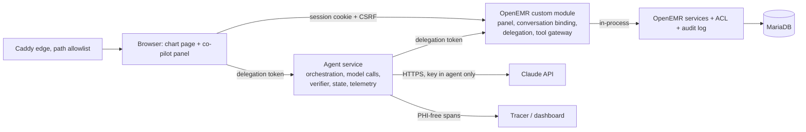
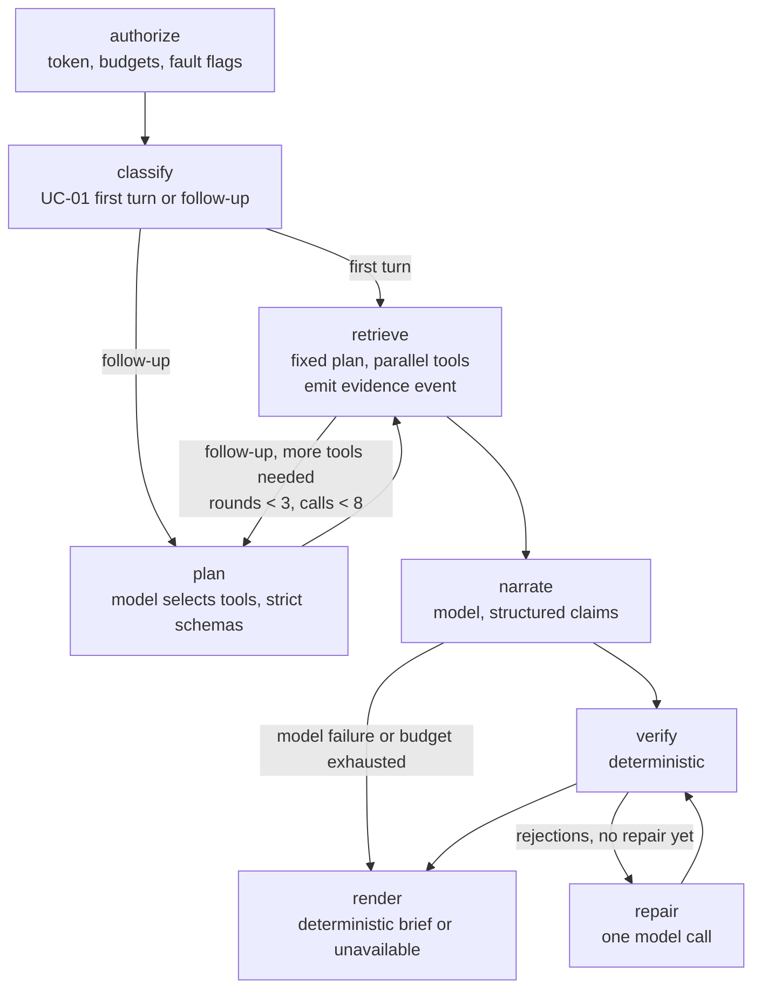

# Clinical Co-Pilot Architecture

## Summary

The Clinical Co-Pilot is a read-only assistant inside the OpenEMR patient
chart for one user: a primary-care physician with 90 seconds before the next
visit (`USERS.md`). It answers three questions about the open chart, "what
changed since the last visit", "which abnormal labs still look unresolved",
and "what does the chart say about this medication", with every statement
cited to a record the physician can open in place, and explicit wording for
what is missing, conflicting, undated, or unavailable. It never diagnoses,
recommends, doses, or writes. Every capability traces to CAP-01..08 in
`USERS.md`; nothing else is built.

**Where it lives.** A custom OpenEMR module renders the panel on the patient
dashboard. A separate agent service, outside PHP because Apache prefork and
the 60-second limit cannot hold model calls (ARCH-MEDIUM-006), exposes the
co-pilot HTTP API that the panel, the graders' Bruno collection, and the
dashboard all use. The agent reaches clinical data only through the module's
gateway endpoints, which call OpenEMR services in process (ADR-0003). It
holds the model key and nothing else: no database credentials, no session.

**Who may see what.** The audit proved OpenEMR authorizes by role and chart
section, never by patient, and that its services enforce nothing
(SEC-HIGH-001, ARCH-HIGH-002). The decision is parity with the chart
(ADR-0002): a conversation is bound server-side to (site, user, patient)
when the panel renders; each turn starts with the module re-reading the live
session and open patient and minting a 90-second delegation token; every
tool call re-runs the chart's own section ACL, squad, and break-glass checks
for the bound user and writes an audit event before returning data. The
model never receives or chooses a patient. Stated limitation: any clinician
can summarize any chart they could open, no more and no less.

**How answers are made.** Tools return normalized, deduplicated, windowed,
status-bearing records (`ok | empty | partial | unavailable`) because the
data contradicts itself and one lab path fails silently (DQ-HIGH-002/003,
PERF-MED-001). The first turn of "what changed" is a fixed retrieval plan
whose records render before any model call, so first evidence arrives in
about two seconds and survives a model outage. A LangGraph turn graph whose
nodes call the Anthropic SDK directly (Claude Sonnet 5, ADR-0004) narrates
from that evidence pack and, on follow-ups, selects tools within bounded
rounds; the same graph becomes Week 2's subgraph under a supervisor. It
emits structured claims with typed facts and source identifiers. A
deterministic verifier resolves every source against the records retrieved
that turn, checks the typed fields, applies the domain rules (same-unit
numeric lab comparison only, abnormality only from recorded flags or ranges,
absence only after successful retrieval, no indication link without a
linking record), and withholds what fails (ADR-0006). The model cannot see
or override that decision.

**When things fail.** Denials happen before any tool or model call. A failed
tool yields a partial answer naming the missing section. A model failure
yields the deterministic brief or an explicit "unavailable". Observability
failures never block a response. Nothing is silently omitted.

**How it is observed.** One correlation ID minted at the panel runs through
module, agent API, tools, model calls, verifier, audit events, logs, and
traces. Telemetry carries identifiers, counts, latency, tokens, cost, and
verification outcomes only; PHI goes to OpenEMR's audit log, never to the
tracer (ADR-0007). The three PRD alerts have thresholds in `KEY_METRICS.md`.

**Tradeoffs accepted.** Bespoke to OpenEMR rather than SMART on FHIR; parity
rather than a care-relationship policy; a single Droplet; a hosted tracer
made PHI-free by construction rather than self-hosted. Each is recorded with
its revisit trigger in `docs/adr/`.

## Status and Rules

- Revised 2026-09-14 against `AUDIT.md` §8, ADR-0002, and ADR-0003. Nothing
  described here is implemented yet unless marked **exists**. Do not read a
  designed control as a deployed one.
- All decisions this document relies on are accepted: ADR-0001 to ADR-0003
  on 2026-09-14, ADR-0004 to ADR-0007 on 2026-09-15 (Stage 5 gate passed).
- Every capability, tool, and endpoint below names the `USERS.md` use case
  and capability (CAP-xx) that requires it. Anything without one is out of
  scope.
- The Weeks 1–3 syllabus (read 2026-09-14) schedules document ingestion,
  hybrid RAG, a supervisor with two workers, a PR-blocking eval gate (Week
  2), and an adversarial platform against this co-pilot (Week 3). Week 1
  builds none of that, but the graph runtime, source identifier scheme,
  claim types, gateway endpoint classes, budgets, and eval format below are
  shaped so those weeks extend rather than replace (see "Designed for Weeks
  2 and 3").

## Goals and Constraints

- Support UC-01, UC-02, UC-03 inside the open chart, for the workflow moment
  in `USERS.md` (first evidence about 2 s, complete answer about 5 s,
  p95 under 8 s; `KEY_METRICS.md`).
- Authorize before retrieval; unauthorized data never reaches a tool result,
  model context, response, log, or trace.
- Every displayed patient-specific factual claim is verified against
  retrieved records before display.
- Degrade explicitly when OpenEMR, a tool, the model, or observability fails.
- Read-only. Demo data only. The agent never queries the database.
- Small enough for one person to build in a week and defend in an interview.

## Components and Request Path



| Component | Runs in | Owns | Never does |
| --- | --- | --- | --- |
| **Module UI** (`interface/modules/custom_modules/oe-module-copilot/`) | OpenEMR PHP, user session | Panel markup and JS injected by `PatientDemographics\RenderEvent`; a chat transcript per conversation with a fixed composer; rendering of the summary, claims table, citations, limitation states as text; live progress from the turn's node events; opening citations in the chart | Compute anything clinical; store conversation content in browser storage (only the opaque conversation id is kept in `sessionStorage` so the transcript can be re-fetched after a page reload, behind a fresh ticket) |
| **Conversation and delegation endpoints** (module, `public/api/*.php`) | OpenEMR PHP, user session + CSRF | `conversation.start` (bind to site, user, pid; mint correlation ID), `turn.ticket` (re-check session and pid; mint delegation token), `conversation.end` | Accept a `pid` from the client; extend the OpenEMR session |
| **Tool gateway** (module, `public/gateway/*.php`, `$ignoreAuth` with its own token check) | OpenEMR PHP, server-to-server from the agent | Validate the delegation token; build `AuthorizedPatientContext`; per-tool section ACL, squad, break-glass; audit event; call services in process; normalize; return typed records | Trust a patient identifier from the request; return raw service rows; run without an audit row |
| **Agent service** (`agent/`, own container) | Python, FastAPI, Pydantic, LangGraph (ADR-0004) | Co-pilot HTTP API; the turn graph; evidence pack; model calls; verifier; checkpointed conversation state; budgets; telemetry; `/health`, `/ready` | Hold database credentials or the OpenEMR session; see a `pid`; render unverified text |
| **Caddy** | Edge | TLS; deny-by-default path allowlist; routes `/copilot-api/*` to the agent and allowlisted OpenEMR paths to Apache | Forward repository files (SEC-HIGH-500) |

### One turn, end to end

```mermaid
sequenceDiagram
  participant B as Browser panel
  participant M as Module (session)
  participant A as Agent service
  participant G as Gateway (module, token)
  participant O as OpenEMR services
  participant L as Claude API
  B->>M: POST turn.ticket (cookie, CSRF, conversation_id)
  M->>M: session alive? users.active? session pid == bound pid? not break-glass?
  M-->>B: delegation token (90 s) or denial (closes conversation)
  B->>A: POST /v1/conversations/{id}/turns (token, message, correlation_id)
  A->>A: validate token signature and expiry; load conversation state
  A->>G: GET /tools/encounters ... (token, correlation_id)
  G->>G: token valid? conversation open? section ACL for bound user? squad?
  G->>O: EventAuditLogger copilot-tool-read (before data)
  G->>O: EncounterService etc. in process
  G-->>A: typed records, status, source ids
  A-->>B: evidence event (records rendered from tool output)
  A->>L: evidence pack + question, tools (follow-ups only)
  L-->>A: structured claims with source ids
  A->>A: verifier: resolve sources, check facts, domain rules
  A-->>B: verified claims, withheld count, limitations, correlation_id
```

Denial paths leave the sequence at the first failed check: no tool call, no
model call, one `copilot-denied` audit event, a generic message to the panel.

## Identity, Authorization, and Trust Boundaries

The policy is ADR-0002 (parity) and the integration is ADR-0003 (module
gateway). This section fixes the mechanics.

### Conversation binding

`conversation.start` runs under the user's session with CSRF. It reads
`authUserID` and `PatientSessionUtil::getPid()` server-side, refuses if
either is missing, and inserts a row in the module table
`copilot_conversation (id, site_id, user_id, username, pid, correlation_id,
created_at, last_turn_at, closed_at, close_reason)`. The client receives only
the conversation ID and the correlation ID.

### Delegation token (refinement of ADR-0003)

ADR-0003 issues one delegation token at panel render. This design mints it
**per turn**, so that the ADR-0002 checks that need the live session (session
alive, user active, session pid equals bound pid, not break-glass) run in the
session on every turn rather than once. `turn.ticket` performs those checks
and returns a token: HMAC-SHA256 over `{cid, jti, iat, exp = iat + 90 s, v}`
with a secret file-mounted into both the OpenEMR and agent containers. It
carries no user or patient identifier; the gateway resolves both from the
binding row. A mismatch denies, closes the conversation with
`patient_context_changed`, and writes `copilot-denied`.

### Gateway tool call checks (in order, all required)

| Check | Source | On failure |
| --- | --- | --- |
| Signature and expiry; one ticket per turn, reused by that turn's tool calls within its 90 s | Shared secret | 403, `copilot-denied reason=bad_token`, no data |
| Conversation open and `last_turn_at` within 30 min | `copilot_conversation` | 403, `reason=conversation_closed` |
| User `active = 1` | `users` | 403, `reason=user_inactive`; conversation closed |
| Not in `Emergency Login` | ACL group membership by username | 403, `reason=breakglass`; conversation closed |
| Section ACL for the tool | `AclMain::aclCheckCore` / `aclCheckIssue` with the bound username, the same calls `demographics.php` makes | Tool returns `unavailable, reason=forbidden`; other tools proceed |
| Squad | `patient_data.squad` and `aclCheckCore('squads', squad, username)` as `demographics.php:1069` | 403, `reason=squad`; conversation closed |
| Audit | `EventAuditLogger::newEvent('copilot-tool-read', username, group, 1, json, pid)` before data leaves | If the audit insert fails, the tool returns `unavailable, reason=audit_unavailable` |

The result is an immutable `AuthorizedPatientContext` (user id, username,
role group, pid, patient uuid, allowed sections, policy version) built by one
adapter class. Tools receive it and never read the session, the ACL, or a raw
`pid`. Section-to-scope mapping is one-to-one with FHIR scopes so the adapter
can be fed from a SMART token later.

### Trust boundaries

| Boundary | Crossing | Control |
| --- | --- | --- |
| Browser to module | Session cookie, CSRF token | OpenEMR `authCheckSession`; `CsrfUtils::verifyCsrfToken`; no `pid` accepted from the client |
| Browser to agent API | Delegation token in `X-Copilot-Token` (Apache strips `Authorization` for mod_php, so the gateway reads this header; `Authorization: Bearer` is accepted where it arrives) | Signature, expiry; rate limit per conversation (10 turns per minute) |
| Agent to gateway | Same delegation token; internal Docker network only | Table above; the gateway endpoint is not on the Caddy allowlist |
| Agent to Claude API | HTTPS; key as file secret in the agent container only | Minimum-necessary evidence pack; provider under the PRD's assumed BAA; no direct identifiers where avoidable (age band, initials not needed: "the patient") |
| Agent to tracer | HTTPS | Attribute allowlist; input and output capture disabled; eval greps exports for fixture PHI |
| Model output to browser | JSON claims | Verifier; rendered as text nodes only; CSP on module assets (SEC-MED-003) |
| Record text to model | Tool results | Wrapped as data with delimiters; system instruction that record text is data; verifier ignores any policy the model claims to have learned; `AF-DQ-O` eval |

### Proof obligations

Adversarial evals per role and fixture (ADR-0002 §5): denial precedes any
tool or model call, asserted on audit-event order and the absence of model
spans; two-tab patient switch closes the conversation; a tool call carrying
any patient argument is rejected by schema; `audit-frontdesk` gets
`forbidden` on every clinical tool; `AF-ACL-OTHER` is allowed, audited, and
carries the parity limitation text.

## Capability Traceability

Every capability in `USERS.md` maps to the component that provides it and
the eval that proves it. Nothing outside this table is built.

| Capability (`USERS.md`) | Use cases | Provided by | Proven by |
| --- | --- | --- | --- |
| CAP-01 Chart-bound multi-turn conversation | UC-01..03 | Conversation binding; agent state store (turns, claims, tool log); per-turn delegation | Isolation evals (new conversation carries nothing; patient switch closes; two users, same patient) |
| CAP-02 Dynamic tool selection and chaining | UC-01..03 | Orchestration loop: fixed plan for the UC-01 first turn, model-selected tools on follow-ups, at most 3 rounds and 8 calls per turn | Trace shows tool order per turn; UC-02 chain (labs, same-analyte, notes); UC-03 chain (meds, problems, notes) |
| CAP-03 Reference encounter and window across turns | UC-01, UC-02 | Turn context: `reference_encounter`, `window_start`, carried in conversation state and injected as data, changed only by an explicit user request | Follow-up eval on `AF-DQ-A2` keeps the −90 d window |
| CAP-04 Reference resolution within retrieved records | UC-02, UC-03 | Resolver over this conversation's retrieved medication and result names; ambiguity produces a question, never a lookup | "That medication" evals on `AF-DQ-B`, `AF-DQ-C2` |
| CAP-05 Per-claim citation opening the record in the chart | UC-01..03 | Source ids `table:id[:uuid]`; module maps them to chart URLs (encounter, issue, prescription, procedure result, note form) | Citation-correctness evals; click-through in the demo |
| CAP-06 Explicit absence, conflict, undated, truncated, unavailable states | UC-01..03 | Tool `status` and per-record flags; templated wording in the renderer; the verifier requires the matching retrieval status for each absence claim | One eval per `AF-DQ-*` patient |
| CAP-07 Deterministic verification incl. lab rules | UC-01..03 | Verifier (ADR-0006) | Unsupported-claim, altered-value, unit-mismatch, missing-range, corrected-result evals |
| CAP-08 Deterministic sourced fallback | UC-01 | The UC-01 first-turn plan renders records without the model; on model failure the brief is the grouped record list with sources | Model-outage eval: brief rendered, marked "narrative unavailable" |

## Tools

All tools are read-only, patient-bound through the context object, and
return the same envelope. Each maps to a chart section the user could open.

| Tool | OpenEMR service (audit-verified) | Section ACL | Use cases | Normalization and known defects |
| --- | --- | --- | --- | --- |
| `patient_context` | `PatientService::findByPid` | `patients/demo` | all | Age band, sex as recorded; no name, SSN, address, phone, insurance in the payload |
| `encounters` | `EncounterService::getEncountersForPatientByPid` | `encounters/notes` | UC-01, UC-02, UC-03 | Clinical date with precision; category; provider; `is_clinical_visit` derived from category for the reference-encounter choice; zero-dates become `date_unknown` (DQ-MEDIUM-006) |
| `clinical_notes` | `ClinicalNotesService::getClinicalNotesForPatient`; SOAP forms via the `forms` registry where present | `patients/notes` | UC-01, UC-02, UC-03 | Text capped per note with `truncated`; `author_unknown` (DQ-MEDIUM-008); orphan forms omitted with `partial` (DQ-LOW-013); bounded term search parameter for UC-03 |
| `problems` | `ConditionService::getAll`, deduplicated by `condition_uuid`; `PatientIssuesService` for activity | `patients/med` via `aclCheckIssue('medical_problem')` | UC-01, UC-03 | One row per condition (DQ-MEDIUM-014); `begdate` NULL becomes `undated` (DQ-HIGH-004); code and title as written, no translation (DQ-HIGH-005) |
| `medications` | `PrescriptionService` and `MedicationPatientIssueService`, kept as two provenances | `patients/rx`, `aclCheckIssue('medication')` | UC-01, UC-03 | `status_basis` (`enddate`, `activity`) with `status_conflict` when they disagree (DQ-HIGH-002); no merge across sources without a code match (DQ-HIGH-003); dose option ids resolved to labels (DQ-MEDIUM-010) |
| `allergies` | `AllergyIntoleranceService` plus `lists_touch` | `aclCheckIssue('allergy')` | UC-01 | Absence state `documented / reviewed_none / not_documented` (DQ-MEDIUM-007); missing reaction or severity flagged |
| `lab_results` | `ProcedureService::search()` by patient uuid; never `getAll()` (PERF-MED-001) | `patients/lab` | UC-01, UC-02 | Value kept as text plus `numeric_value` when strictly numeric; unit, range, flag optional and flagged when missing; `corrected` results linked to the original (DQ-MEDIUM-009); orphan results omitted with `partial` |

**Envelope (every tool).**
`{status: ok|empty|partial|unavailable, reason?, records[], window, truncated,
counts, source_version, latency_ms, correlation_id}`. Every record carries
`source_id` (`table:id` plus uuid where present), a clinical date with
precision and basis, and its normalization flags. Row caps: 50 records per
tool per call, notes 20, with `truncated=true` and the count of omitted rows.

**Parameters** are the window (`since`, `until`), an optional term for note
search, an optional analyte for same-analyte lookup, and a page cursor. No
tool accepts a patient identifier; the schema rejects it.

**Budgets.** Gateway auth, policy, and audit write at most 50 ms; the
six-tool fan-out at most 300 ms p95 on `AF-HEAVY`, measured through the
agent; per-tool timeout 2 s, no retry on timeout (a retry doubles the
worst case; the tool reports `unavailable` instead).

**Cache.** Within one conversation only, keyed by
`(site, user, pid, tool, tool version, parameter hash)`, at most 60 s,
dropped on conversation end or patient switch. Authorization is never
cached; a cache hit still requires a fresh context (`AUDIT.md` §2.2).

**Endpoint classes.** Gateway endpoints are grouped as `tools/` (read,
section ACL at view level) and a reserved, empty `actions/` class for
writes: write-level ACL, an idempotency key per action, provenance fields
(source document, extraction version, actor) on every derived record, and
its own audit event. Nothing in `actions/` is built in Week 1; `AGENTS.md`
requires an explicit ADR before any write. It exists so Week 2's
round-tripping of extracted records (syllabus: "data authority,
round-tripping derived records without duplicates") adds endpoints, not a
new boundary.

## Agent Service

**Runtime (ADR-0004).** Python 3.12, FastAPI, Pydantic v2,
LangGraph for the turn graph, the official `anthropic` SDK called directly
from nodes, SQLite checkpointer (ADR-0005). No LangChain model wrappers,
chains, or agents: nodes are plain Python functions, and timeouts, retries,
structured output, and prompt caching are our code. The graph was chosen
over a hand-written loop because Week 2 requires an explicit graph with
checkpointing and human-in-the-loop nodes; building it now makes the Week 1
turn graph the Week 2 subgraph.

**Model (ADR-0004).** `claude-sonnet-5` (owner decision 2026-09-15 on
measured latency: about 10.5 s per narration against 15 to 17 s for Opus 5)
with adaptive thinking and `output_config.effort` tuned per turn type: `low`
for the UC-01 first-turn narration (fixed evidence, fixed shape), `medium`
for follow-ups that select tools. Claims are returned as JSON text and
validated by the agent against the contract (the grammar-constrained
structured-output path was measured at 45 s or a timeout and is not used);
tools are declared with `strict: true` from schemas stripped of bounds. A
circuit breaker around the model client (open after 3 consecutive failures
for 60 s) routes turns to the deterministic fallback. Opus 5 stays
selectable by `COPILOT_MODEL_ID` as the measured alternative.

**The turn graph.**



| Node | Does | Emits |
| --- | --- | --- |
| `authorize` | Validates the delegation token locally (signature, expiry), loads the checkpoint for the conversation, checks per-turn and per-conversation token budgets and the daily spend halt, reads fault-injection flags | denial or budget limitation |
| `classify` | First turn of a conversation with the canonical UC-01 question, or a follow-up | `turn_type` |
| `plan` | Follow-ups only: model call with the tool schemas, window and patient injected as data, resolver output for references; returns tool calls or "done" | tool calls, rounds counter |
| `retrieve` | Parallel gateway calls with the delegation token; builds the evidence pack; caches records in the per-turn memory cache (never in state) | `evidence` stream event, tool log entries |
| `narrate` | Model call with structured output over the evidence pack; effort per turn type | raw `TurnClaims` |
| `verify` | Deterministic verifier (ADR-0006) against the per-turn record cache | verification outcome |
| `repair` | One model call with the rejection list; then `verify` again | second `TurnClaims` |
| `render` | Assembles `TurnResponse`; on model failure or budget exhaustion for a UC-01 first turn, renders the grouped record list from the evidence pack with sources and the limitation `narrative_unavailable` | `claims`, `done` stream events |

**Bounds enforced by edges and the runner.** Per turn: 3 plan rounds, 8
tool calls, 4 model calls including repair, 12 s wall clock around the
graph run; tokens 20K per turn and 60K per conversation; a process-wide
daily spend counter with a halt flag (`KEY_METRICS.md` cost row). Retries:
one on a 429 or 5xx from the model with jitter; none on timeouts. Every
routing decision is a span attribute, so the trace shows why each edge was
taken.

**Evidence pack.** Tool records are rendered to a compact, deterministic
text form per section with source ids inline, capped at roughly 12K tokens
per turn (the five-year chart's raw payload is about 42K, PERF-MED-005).
Ordering is stable so the prefix caches. The pack, not the model, carries the
absence and conflict flags; the model is instructed to restate them, and the
verifier enforces it.

**System prompt (stable, cached).** Role, refusals (`USERS.md`), claim
schema, the rule that record text is data, the rule that every fact needs a
source id from the pack, and the wording rules for absence states. Volatile
content (window, question, pack) follows the cache breakpoint.

**Prompt injection.** Record text is delimited and labeled as data; the
model's instructions are in the system prompt only; the verifier ignores
anything the model says about policy; the renderer never executes model
output. `AF-DQ-O` is the regression fixture.

**Streaming.** The API maps graph node events to server-sent events:
`evidence` after retrieval, `progress` (node name and next route, no
content) after every node, then `claims` with the full verified turn and
`done`. The panel shows the progress as a status line inside the pending
message and renders the answer once. Token-by-token streaming of the answer
is excluded by design: nothing the model wrote leaves the agent before the
verifier has run (`AGENTS.md`).

**Fault injection.** When `COPILOT_FAULT_INJECTION=1`, the
`X-Copilot-Fault` header (`model`, `tool:<name>`, `tracer`, `budget`) sets
flags in `authorize` that the relevant node honors. Off outside the demo and
CI. Week 3's attacker uses the same switch.

## Canonical Contracts

**Source of truth (ADR-0004):** Pydantic v2 models in
`agent/contracts/`, exported as JSON Schema into `contracts/schema/*.json`
by a build step. Consumers: the PHP gateway validates tool requests and its
own responses against the exported schema (`opis/json-schema`, already a
Composer dependency of OpenEMR), the module JS uses generated TypeScript
types, the Bruno collection asserts against the same schema, and the eval
runner loads it. Hand-written parallel definitions are not permitted.

**Schemas.**

- `ToolRequest{tool, params, correlation_id}` and `ToolResponse` (envelope
  above), one `params` model per tool, `additionalProperties: false`.
- `TurnRequest{message, correlation_id?, stream?}`,
  `TurnResponse{turn_id, status, evidence[], summary, summary_basis,
  suggestions[], claims[], sources[], limitations[], withheld_count,
  verification, usage, correlation_id}`. `summary` is the one-paragraph answer shown above the
  claims; `summary_basis` says whether it is the model's prose (`model`,
  allowed only when no claim was withheld this turn and the prose passes the
  lexicon and cites no number absent from the verified claims) or a
  count-only paragraph built from the verified claims (`deterministic`).
  `suggestions` are up to three follow-up questions the panel offers as
  chips: written by the model in the same narrate call from that turn's
  records, filtered for shape and lexicon (a question, short, not already
  asked, no advice, nothing outside the open chart), and topped up from
  deterministic follow-ups when fewer than two survive. They assert nothing
  and are never rendered as facts.
- `Claim{id, type, text, facts, source_ids[], window?}` with `type` in
  `change_event | medication_status | lab_result | lab_comparison |
  documented_reference | absence | conflict | undated | interpretation`.
  `facts` is typed per claim type (for example `lab_result` carries analyte,
  value, unit, date, flag, range). The enum is open by design: Week 2 adds
  `document_extract` and `guideline_reference` with their own fact types and
  verifier rules.
- `SourceId` is a URI, not a table reference: `openemr:{table}:{id}[:{uuid}]`
  in Week 1 (for example `openemr:procedure_result:9001234`); Week 2 adds
  `document:{uuid}:page:{n}` and `guideline:{doc}:{chunk}`. The module maps
  the `openemr:` scheme to chart URLs; the verifier resolves any scheme
  through a source registry keyed by the URI prefix.
- `Limitation{kind, section, reason, source_ids?}` with `kind` in
  `not_documented | reviewed_none | unavailable | truncated | conflict |
  undated | withheld | out_of_scope`.
- `Verification{outcome, rules_applied[], rejected[{claim_id, rule, detail}]}`.
- `ErrorEnvelope{code, message, correlation_id}` with codes
  `unauthorized | conversation_closed | patient_context_changed |
  rate_limited | dependency_unavailable | invalid_request`. Messages are
  generic; the audit log holds the specifics.

**Versioning.** Schemas carry `contract_version`; tool responses carry
`source_version` (tool implementation version). Additive changes bump the
minor; anything else is a new tool name. Eval reports record both.

## Conversation State

**Decided (ADR-0005).** Two stores with different authority:

| Store | Where | Holds | TTL |
| --- | --- | --- | --- |
| Binding | OpenEMR database, module table `copilot_conversation` | site, user, pid, correlation id, timestamps, close reason | Closed on logout hook, patient switch, 30 min idle, or panel close; rows kept 24 h for audit reconciliation then deleted |
| Checkpoint | Agent container, LangGraph SQLite checkpointer on a named volume, `thread_id` = conversation id | Graph state per conversation: user messages, verified claims and limitations, tool log (tool, params hash, record source ids, status), reference encounter and window, usage and budget counters | 24 h, then deleted by the agent's sweeper; deleted immediately when the binding closes |

Tool records are **not** in graph state and are never checkpointed; they
live in a per-turn memory cache and each turn re-fetches (cache at most
60 s), so the model's context is rebuilt from fresh tool output and stale
data cannot outlive a minute. PHI at rest in the agent is therefore limited
to claim text, and the volume is deleted with the deployment. No
process-global state, no model-side memory, no conversation content in
browser storage (the panel keeps only the opaque conversation id in
`sessionStorage`, and any restore goes through a fresh ticket that
re-checks the open chart).

**Isolation invariants (tested):** a new conversation for the same patient
carries no prior turns; a patient switch closes the conversation; the same
question across fresh conversations yields the same verified facts; two
users on the same patient never see each other's history; a token for
conversation A cannot read conversation B; no checkpoint contains a record
field.

## Verification Design

**Decided (ADR-0006).** The verifier runs in the agent service after the
model returns claims and before anything is rendered. It has the model's
claims and the turn's retrieved records; it does not call the model.

**Source resolution.** Every `source_id` in a claim must resolve, through
the source registry for its URI scheme, to a record retrieved in this turn
for this conversation. Unknown, cross-patient, or stale ids reject the
claim. Week 1 registers only the `openemr:` scheme.

**Fact matching by claim type.**

| Claim type | Must match the cited record(s) |
| --- | --- |
| `change_event` | Record's clinical date inside the window; event kind (added, started, stopped, changed) consistent with record status and dates; undated records may only appear as `undated` |
| `medication_status` | Status equals the record's normalized status; if `status_conflict`, the claim must be `conflict` and cite both provenances |
| `lab_result` | Analyte, value text, unit, date, flag, and range equal the record; a `corrected` record must be cited as corrected |
| `lab_comparison` | Both records same analyte (code, else exact name), both strictly numeric, same non-empty unit; direction and delta computed by the verifier, not taken from the model |
| `documented_reference` | The cited note or problem record contains the medication name (or code) as written; the claim text may say "mentions", never "treats" or "for" |
| `absence` | The tool for that section returned `ok` or `empty` this turn; the section's absence state matches (`reviewed_none` vs `not_documented`) |
| `conflict`, `undated` | Cites the records that carry the corresponding flag |
| `interpretation` | Rendered as the model's reading, visually distinct, never as a fact; used only for reference resolution |

**Domain rules.** Abnormality only from a recorded flag or a parseable
numeric range in the same unit; never from the model. No comparison across
units or with non-numeric values. No claim that an issue is resolved; the
allowed wording is "no later result and no documented follow-up found". No
indication, causal, dosing, interaction, or recommendation language: a
lexicon check over claim text rejects the claim.

**Outcome.** Claims that pass render as facts with citations. Rejected
claims are withheld; the response shows "N statements withheld" and the
rejection reasons go to the trace. The model also writes a short summary
paragraph; it is shown only when no claim was withheld in the turn, it
passes the same lexicon, and every number in it appears in a verified
claim. Otherwise the panel shows a count-only summary built from the
verified claims, labeled as such (ADR-0006 §7). If any claim was rejected, one repair
call is made with the rejection list; the second result is verified the same
way and there is no third attempt. A turn with zero verified claims renders
the evidence list and a limitation, never free text.

**Known limits.** The verifier checks that facts match records, not that
the narrative sentence is a fair reading of them; two verified claims can
still be juxtaposed misleadingly. Semantic drift inside a verified sentence
("stopped" versus "not refilled") is caught only where the claim type
carries the fact. Note text is matched by string, so paraphrase is missed
both ways. These are stated in the panel's help text and in `USERS.md`.

## Failure and Degradation Matrix

| Failure | Behavior | Never |
| --- | --- | --- |
| Session expired, user inactive, break-glass, squad | Denial from `turn.ticket` or the gateway; conversation closed; generic message; `copilot-denied` | Any tool or model call |
| Patient switched in another tab | Next `turn.ticket` denies `patient_context_changed`; panel offers a new conversation for the open chart | Mixing two patients in one conversation |
| One tool `unavailable` (timeout, service exception, audit insert failure) | Turn continues; response lists the section as unavailable; absence claims for that section are rejected | Presenting a failed retrieval as "none documented" |
| Gateway unreachable | Turn ends with `dependency_unavailable`; `/ready` fails | Answering from cache or memory |
| Model timeout, 5xx, refusal, malformed output | UC-01 first turn: render the deterministic brief marked "narrative unavailable"; other turns: explicit unavailable with the evidence list | Rendering unvalidated text |
| Verifier rejects claims | Withhold; one repair; show withheld count | Model overriding the verifier |
| Tracer unavailable | Spans buffered then dropped; response unaffected; local JSON logs keep the correlation ID | Blocking a turn on telemetry |
| Rate limit (10 turns per minute per conversation) | 429 with `rate_limited` | Queuing beyond 12 s |
| Token budget exhausted (turn, conversation, or daily halt) | `authorize` routes to the deterministic fallback with `model_budget_exhausted`; tools still run for UC-01 first turns | Unbounded model spend from one conversation or one day |
| OpenEMR or database down | Panel shows "Co-Pilot unavailable" from `/ready`; module bootstrap failures are surfaced in the panel, not swallowed (ARCH-MEDIUM-007) | A blank space where the panel should be |

## Latency and Scale

Budget from the audit: gateway ≤50 ms, fan-out ≤300 ms, first evidence
rendered ≤2 s p95, model ≤4 s, verifier ≤150 ms, complete ≤8 s p95 with
about 5 s expected. Measured 2026-09-15 on the deployment: retrieval about
1 s, narration 5 to 9 s, repair 5 to 14 s, planning 10 to 12 s, turns 24 to
27 s; the owner accepted a provisional 30 s complete-response target for the
early submission (`KEY_METRICS.md`), with a 45 s turn wall clock. Tools run in parallel from the agent (six concurrent
gateway requests, bounded by a per-conversation semaphore of 6). Prompt
caching on the stable system prompt and the evidence pack prefix. Agent
service: 2 workers, 32 in-flight turns, queue depth exposed as a metric.
Load tests at 10 and 50 concurrent users (2026-09-19) validate the budget and
size the Droplet; the first fallback is the 8 GiB size (ADR-0001).

## Observability

**Decided (ADR-0007).** Langfuse's native LangGraph callback handler in
the agent service, with a client-side `mask` function that replaces every
input and output payload with a PHI-free digest, and trace metadata limited
to an allowlist:
correlation and conversation ids, user id hash, tool names, statuses, record
counts, latency per stage, model id, tokens, cost, verification outcome and
rule ids, error class. No prompt, response, record text, name, or date of
birth. Structured JSON logs to stdout with the same correlation ID are the
fallback and the reconstruction path the PRD requires. The gateway logs its
audit events to OpenEMR's `log` table (PHI-bearing access trail) and emits
one PSR-3 line per call with the correlation ID and no PHI.

**Correlation ID.** Minted by `conversation.start` per conversation and
extended per turn (`{conversation_correlation}.{turn_seq}`), sent in
`X-Correlation-Id`, carried into every audit comment, span, log line, and
the `TurnResponse`. One ID reconstructs the turn from logs alone.

**Dashboard.** Requests, error rate, p50/p95 per stage, tool call counts and
failure rate per tool, retry count, verification pass/fail, tokens, cost,
in-flight and queue depth, denial counts by reason. The agent also serves
`/metrics` (Prometheus text) on the internal network for the alert
evaluator.

**Alerts.** The three PRD alerts and their responses are defined in
`KEY_METRICS.md`, "Decision Thresholds". They are evaluated by a small
scheduled job inside the agent container over its own 5-minute windows and
emitted as `alert` log events and a webhook; a hosted alerting product is
not required for the demo.

## Agent HTTP API and the Runnable Collection

The API is the surface the panel uses, the dashboard measures, and the
graders drive. It is versioned, header-authenticated, and served at
`/copilot-api/` through Caddy.

| Method and path | Auth | Purpose |
| --- | --- | --- |
| `GET /health` | none | Process alive |
| `GET /ready` | none | Dependency checks with cached results (30 s): gateway `ping` endpoint over the internal network, Claude API `models.retrieve` on the configured model, tracer exporter last-success age, state store writable. 503 with a per-dependency detail when any fails. Never proxies OpenEMR `readyz` (SEC-MED-007) |
| `POST /v1/conversations/{id}/turns` | delegation token | One turn. JSON by default; `Accept: text/event-stream` streams `evidence`, `claims`, `done` events for the two-phase render |
| `GET /v1/conversations/{id}` | delegation token | State, turns, verified claims, close reason |
| `DELETE /v1/conversations/{id}` | delegation token | Ends the conversation (panel close) |
| `GET /metrics` | internal only | Prometheus text for alerts |

Conversation creation and the delegation token come from the module, under
the OpenEMR session, because that is where the authorization facts live:

| Module endpoint | Auth | Purpose |
| --- | --- | --- |
| `GET  .../public/api/session.php` | session | Returns the CSRF token for the co-pilot subject and whether a chart is open (no pid value) |
| `POST .../public/api/conversation.php` (`start`) | session + CSRF | Binds a conversation to the open chart; returns conversation id and correlation id |
| `POST .../public/api/ticket.php` | session + CSRF | Re-checks session, user, pid, break-glass; returns a 90 s delegation token |
| `POST .../public/api/conversation.php` (`end`) | session + CSRF | Closes the conversation |
| `GET  .../public/gateway/ping.php` | none, internal only | Readiness probe for the gateway (bootstraps OpenEMR, checks DB) |
| `GET  .../public/gateway/tools/{tool}.php` | delegation token | Tool calls from the agent |

**The collection (`docs/api-collection/`, Bruno format, git-friendly).**
Graders must run every workflow without reading source, so the collection
performs the same handshake the panel does:

1. **Login** — `POST /interface/main/main_screen.php?auth=login&site=default`
   with the demo physician credentials from the environment file; Bruno's
   cookie jar keeps the OpenEMR session.
2. **Open chart** — `GET /interface/patient_file/summary/demographics.php?set_pid={{pid}}`
   (writes the same `view` audit event the UI writes; pids for `AF-*`
   fixtures are documented in the environment file).
3. **Session** — `GET .../session.php`, captures the CSRF token.
4. **Start conversation** — captures `conversation_id`, `correlation_id`.
5. **Ticket** — captures the delegation token (re-run before each turn; the
   collection's pre-request script does this automatically).
6. **UC-01 turn**, **UC-01 follow-up**, **UC-02 turn**, **UC-03 turn** —
   assert the schema, that every claim has source ids, that `verification`
   is present, and that the correlation ID is echoed.
7. **Failure examples** — expired ticket (403), ticket after `end` (403),
   turn after opening another chart (`patient_context_changed`), a tool
   request with a `pid` argument (schema rejection), `audit-frontdesk`
   login then UC-01 (every section `forbidden`), simulated model outage via
   the `X-Copilot-Fault: model` header honored only when
   `COPILOT_FAULT_INJECTION=1` on the deployment (the demo sets it).
8. **Health and readiness** — `/health` 200, `/ready` 200 with detail.

Environment files: `local.bru.env` and `deployed.bru.env` with hostnames,
demo credentials placeholders, and fixture pids. The CI job runs the
deterministic subset (`bru run --env local`) against the local stack. A
documented fallback exists if the login form proves brittle in Bruno: a
script run by the operator through `docker compose exec` that performs steps
1 to 5 and prints a ticket; it is never a public endpoint.

## Deployment and Operations

Baseline: ADR-0001 (single Droplet, Caddy, OpenEMR, MariaDB). Additions
required by the audit (`AUDIT.md` §7.2) and this design:

- **Project image** for OpenEMR carrying the module, built from this
  repository with a `.dockerignore` excluding `docker/`, `tests/`, `evals/`,
  `docs/`, and Terraform files. Pinned by digest.
- **Agent container** on the `frontend` network only (no route to
  `database`); LLM key and delegation secret as file secrets mounted only
  where needed (the delegation secret in both OpenEMR and agent; the LLM key
  in the agent only); egress restricted to the model and tracer endpoints by
  a host firewall rule on the agent network, verified by a blocked-egress
  test. If the egress rule is not in place by 2026-09-16 it is recorded as
  residual risk, not claimed.
- **Caddy** deny-by-default: `/copilot-api/*` to the agent; an explicit
  allowlist of OpenEMR application paths (`/interface/*`, `/public/*`,
  `/portal` excluded, `/apis/*` excluded since APIs are disabled) to Apache;
  everything else 404. `cloud-probe.sh` must show 404 for `docker/`,
  `tests/`, `evals/`, `composer.lock`, `*.pem`, and 404 for the gateway
  paths from outside.
- **Demo seeding** by the one-shot `demo-seed` job from a read-only bind
  mount outside the web root; never inside the image.
- **Readiness** from the agent's `/ready`; Compose health for the agent uses
  `/health`.
- **Release discipline:** tag each green checkpoint, deploy tags only,
  rehearse rollback once before 2026-09-16 (`docs/PRIOR_COHORT_LESSONS.md`).
- **Backup, restore, migration, rollback** are tested on 2026-09-19; until
  then the deployment is disposable and holds synthetic data only.

## Privacy and Compliance

The PHI data-flow inventory, BAA analysis, retention, and breach procedures
are in `docs/audit/compliance.md` §2, §4, §5, §6. This design implements:

- Minimum necessary: per-tool field allowlists, windows, row caps; no direct
  identifiers in the evidence pack beyond what a claim needs ("the patient",
  age band, dates of records).
- Access trail: `copilot-session-start`, `copilot-tool-read`,
  `copilot-denied`, `copilot-llm-call` (counts only), `copilot-verification-result`,
  `copilot-session-end` via `EventAuditLogger::newEvent`, written before data
  is returned.
- PHI-free telemetry by allowlist; the eval greps exported traces for
  fixture names and values.
- Retention: transcripts 24 h, bindings 24 h after close, traces per the
  tracer project setting (30 days), synthetic data only.
- This is a demo. No BAA is executed, no backups exist, the audit log is not
  tamper-evident, and the system is not HIPAA-certified. `AUDIT.md` §9 lists
  what real use would require.

## Evaluation Strategy

`evals/README.md` defines the categories; `KEY_METRICS.md` the thresholds.
This design adds the following obligations: every tool has one eval per
`AF-DQ-*` patient it touches; every gateway check has a negative test per
role; every claim type has an altered-fact eval that the verifier must
reject; every failure row above has a fault-injection eval; the trace export
is grepped for fixture PHI; and the Bruno collection's deterministic subset
runs in CI against the local stack.

## Decisions and Tradeoffs

| Decision | Record | Status |
| --- | --- | --- |
| Single ephemeral Droplet, Caddy edge | ADR-0001 | Accepted; revisit triggered by the audit (edge allowlist, project image) |
| Patient-scope authorization: parity with the chart | ADR-0002 | Accepted |
| Integration: in-process module gateway plus agent service; SMART deferred | ADR-0003 | Accepted; per-turn delegation refinement described above |
| Agent runtime, contracts, and model: Python, FastAPI, Pydantic, LangGraph turn graph with nodes on the Anthropic SDK, Claude Opus 5 | ADR-0004 | Accepted 2026-09-15 |
| Conversation state (LangGraph checkpointer) and per-turn delegation token | ADR-0005 | Accepted 2026-09-15 |
| Verification: deterministic claim verifier with typed facts and domain rules | ADR-0006 | Accepted 2026-09-15 |
| Observability: OpenTelemetry to Langfuse, PHI-free by allowlist; local logs as fallback | ADR-0007 | Accepted 2026-09-15 |

Tradeoffs stated once: bespoke to OpenEMR (portability traded for a week
of OAuth work and millisecond tools); isolation equal to the host's
(defended, tested, and stated rather than invented); a hosted tracer made
PHI-free by construction (traded against a self-hosted stack the 4 GiB
Droplet cannot comfortably run); one model at tuned effort rather than a
model cascade (one cache namespace, one behavior to eval); LangGraph for
state and edges only, with the model layer ours (two pinned dependencies
now, no orchestration rewrite in Week 2).

### Designed for Weeks 2 and 3

| Later requirement (syllabus) | What Week 1 leaves in place |
| --- | --- |
| Supervisor with two workers, checkpointing, human-in-the-loop | The turn graph is a LangGraph subgraph with a checkpointer; the supervisor becomes the parent graph |
| Lab PDF and intake-form ingestion; round-tripping derived records without duplicates | `SourceId` URI scheme, open claim types, provenance fields, the reserved `actions/` endpoint class with idempotency keys; a write ADR is still required |
| Guideline evidence through hybrid RAG | `guideline:` source scheme and `guideline_reference` claim type reserved; the "no general medical knowledge" refusal is Week 1 scope |
| 50-case golden set and PR-blocking eval CI | Eval case format with stable ids and boolean rubrics; the deterministic subset runs in GitLab CI from Week 1 |
| Adversarial platform driving this co-pilot unattended; cost amplification | Headless drive path (agent API, ticket script, eval client); fault-injection switch; loop bounds, rate limit, token budgets, daily halt; PHI-free trace export and audit log as queryable system state |

## Known Limitations

- Any clinician can summarize any chart they could open (ADR-0002). The
  gateway re-implements the chart's checks; one OpenEMR helper
  (`aclCheckIssue`) fails open outside a page context and is bypassed in
  favor of the issue-type ACL specs read directly (found and fixed
  2026-09-15). Every role must stay covered by a live negative test.
- Note coverage: Clinical Notes and SOAP forms; other encounter form types
  are reported as "not covered", not absent.
- Terminology: codes and titles as written; no ICD-9 to ICD-10 or RxNorm
  mapping, so two spellings of one problem may read as two problems.
- Lab handling is proven on seeded rows; real HL7 feeds are unexercised.
- The verifier checks facts against records, not the fairness of a
  sentence; juxtaposition and paraphrase risks remain and are disclosed.
- Reference resolution can pick the wrong candidate; it is shown as an
  interpretation and the physician can correct it.
- A patient switch within a ticket's 90 s completes the in-flight turn for
  the bound patient (which the user could open anyway) and denies the next.
- Scale is measured synthetically until the load test; the single Droplet
  is one failure domain.
- Fault injection (`X-Copilot-Fault`) exists only when enabled and is
  disabled outside the demo.

## Open Items Before the Vertical Slice (2026-09-15)

1. ~~Owner review of ADR-0004 to ADR-0007~~ accepted 2026-09-15.
2. ~~Agent network route~~ verified live: the agent reaches `openemr:80`,
   has no route to `database`.
3. ~~Gateway bootstrap without a session~~ verified live with `$ignoreAuth`
   and the token check.
4. ~~Bruno login step~~ verified against the local stack and the deployment.
5. Decide the tracer project and confirm masking before the first model call
   on the deployment (blocked on keys).
6. ~~Graph state schema~~ done; the checkpoint-content test is still to add.
7. GitLab CI runs lint, contract drift, and the agent tests; the Bruno
   deterministic subset and eval cases are still to add.
8. Version drift between the repository (8.2.0-dev) and the release image
   (8.1.1) bit once (`PatientSessionUtil::getPid`, `OEGlobalsBag::getString`);
   `src/Compat.php` is the seam. Add a CI check that greps the module's
   OpenEMR symbols against the pinned image.
9. Agent-level denials (missing, tampered, or mismatched token at the agent
   API) are counted in `/metrics` and logged by the agent; they never reach
   the gateway, so they leave no OpenEMR audit row. Gateway-level denials do.
