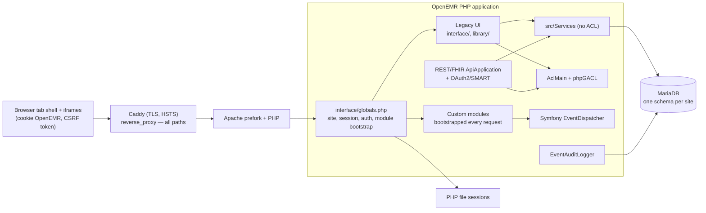

# OpenEMR and Clinical Co-Pilot Audit

## Executive Summary

We audited OpenEMR (commit `fc95374`) before writing any AI code: code tracing,
read-only SQL, live role tests, image scans, a public deployment probe, timing,
and a planted synthetic cohort. Each claim below was re-checked against source
or the database. Five findings changed the design, ranked by their effect on it.

**1. OpenEMR has no patient-level authorization.** Access is decided by role
and chart section. `AclMain::aclCheckCore` takes no patient argument; only 4 of
310 service classes reference it, none clinical. API tokens are checked for
role, scope, and section, never patient. Live, Physician and Clinician
accounts with no relationship to any patient opened full dashboards of
arbitrary patients, each logged as an ordinary view.
*Consequence:* the co-pilot's isolation equals the chart's, by decision
(ADR-0002): the gateway binds each conversation to the open chart, re-runs
the chart's section ACLs per tool, audits every read, and never lets the model
choose a patient. A stricter care-relationship policy is designed and deferred.

**2. The data cannot support the use case, and it contradicts itself.** Three
demo patients, one 2014 encounter each, no lab results, three placeholder SOAP
notes under 50 characters, and no onset dates anywhere. The one prescription is
active in `prescriptions` and inactive in `lists`; the chart greys a medication
by end date while the API calls it "stopped" by activity flag, so they disagree
on the same row. *Consequence:* tools normalize status and dates, flag conflicts, and
distinguish "not documented" from "reviewed, none" and "unavailable". A
versioned synthetic cohort reproduces each defect for evals.

**3. Silent failure exists below the agent.** `ProcedureService::getAll()`
emits invalid SQL (a dangling `LEFT JOIN`), and `ConditionService` returns one
row per linked encounter (26 rows for 7 conditions on the synthetic chart). A
naive tool would say "no labs" or repeat diagnoses. *Consequence:* every
tool returns `ok | empty | partial | unavailable`, deduplicates by record
identity, and uses the working `search()` path for labs. The verifier rejects
absence claims unless retrieval succeeded.

**4. Audit logging and telemetry are the likeliest compliance failures.**
Query-event logging is off, so co-pilot reads would leave no trail unless the
gateway writes one. Log integrity is an unkeyed SHA3-512 stored beside the rows
it protects. API logging defaults to "full", copying PHI response bodies into
the database. Hosted tracing means a business associate with no BAA. *Consequence:* the gateway writes its own audit event before
returning data, and telemetry is PHI-free or self-hosted.

**5. The deployment path exposes upstream files.** The official image serves
its whole repository and our Caddy forwarded every path, so a probe downloaded
upstream dev private keys and a compose file with token-format strings; none of
our secrets leaked. *Consequence:* a deny-by-default edge
allowlist precedes any agent component or LLM key. A configuration fix, not a
design change.

**Performance was not the constraint we expected.** A dashboard render takes
about 360 ms and 1,045 SQL statements, mostly translation, layout, and ACL
lookups, regardless of chart size. Services answer in milliseconds even for a
five-year synthetic chart, but its raw payload is about 42K tokens. Context size, not OpenEMR, drives latency and cost.

**Residual risk.** Patient isolation equals OpenEMR's, which is none beyond
role, and rests on our gateway checks until adversarial evals prove them. Both pinned images carry fixable Critical CVEs that
we document, not patch. Authenticated behavior on the deployment, load
behavior, and real data distributions are unverified, and the workflow has not
been validated with a clinician. There are no executed BAAs, backups, retention
schedule, or tamper-evident audit sink. This is a demo system: not for real
PHI, and not HIPAA-certified.

---

## Audit Record

| Field | Value |
| --- | --- |
| Audit dates | 2026-09-14. Local audit; public cloud window 23:34–23:42 UTC; synthetic cohort measurements afterwards |
| Auditor | Andre Batista (lead), with AI-assisted parallel review tracks whose high-impact claims the lead re-verified |
| Commit | `fc95374` |
| Local environment | `docker/development-easy` (OpenEMR `flex` image, MariaDB 11.8, repository bind-mounted, Xdebug loaded) |
| Public environment | DigitalOcean `s-2vcpu-4gb` (sfo3), upstream `openemr/openemr:8.1.1` behind Caddy 2.10.2 with Let's Encrypt TLS. Provisioned and destroyed from reviewed saved Terraform plans. No clinical data loaded during the probe. |
| Data | Demo and synthetic only: the bundled OpenEMR demo dataset (3 patients) plus `af-cohort-v1` (26 fictional patients, `evals/fixtures/cohort/`). Three local audit test users: `audit-physician`, `audit-nurse`, `audit-frontdesk`. |
| In scope | Authentication, sessions, ACL, REST/FHIR/OAuth2, audit logging, clinical services and schema, demo data, deployment configuration and images, and the proposed co-pilot integration |
| Out of scope | Patient portal, billing, CouchDB/LDAP, and the C-CDA service (not on the co-pilot data path). Authenticated testing and exploitation on the Droplet. Legal review of BAAs (assumed per PRD). Exhaustive triage of all 594 Semgrep results and every CVE (sampled). |

## Methodology and Evidence Standards

- **Labels.** Every statement in the detail documents is **OBSERVED** (file:line,
  SQL aggregate, or sanitized command output) or **INFERRED** (reasoning, not
  tested). Synthetic-cohort results are labeled synthetic. No credentials,
  tokens, session IDs, or patient values are recorded.
- **Tracks.** Security (authentication, ACL, sessions, API) and performance ran
  as the lead track. Architecture, data quality, compliance, and
  dependencies/secrets ran as AI-assisted tracks. The lead re-checked their
  highest-impact claims against code or data
  (`docs/audit/evidence/*/lead-spot-check.md`), and one claim was corrected
  before synthesis.
- **Sequencing** kept measurements uncontaminated:
  1. Read-only profiling of pristine demo data.
  2. Test users created through OpenEMR's own admin form.
  3. Live access tests.
  4. Timing and SQL capture on an idle stack. Global settings were restored and
     the capture table truncated.
  5. Cloud window: unauthenticated probes plus a read-only SSH configuration
     dump.
  6. Synthetic cohort load, then repeat data-dependent measurements.

| Area | Detail document | Evidence |
| --- | --- | --- |
| Security: authentication, sessions, ACL, API | [docs/audit/security.md](docs/audit/security.md) | `docs/audit/evidence/security/` |
| Security: dependencies, secrets, exposure | [docs/audit/dependencies-secrets.md](docs/audit/dependencies-secrets.md) | `docs/audit/evidence/dependencies/` |
| Performance | [docs/audit/performance.md](docs/audit/performance.md) | `docs/audit/evidence/performance/` |
| Architecture | [docs/audit/architecture.md](docs/audit/architecture.md) | `docs/audit/evidence/architecture/` |
| Data quality | [docs/audit/data-quality.md](docs/audit/data-quality.md) | `docs/audit/evidence/data-quality/` |
| Compliance and regulatory | [docs/audit/compliance.md](docs/audit/compliance.md) | `docs/audit/evidence/compliance/` |
| Reproduction scripts | [docs/audit/scripts/](docs/audit/scripts/) · [evals/fixtures/cohort/](evals/fixtures/cohort/) | — |

---

## 1. Security Audit

### 1.1 Authorization and patient isolation

OpenEMR authorizes by **role and chart section**, never by **patient**.

- `AclMain::aclCheckCore($section, $value, $user, $return_value)` has no patient
  argument (`src/Common/Acl/AclMain.php:166`). Admin/super short-circuits every
  check (`:174`).
- Only 4 of 310 classes under `src/Services/` reference `AclMain` (`FormService`, `EncounterService`, `PatientPortalService`, `FhirLocationService`). The services that
  return patients, problems, allergies, medications, and labs trust their
  callers (ARCH-HIGH-002).
- **REST/FHIR:**
  - A clinician (`users`) token is checked for role, scope, and per-route
    section ACL only; nothing filters results by patient
    (`BearerTokenAuthorizationStrategy.php:383-385`,
    `RestConfig::request_authorization_check`).
  - The only patient-access hook, `checkUserHasAccessToPatient()`, runs just
    when a SMART EHR-launch patient is bound to a token, and it is a stub that
    returns `true` (`:443`, `:479-485`).
  - The same stub is in the deployed 8.1.1 image.
  - REST/FHIR are disabled in our deployment, and no token-based request was
    live-tested.
  The in-session local API sets `skipAuthorization=true`
  (`LocalApiAuthorizationController.php:111`), and `AuthorizationListener` then
  skips all role and scope checks (`AuthorizationListener.php:154-157`).
- The only per-patient view hook (`ViewEvent`) is served by the Zend
  `PatientFilter` module, which is not installed. `restrict_user_facility` is
  off, and it restricts schedule facilities, not care relationships.
- **Live test** (`docs/audit/evidence/security/live-cross-patient-test.md`).
  Test users with no relationship to any patient opened two different
  patients' dashboards:

  | Role | HTTP | Sections rendered | Audit log |
  | --- | --- | --- | --- |
  | Physicians | 200 for both patients | All 12 clinical sections | `view` per patient, success |
  | Clinicians (nurse) | 200 for both patients | All 12 clinical sections | `view` per patient, success |
  | Front Office | 200 for both patients | Demographics-level cards; `stats_full.php` issue lists **403** | `view` per patient, success |

- The session patient is **one mutable value per login**. It is written, and a
  `view` event logged, before the page's ACL check runs
  (`demographics.php:84-94` vs `:1056`; `PatientSessionUtil.php:44-81`). The
  downstream section-ACL bypass we inferred did **not** reproduce:
  `stats_full.php` re-checks issue ACLs and returned 403 to Front Office.
- **Break-glass** users (`Emergency Login`) hold `admin/super`. Their SQL,
  including SELECTs, is force-logged, but nothing alerts, time-limits, or asks
  for a reason. **Resident supervision** (`users.supervisor_id`) feeds billing
  and encounter data only, never access.

### 1.2 Authentication and sessions

- **Positive controls:** the session ID is regenerated at login
  (`main_screen.php:403`); `SameSite=Strict`; `X-Frame-Options: DENY`;
  `frame-ancestors 'none'`; bcrypt/argon hashing; CSRF on login; API data
  endpoints return 401 without a token.
- **Session cookie readable by JavaScript.** The core `OpenEMR` cookie is not
  `HttpOnly` and not `Secure`, by design: `restoreSession.php` rewrites it from
  JavaScript to support per-window sessions (`SessionConfigurationBuilder.php:83-91`).
  This was confirmed over public HTTPS. Any XSS, including one introduced by
  rendering model output or note text, can steal a PHI-bearing session.
- **Weak account protection:** lockout after 20 failures per user and 100 per
  IP, a 2-hour idle timeout, and zero MFA registrations, both locally and on
  the deployment. Password complexity is off locally and on in the deployment.
- **CSRF** is enforced per script, with no central gate. 65 of 237 `interface/`
  files that read `$_POST` contain no visible CSRF check (candidates only,
  untriaged; `SameSite=Strict` mitigates most cross-site posts).

### 1.3 API and OAuth2 surface

| Setting | Local dev | Deployment |
| --- | --- | --- |
| `rest_api` / `rest_fhir_api` / `rest_portal_api` / `rest_system_scopes_api` | 1 / 1 / 1 / 1 | 0 / 0 / 0 / 0 |
| `oauth_password_grant` | 3 (users + patients) | 0 |
| `oauth_app_manual_approval` | 0 | 0 |
| OIDC discovery | advertises `registration_endpoint`, `password` grant, 293 scopes | 404 |

Locally, three things line up into an attack path, each observed in code:
- A self-registered **public** client requesting `user/*` scopes is
  auto-enabled (`ScopeRepository.php:334-363`).
- The password grant only requires an enabled client (`CustomPasswordGrant.php:112-125`).
- Together they would turn phished or sprayed credentials into bearer tokens
  that bypass the browser session and CSRF.

The end-to-end chain was not exercised. The fresh deployment has these
features off, but they return with the same permissive defaults if SMART or
FHIR is enabled later.

### 1.4 Data exposure vectors

| Vector | Evidence | Status |
| --- | --- | --- |
| Repository files served publicly: dev TLS private key, test JWT private key, dev `docker-compose.yml` with token-format values, `composer.lock` | HTTP 200 for each through Caddy on the live Droplet; Trivy flagged 42 private-key files in the 8.1.1 image; Caddy is a bare `reverse_proxy openemr:80` | **Confirmed live** |
| Committed token-format credentials (three GitHub-token-format values, obfuscated as hex/base64/decimal, in four dev compose files) | `dependencies-secrets.md` SEC-HIGH-501; values never recorded or tested | Confirmed |
| Session theft via XSS | JavaScript-readable cookie (1.2); co-pilot renders untrusted note and model text | Design risk |
| PHI copied into logs | `api_log_option=2` stores full API response bodies twice (`ApiResponseLoggerListener.php:62-85`); SQL audit rows store bound values; logs readable with `admin/users` | Confirmed (config) |
| Unauthenticated readiness probe returns exception messages with HTTP 200 | `meta/health/index.php:92` | Confirmed (code) |
| Database root password in the web process environment | `MYSQL_ROOT_PASS` present in the Apache parent (root) environment on the Droplet, exported by `openemr-entrypoint.sh:16-19`; worker inheritance INFERRED | Confirmed (parent) |
| Prompt injection through free text | Notes, problem comments, and pnotes are clinician-editable free text | Design risk; fixture `AF-DQ-O` |

### 1.5 Dependencies, images, and runtime

- **CVEs:** Caddy 2.10.2 has 6 Critical and 77 High; OpenEMR 8.1.1 has 8
  Critical and 226 High, including Twig 3.24.0, while the repo lock already has
  3.27.1. Nearly all have fixes. The deployed image is **not built from this
  repository** and contains no project code.
- **Runtime:** no container hardening (no `cap_drop`, `no-new-privileges`,
  read-only root filesystem, or memory limits; confirmed live). Unrestricted
  Droplet egress. The app DB account holds `ALL PRIVILEGES ON openemr.*`.
- **Dev stack only:** 10 ports on all interfaces, default credentials, Xdebug in
  debug and profile mode (PRE-001/004). The deployment publishes only Caddy
  80/443 on an internal DB network, without Xdebug.
- **Supply chain:** unpinned build downloads and scanner; no `.dockerignore`;
  local Terraform state files are world-readable. There are vulnerable
  production PHP libraries in the repo lock (Guzzle, dompdf, Smarty,
  PhpSpreadsheet). Semgrep reported 594 results; 10 sampled were false
  positives.
- **Readiness probe:** `/meta/health/readyz` returns HTTP 200
  `setup_required` on a working install, locally and publicly, because
  `library/sql.inc.php:59` overwrites the global `$config` that
  `InstallationCheck` reads.

### 1.6 Security findings

| ID | Sev. | Finding | Status |
| --- | --- | --- | --- |
| SEC-HIGH-001 (= ARCH-HIGH-003) | High | No patient-level authorization; any role with section ACLs opens any chart; REST/FHIR clinician tokens are not patient-filtered (the SMART launch-patient check is a `return true` stub); local API skips authorization | **Confirmed live** (chart UI); API path code-only |
| SEC-HIGH-500 | High | Deployed image publicly serves private keys, dev compose credentials, and manifests; Caddy proxies all paths | **Confirmed live** |
| SEC-HIGH-501 | High | Token-format credentials committed in dev compose files (PRE-002) | Confirmed; validity untested |
| SEC-HIGH-502 | High | Fixable Critical/High CVEs in Caddy and OpenEMR images; deployed vendor tree lags repo | Scanned |
| SEC-HIGH-002 (≈ ARCH-HIGH-001) | High for co-pilot, Medium native | Session patient set and `view` logged before authorization; one patient per login | Code-confirmed; section-ACL bypass not reproduced |
| SEC-MED-003 (= ARCH-LOW-009) | Medium | Core session cookie not `HttpOnly`/`Secure` by design | Confirmed live |
| SEC-MED-004 | Medium | Lockout 20/100, 2 h idle timeout, no MFA; complexity off locally | Confirmed (local + deployed) |
| SEC-MED-005 | Medium (dev) / Low (deploy) | Password grant, auto-enabled self-registered clients, system scopes enabled locally | Deployment: off |
| SEC-MED-006 | Medium | CSRF per script; 65 POST handlers without a visible check | Untriaged |
| SEC-MED-007 | Medium | Readiness probe semantics broken; exception text with HTTP 200 (PRE-003) | Confirmed live, root cause found |
| SEC-MEDIUM-503 | Medium | No container hardening; DB root password in web process environment; app DB account has ALL | Confirmed live |
| SEC-MEDIUM-504 | Medium | Unrestricted Droplet egress | Observed (config) |
| SEC-MEDIUM-505 | Medium | Dev stack exposure, default credentials, Xdebug (PRE-001/004) | Dev only |
| SEC-MEDIUM-506 | Medium | Unpinned build downloads and scanner | Observed |
| SEC-LOW-507 | Low | Vulnerable production PHP libraries in repo lock | Scanned |
| SEC-LOW-508 | Low | No `.dockerignore`; world-readable local Terraform artifacts | Observed |
| SEC-INFO-008 | Info | Break-glass is detective-only | Observed |
| SEC-INFO-009 | Info | Resident supervision recorded for billing, not access | Observed |
| SEC-INFO-509 | Info | Semgrep baseline: 594 results; sampled results false positives | Accepted baseline |

---

## 2. Performance Audit

### 2.1 Where time goes

| Measurement | Result | Source |
| --- | --- | --- |
| Patient dashboard (local, n=20) | p50 359.5 ms · p95 395.8 ms · 155 KB HTML | `evidence/performance/page-timing-local.md` |
| SQL per dashboard load | 1,047 statements (886 SELECT), identical over runs | Global status deltas |
| Composition of those statements | 431 translation lookups, 104 layout-group lookups, 112 phpGACL queries (56 ACL checks), 50 list-label lookups; clinical data is a small share | General-log shape analysis (literals stripped) |
| Dashboard on synthetic 5-year patient | p50 362.6 ms · 1,161 statements (+3% time) | `cohort-measurements.md` §4 |
| Clinical services, demo chart (in-process, warm) | p50 1.3–4.6 ms per call; ≈14 ms serial | `service-timing-and-query-shapes.md` |
| Clinical services, synthetic 5-year patient | p50 1.4–24.5 ms · p95 ≤36.5 ms per call | `cohort-measurements.md` §2 |
| Raw tool payload, synthetic 5-year / 3-visit patient | 168.6 KB (≈42K tokens) / 26.1 KB (≈6.5K tokens); labs 54 KB, notes 38 KB | `cohort-measurements.md` §3 |
| Public path (Droplet, unauthenticated, n=20) | Login p50 158.8 ms; FHIR `metadata` p50 689 ms, **p95 1,023 ms**; `readyz` p50 124.9 ms | `evidence/security/cloud-probe-2026-09-14.txt` §6 |
| Idle footprint (local) | OpenEMR 333 MiB / 0.2% CPU · MariaDB 229 MiB | `page-timing-local.md` |

Local timings include Xdebug and are relative baselines. Token counts use a
bytes÷4 heuristic and must be re-measured with the provider tokenizer.

### 2.2 Bottlenecks and constraints on agent latency

- **Rendering, not data, is expensive.** Dashboard cost is fixed per-page work:
  uncached translation, layout, ACL, and label lookups. It barely changes with
  chart size. Agent tools must never render or scrape pages.
- **Payload size is the binding constraint.** Services stay fast at five-year
  volume, but forwarding raw output would cost tens of thousands of input
  tokens per turn and push model latency past budget.
- **The FHIR HTTP layer has a high fixed cost.** `metadata` p95 is ≈1 s on the
  Droplet, which argues against fanning tools out through HTTP FHIR.
- **Apache prefork with a 60 s PHP limit** cannot host LLM orchestration.
  Long model calls would hold workers and hit the limit (ARCH-MEDIUM-006).
- **Data structure:** labs need a 3-table join (order → report → result). Note
  tables have no patient index (reached via `forms`), and no clinical table
  has a `(patient, changed-at)` index. This is fine per patient, but it matters
  for whole-schedule prefetch.
- **Readiness probe** bootstraps the full framework (≈85 ms locally).
- **One lab method is broken.** `ProcedureService::getAll()` emits invalid SQL
  (`ProcedureService.php:648`), which breaks REST `GET /api/procedure`.
  `ProcedureService::search()`, used by the FHIR lab services, returned the
  seeded 20 orders / 120 results correctly.

**Proposed latency budget (to validate under load):** gateway auth, policy, and
audit write ≤50 ms · parallel tool fan-out ≤300 ms · LLM generation ≤4 s ·
deterministic verification ≤150 ms · **first verified answer ≈4.5–5 s p95**.

**Cache design (decision, not yet implemented).** Tool results may be cached
only within one conversation, keyed by `(site, user id, pid, tool, tool
version, parameter hash)`, for at most 60 s, and dropped on conversation end
or patient switch. Nothing is shared across users or patients. Authorization
decisions are never cached across requests (ADR-0002 §2). The model's context
is rebuilt from tool output each turn, so a stale cache can only delay a
change by one minute, never leak one.

**Status of the performance requirement.** The baseline part is complete:
page and service latency, SQL shape, payload size, and image footprint on
demo and synthetic data. The following are **not measured** and are scheduled
as later PRD work (§7.1, target 2026-09-19), not evidence that the
requirement is met:

- Authenticated latency on the Droplet (only unauthenticated paths were
  timed in the cloud window).
- Throughput, CPU, memory, and DB connections under 10 and 50 concurrent
  users; p99 at realistic volume.
- Model latency, real tokenizer counts, and cost per turn
  (`AI_COST_ANALYSIS.md`).
- Cache hit rates and invalidation behavior once the design above exists.

### 2.3 Performance findings

| ID | Sev. | Finding | Status |
| --- | --- | --- | --- |
| PERF-MED-001 | Medium | `ProcedureService::getAll()` emits invalid SQL (REST `/api/procedure` broken); `search()` path verified on synthetic labs | Observed |
| PERF-MED-002 | Medium | Dashboard ≈1,045 SQL statements per load, dominated by uncached lookups | Observed |
| PERF-MED-003 | Medium | No realistic-volume baseline from demo data; no `(patient, changed-at)` indexes | Partially addressed (synthetic) |
| PERF-MED-005 | Medium | Raw service payloads too large for model context (≈42K tokens for a 5-year chart) | Observed (synthetic) |
| PERF-LOW-004 | Low | Readiness probe bootstraps full framework | Observed |
| ARCH-MEDIUM-006 | Medium | Apache prefork + 60 s PHP limit unsuitable for LLM orchestration | Observed |

---

## 3. Architecture Audit

### 3.1 How the system is organized

- **Deployment (confirmed live):** one Droplet running Caddy (`frontend`
  network), OpenEMR (`frontend` + `backend`), and MariaDB (`backend`,
  `internal=true`, no host port). Only 80/443 are public; SSH is limited to one
  CIDR. The Caddy→OpenEMR and app→DB hops are plaintext on the host.
- **Request bootstrap:** every page passes through `interface/globals.php`
  (site → session → `authCheckSession` and idle timeout → active module
  bootstrap → `pid`/`encounter` from the session → HTTP audit event).
- **Multisite:** `sites/<site_id>/` holds DB configuration, documents, and keys,
  on a Docker volume.

### 3.2 Where UC-01 data lives

| Clinical area | Tables | Service (audit-verified behavior) |
| --- | --- | --- |
| Demographics | `patient_data` | `PatientService::findByPid` |
| Encounters | `form_encounter`, `forms` (registry) | `EncounterService::getEncountersForPatientByPid` |
| Clinical notes | `form_clinical_notes` (Clinical Notes form only; SOAP/LBF/other forms are separate tables); `pnotes` are messages | `ClinicalNotesService::getClinicalNotesForPatient` |
| Problems | `lists` (`type='medical_problem'`), `issue_encounter` | `ConditionService::getAll` — **one row per linked encounter**; `PatientIssuesService::getActiveIssues` |
| Allergies | `lists` (`type='allergy'`), `lists_touch` (review marker) | `AllergyIntoleranceService::getAll` |
| Medications | `prescriptions` **and** `lists`/`lists_medication`, unlinked | `PrescriptionService` (UNION), `MedicationPatientIssueService` |
| Labs | `procedure_order` → `procedure_report` → `procedure_result` | `ProcedureService::search()` works; `getAll()` broken |
| Vitals | `form_vitals` | `VitalsService` |
| Audit | `log`, `log_comment_encrypt`, `api_log`, `extended_log` (same schema) | `EventAuditLogger` |

### 3.3 How context flows between layers

- **Identity:** login sets `authUser`, `authUserID`, and `userauthorized` in the
  session. `authCheckSession` re-validates on every request. ACLs are keyed by
  **username**.
- **Active patient:** `set_pid` writes one `pid` per login session. Every tab
  and frame of that login reads the same value, so the last chart opened wins
  (two-tab behavior INFERRED, not live-tested).
- **Services** take `pid`/`puuid` as parameters and never read the session;
  authorization lives in the calling page or REST route
  (`RestConfig::request_authorization_check`).

### 3.4 Integration points for new capabilities

| Integration point | Use for the co-pilot |
| --- | --- |
| `PatientDemographics\RenderEvent` (section top/before/after, post page load) | Patient-scoped panel on the dashboard |
| `PageHeadingRenderEvent` (`core.mrd`) | "Co-Pilot" button in the chart header |
| `Main\Tabs\RenderEvent`, `ScriptFilterEvent`/`StyleFilterEvent` | Persistent shell, asset injection |
| Custom module (`interface/modules/custom_modules/*`, Module Manager lifecycle) | Packaging; reference implementation `oe-module-dashboard-context` (AJAX endpoint with session identity and CSRF) |
| `RestApiCreateEvent` | Module-defined REST routes (inherit OAuth2/local-API auth) |

**Data-access options** (scores from `architecture.md` §4.2):

| Option | Total | Verdict |
| --- | ---: | --- |
| In-process services behind a module gateway | **18** | Chosen: session identity, full data reach, lowest latency |
| OAuth2/SMART EHR launch (`patient/*.read`) | 17 | Documented alternative; token plumbing and FHIR mapping cost |
| Local REST/FHIR with session + `APICSRFTOKEN` | 16 | Scope checks skipped; not bound to active patient |
| Direct SQL | 13 | Disqualified: bypasses all ACL and semantics |

### 3.5 Trust boundaries and failure domains

| Boundary | Present control | Gap |
| --- | --- | --- |
| Internet → Caddy | TLS 1.2/1.3, HSTS, firewall | No path allowlist (SEC-HIGH-500), no rate limiting |
| Browser JS → PHP | Session + CSRF token | Cookie readable by JS (SEC-MED-003) |
| User → patient record | Section ACLs, sensitivities, squads | No patient-level policy (SEC-HIGH-001) |
| OAuth2 client → API | Scopes, section ACLs, patient binding for `patient/` launch scopes | `user/` scopes not patient-filtered; launch-patient access check is a stub |
| Module → core | Enabled-module gate | Full process privileges; bootstrap exceptions swallowed (ARCH-MEDIUM-007) |
| PHP → MariaDB | Internal network | App account has ALL; plaintext |
| Gateway → agent → LLM (planned) | None yet | Must be designed: BAA, minimum necessary, injection, PHI-free telemetry |

Failure domains: a single host (all components fail together), MariaDB (data
and audit fail together), the prefork pool (60 s limit), PHP file sessions
(lost on container recreate), and module bootstrap (panel silently absent).

### 3.6 Architecture findings

| ID | Sev. | Finding |
| --- | --- | --- |
| ARCH-HIGH-001 (≈ SEC-HIGH-002) | High | Active patient is a single mutable session value shared by every tab and frame |
| ARCH-HIGH-002 | High | Clinical services do not enforce ACL; authorization lives in callers |
| ARCH-HIGH-003 (= SEC-HIGH-001) | High | No patient-level (care-relationship) authorization exists |
| ARCH-MEDIUM-004 | Medium | UC-01 data fragmented across heterogeneous tables (meds in two sources; notes across form tables) |
| ARCH-MEDIUM-005 (≈ COMP-HIGH-002, COMP-MED-003) | Medium | Audit trail will not record agent reads by default; API path duplicates PHI into `api_log` |
| ARCH-MEDIUM-006 | Medium | PHP request model unsuitable for LLM orchestration |
| ARCH-MEDIUM-007 | Medium | Module bootstrap failures are silent (`ModulesApplication.php:189-191`) |
| ARCH-LOW-008 | Low | Custom modules not registered in the dev DB; deployed image contains no project code |
| ARCH-LOW-009 (= SEC-MED-003) | Low | Core session cookie is JavaScript-readable |
| ARCH-INFO-010 | Info | Minor code observations (see `architecture.md`) |

---

## 4. Data Quality Audit

### 4.1 Demo data profile (observed)

- **Volume:** 3 patients, 3 encounters on one 2014 date, 0 lab results, 0
  clinical notes, 0 `pnotes`, 1 prescription. SOAP notes are placeholder text a
  few characters long.
- **Completeness:** `begdate`/`enddate` are NULL on all 9 problems,
  medications, and allergies. Every `modifydate` is the install time, and
  author and provenance fields are empty. Zero-dates (`0000-00-00`) appear, and
  datetimes carry no time zone.
- **Coding:** 0 of 6 medications have an RxNorm code, the allergy is uncoded,
  and the 2 coded problems use retired ICD-9. RxNorm and SNOMED are not loaded.
- **Consistency:**
  - An active prescription matches a medication list entry marked inactive,
    and the API returns both.
  - One medication has `activity=0` with no end date. The chart summary treats
    it as active (it ignores `activity`); the API medication path treats it as
    stopped.
- **Absence:** 2 of 3 patients have neither allergy rows nor the "list
  reviewed" marker. That means "not documented", not "no allergies".
- **Integrity:** no orphan rows in the demo data. Integrity is enforced only by
  application code.
- **Why modify timestamps mislead** (observed while seeding): OpenEMR's UUID
  backfill runs `UPDATE … SET uuid` (`UuidRegistry.php:425`, called from
  `sql_upgrade.php:407`). That fires `ON UPDATE CURRENT_TIMESTAMP` on
  `lists.modifydate` and `last_updated` columns, stamping maintenance time onto
  clinical rows.

### 4.2 Defects as agent failure modes

| Defect | Co-pilot failure it would cause | Required behavior |
| --- | --- | --- |
| No prior visit | Invents a "previous visit" | "No prior visit documented" |
| Conflicting "active" definitions | Says stopped while chart says active, or silently drops | Show both states with sources ("status conflict") |
| Meds in two unlinked tables | Double-counts or silently picks one | Grouped with provenance, never merged without a code match |
| NULL clinical dates, misleading `modifydate` | Reports everything as "new since last visit" | Timeline on clinical dates only; "cannot place in timeline" group |
| Uncoded / ICD-9 values | False "not on problem list" | Match by title and code as written; no translation claims |
| "None" vs "not documented" | "No known allergies" when never asked | Distinct absence states, templated wording |
| Lab text values, missing unit/range/flag, corrections | Invalid trends and abnormality claims | Compare only strictly numeric, same-unit values; quote others; show corrected value |
| Duplicate condition rows | Repeats a diagnosis; wrong counts | Dedupe by record identity |
| Vitals `0` sentinel | "Waist 0" trend | "Not measured" |
| Orphan rows | Crash or cross-patient attachment | Omit, say "partial data" |
| Instruction-like note text | Policy override, data leak | Quote as data; no behavior change |

### 4.3 Synthetic cohort `af-cohort-v1`

Because the demo data could not exercise UC-01 or UC-02, we built
`evals/fixtures/cohort/seed_cohort.php`:
- 26 fictional patients: one per catalogued defect, one 5-year chronic patient
  (20 visits, 120 lab results, 39 notes), and three access-control fixtures
  (squad-restricted, scheduled with another physician, unscheduled).
- Fixed pids and row IDs, and dates relative to an anchor.
- Two reloads produce identical checksums, and post-load assertions pass.

**Every defect in it is planted.** It proves how OpenEMR and the tools behave
on realistic-shaped data, not how often defects occur in real charts.

### 4.4 Data quality findings

| ID | Sev. | Finding |
| --- | --- | --- |
| DQ-CRITICAL-001 | Critical | Demo dataset cannot exercise UC-01/UC-02 (mitigated for evals by the synthetic cohort) |
| DQ-HIGH-002 | High | Conflicting definitions of "active" (chart uses `enddate`, API uses `activity`) |
| DQ-HIGH-003 | High | Medications split across `lists` and `prescriptions` with no link, already conflicting |
| DQ-HIGH-004 | High | Clinical dates missing; modification timestamps reflect maintenance jobs |
| DQ-HIGH-005 | High | Clinical values mostly uncoded; terminologies not loaded |
| DQ-MEDIUM-006 | Medium | Zero-dates and time-zone-less datetimes |
| DQ-MEDIUM-007 | Medium | "None" vs "not documented" ambiguous |
| DQ-MEDIUM-008 | Medium | Authorship/provenance fields empty |
| DQ-MEDIUM-009 | Medium | Lab schema allows text values; units, ranges, flags optional |
| DQ-MEDIUM-010 | Medium | Prescription dose fields stored as local list-option IDs |
| DQ-MEDIUM-011 | Medium | No issue-to-encounter linkage in demo data |
| DQ-MEDIUM-014 | Medium | `ConditionService` returns one row per condition × linked encounter (26 rows for 7) |
| DQ-LOW-012 | Low | Vitals use 0 for "not measured"; no per-row units |
| DQ-LOW-013 | Low | Referential integrity clean but enforced only by application code |

---

## 5. Compliance and Regulatory Audit

This section maps technical observations to HIPAA rule provisions. It is not a
legal opinion or certification. Per the PRD, we **assume** a BAA with the LLM
provider that excludes training use; no BAA was reviewed.

### 5.1 Audit logging requirements (45 CFR 164.312(b), 164.308(a)(1)(ii)(D))

- **What is logged:**
  - Login/logout, a `view` event when a chart is opened, and an
    `http-request` event per page.
  - Record-level SELECTs only if `audit_events_query` is on: off locally, on in
    the deployment.
  - External API calls in `api_log`.
  - Calls made through OpenEMR's internal "local API" are **not** in `api_log`
    (`ApiResponseLoggerListener.php:52-53`). Lab-order writes are never
    SQL-audited, because `audit_events_lab-order` is read in code but defined
    nowhere.
- **Integrity (164.312(c)(1)):**
  - Checksums are unkeyed SHA3-512 stored in the same database
    (`LogTablesSink.php:63,83`), so anyone with DB write access can alter a row
    and recompute it.
  - The app account holds ALL privileges.
  - The tamper report runs only on demand.
  - The admin "EventLog Backup" exports log tables to `/tmp` (created `0777`)
    and drops them.
  - Disclosure entries (`extended_log`) are editable.
- **Minimum necessary (164.502(b)):** `api_log_option=2` stores full response
  bodies in `api_log` (local and deployed), and SQL audit rows store bound
  values. Logs contain PHI and are viewable with `admin/users`.
- **Consequence for the co-pilot:** its reads would be invisible as
  configured. The gateway emits `copilot-tool-read`,
  `copilot-access-denied`, `copilot-llm-call` (token counts, no prompt text),
  and `copilot-verification-result` via `EventAuditLogger::newEvent()`, which
  is unconditional, with the patient ID in `patient_id` and no clinical values.

### 5.2 Data retention and deletion

- **Law:**
  - HIPAA sets no retention period for medical records or audit logs; records
    follow state law.
  - Security Rule documentation must be kept 6 years (164.316(b)(2)(i)).
  - Accounting of disclosures covers 6 years (164.528).
- **Observed:**
  - No retention or purge mechanism for `log`, `api_log`, or `extended_log`.
    Demo log rows date back to 2014, so logs are kept indefinitely.
  - No deletion workflow. Deleting clinical data would leave copies in
    `api_log` bodies and SQL audit binds.
  - Deployment backups are disabled by design (`backups = false`). That is
    acceptable only for disposable demo data; contingency planning is required
    under 164.308(a)(7).
- **Co-pilot:** conversation state holds claims and source IDs, not raw
  payloads, with a short TTL and audited deletion. Traces are kept ≤30 days in
  the demo. No browser persistence.

### 5.3 Encryption (addressable: 164.312(a)(2)(iv), (e)(2)(ii); breach safe harbor 164.402)

- **At rest:**
  - App-level `database_encryption` and `drive_encryption` are on, but the
    keys sit in the same schema and site volume.
  - Core clinical and log tables are plaintext, and InnoDB encryption is off.
  - A database dump plus the sites volume yields everything.
- **In transit:**
  - Public TLS 1.2/1.3 at Caddy, verified live.
  - Caddy→OpenEMR is plain HTTP on the host.
  - App→DB TLS is not required (`require_secure_transport=OFF`, no client CA).
- **Planned:** agent→LLM and agent→tracer traffic must use TLS 1.2+.

### 5.4 Breach notification obligations

| Obligation | Rule | Demo posture | Real deployment would need |
| --- | --- | --- | --- |
| Notify individuals of a breach of unsecured PHI without unreasonable delay, ≤60 days after discovery | 164.404 | Synthetic data: no obligation; rehearse detect → contain (rotate LLM/tracer keys, `destroy.sh`, purge traces) → timeline → regression eval | Incident response plan (164.308(a)(6)) and notification machinery |
| Notify HHS (≥500 at the same time; <500 in the annual log within 60 days of year end) and media (>500 residents of a state) | 164.408, 164.406 | — | Same, plus state laws that may be stricter |
| Business associate → covered entity, ≤60 days | 164.410 | — | BAA reporting clauses with the LLM, tracing, and hosting vendors |
| Four-factor risk assessment; encryption per HHS guidance as safe harbor | 164.402 | — | Ability to scope affected patients from `copilot-tool-read`/`copilot-llm-call` events (why they carry pid and resource types) |

### 5.5 BAA implications of sending PHI to an LLM provider

- The LLM provider **is a business associate**. The BAA (164.504(e)) must limit
  use to our purposes, require safeguards and breach reporting, flow down to
  subcontractors, and require return or destruction at termination. "No
  training" and the retention window belong in the contract, not a dashboard
  setting.
- **Minimum necessary still applies under a BAA.** Tools send projected
  fields, bounded time windows, and no SSN, address, phone, or insurance. The
  patient is bound by session, not name. Raw whole-chart payloads (≈42K tokens
  for a 5-year patient) are disallowed on privacy grounds as well as cost.
- **Coverage must be complete:** model API, prompt caching, batch and file
  APIs. A BAA with the LLM provider does **not** cover hosted LangSmith or
  Langfuse. Traces either stay PHI-free (IDs, counts, latency, tokens, cost,
  verification outcome) or the tracer is self-hosted inside the deployment
  boundary.
- **Real use would additionally require** executed BAAs with hosting
  (DigitalOcean), backup, and messaging vendors, and written confirmation of
  product tier, region, and zero-data-retention configuration.

Full PHI data-flow inventory (15 stores and flows, with minimum-necessary rule,
retention, access control, and BAA need) and demo-vs-real procedures:
[`docs/audit/compliance.md`](docs/audit/compliance.md) §4–6.

### 5.6 Compliance findings

| ID | Sev. | Finding |
| --- | --- | --- |
| COMP-HIGH-001 | High | Audit log integrity not protected against privileged or DB-level alteration |
| COMP-HIGH-002 (≈ ARCH-MEDIUM-005) | High | Full API logging copies PHI response bodies into `api_log` indefinitely |
| COMP-HIGH-004 | High | Hosted observability traces would capture PHI and create an uncovered business associate |
| COMP-MED-003 | Medium | Co-pilot record-level reads would not be audited by default |
| COMP-MED-005 | Medium | No retention, backup, or deletion policy for logs, conversation state, or deployment data |
| COMP-MED-006 | Medium | Encryption keys co-located with data; DB and internal transport unencrypted |
| COMP-LOW-007 | Low | Existing logs contain PHI and are readable with `admin/users` |
| COMP-INFO-008 | Info | Local audit configuration deviates from code defaults (e.g. `audit_events_query` off) |

---

## 6. Initial Findings: Resolution

| ID | Pre-audit observation | Result |
| --- | --- | --- |
| PRE-001 | Dev stack exposes admin/data services with default credentials | **Confirmed for dev, refuted for deployment** (only Caddy published, internal DB network) → SEC-MEDIUM-505 |
| PRE-002 | Token-like credentials in dev compose | **Confirmed.** Three obfuscated GitHub-token-format values in four files; publicly served via SEC-HIGH-500; remove and revoke → SEC-HIGH-501 |
| PRE-003 | `readyz` reports `setup_required` with HTTP 200 | **Confirmed with root cause, locally and publicly** (`library/sql.inc.php:59` overwrites `$config`) → SEC-MED-007 |
| PRE-004 | Xdebug and profiling in easy-dev | **Confirmed for dev, refuted for deployment** → SEC-MEDIUM-505; dev timings are relative |
| PRE-005 | Self-signed local certificate | **Confirmed locally; resolved at public ingress** (Let's Encrypt, TLS 1.0/1.1 rejected, HTTP→HTTPS 308, HSTS); internal hops plaintext → COMP-MED-006 |

## 7. Response Plan

The audit's purpose is to plan the Clinical Co-Pilot, **not to repair
OpenEMR**. Every finding lands in one of three groups:

1. **Co-pilot design responses:** what we build because of the finding.
2. **Our deployment:** configuration we own, because the agent ships on this
   public URL.
3. **OpenEMR issues documented, not fixed:** constraints we design around and
   record as requirements for any real clinical deployment.

**Owners and priorities.** This is a one-person project, so every owner
resolves to Andre Batista; the owner column names the component whose code
carries the change so the work can be handed off. Priorities: **P0** must
exist before any agent code is deployed publicly; **P1** before eval sign-off
of the AI layer; **P2** before final submission; **P3** documented only,
revisited if the deployment stops being disposable.

### 7.1 Co-pilot design responses

| Findings | Response in the co-pilot | Owner | Priority | Target | Verification |
| --- | --- | --- | --- | --- | --- |
| DQ-CRITICAL-001, DQ-HIGH-002…005, DQ-MEDIUM-007 | **Done:** deterministic synthetic cohort `af-cohort-v1` reproducing each defect plus access-control fixtures | Evals and fixtures | P1 (done) | 2026-09-14 | Post-load assertions pass; identical checksums across reloads |
| SEC-HIGH-001, SEC-HIGH-002, ARCH-HIGH-001/002/003, SEC-INFO-008/009 | **Parity gateway per ADR-0002:** isolation equals the chart. Conversation bound server-side to (site, user, pid); session `pid` re-checked every turn; the chart's section ACLs and squad check re-run per tool; break-glass denied; typed `AuthorizedPatientContext` built by one adapter; no cross-request caching of decisions; `ViewEvent` dispatched to inherit any future patient filter. Care-relationship policy designed and deferred. Integration via in-process module gateway (ADR-0003) | Gateway module | P0 | 2026-09-15 | **Implemented 2026-09-15** (`oe-module-copilot/src/Gateway`); verified live: tokenless, tampered, and stale tokens denied, patient switch closes the conversation, patient id in params rejected. Still to record: per-role matrix and `AF-ACL-*` evals (ADR-0002 §5), `ViewEvent` dispatch |
| PERF-MED-001, PERF-MED-005, DQ-HIGH-002/003/004, DQ-MEDIUM-006…011/014, DQ-LOW-012/013 | Tool contract: `status ∈ {ok, empty, partial, unavailable}`; normalized status and clinical dates with conflict flags; source table + ID per record; projected fields, time window, row caps with `truncated`; dedupe by record identity; labs via `ProcedureService::search()`, never `getAll()` | Gateway module (tools) | P0 | 2026-09-15 | **Implemented 2026-09-15**; verified: forced lab failure ⇒ `unavailable` and no absence claim; AF-HEAVY yields 7 problems from 26 rows, labs capped at 50 with `truncated`, notes at 20; contract tests on recorded responses. One eval per `AF-DQ-*` patient still to record |
| COMP-HIGH-004, COMP-MED-003, ARCH-MEDIUM-005 | Gateway writes `copilot-*` audit events via `EventAuditLogger::newEvent()` before returning data; telemetry carries IDs, counts, latency, tokens, cost, and verification outcome only, or the tracer is self-hosted | Gateway module; agent service (telemetry) | P0 | 2026-09-16 | **Audit events done 2026-09-15** (`copilot-session-start`, `copilot-tool-read` before data, `copilot-denied`, `copilot-session-end`, verified in the deployment's `log` table). Telemetry: masked Langfuse handler wired, PHI grep eval pending keys |
| SEC-MED-003, SEC-MED-006 | Co-pilot renders model and record text as text only, with a strict CSP on its assets; its endpoints verify CSRF plus a short-lived patient-bound token | Module UI | P1 | 2026-09-16 | `AF-DQ-O` payload renders inert; request without CSRF rejected |
| SEC-MED-007, PERF-LOW-004 | Agent's own `/health` and `/ready` with real status codes and cached dependency checks; never proxy OpenEMR `readyz` | Agent service | P1 | 2026-09-18 | Dependency down ⇒ 503 |
| ARCH-MEDIUM-006, ARCH-MEDIUM-007, PERF-MED-002/003 | Model calls run outside PHP; panel loads asynchronously and shows an explicit "unavailable" state; tools never render or scrape pages; tool fan-out ≤300 ms p95; conversation-scoped tool cache per §2.2 | Agent service; evals (load test) | P1 (design), P2 (load test) | 2026-09-19 | 10/50-user load test with p50/p95/p99, CPU, memory |

### 7.2 Our deployment

| Findings | Change | Owner | Priority | Target | Verification |
| --- | --- | --- | --- | --- | --- |
| SEC-HIGH-500 | Caddy deny-by-default path allowlist, so only application routes reach OpenEMR | Infrastructure | P0 | 2026-09-16 | **Done 2026-09-15:** `evidence/security/cloud-probe-2026-09-15-allowlist.txt` shows 404 for all 20 probed sensitive paths; only `livez` and the root redirect answer |
| ARCH-LOW-008, SEC-HIGH-500 | The co-pilot module ships in our own image with a `.dockerignore` (excludes `docker/`, `tests/`, `evals/`, `docs/`, Terraform). The application image never contains `evals/` | Infrastructure | P0 | 2026-09-16 | **Done 2026-09-15:** `infra/image/openemr.Dockerfile` plus root `.dockerignore`; built image verified to contain the module and no `evals/` |
| DQ-CRITICAL-001, SEC-HIGH-500 | **Demo seeding job**, separate from the image: a one-shot Compose service (`demo-seed`, profile `demo`) that runs the same OpenEMR image with no published ports, bind-mounts `evals/fixtures/cohort/` read-only at `/opt/copilot-demo/cohort` (outside the web root), and runs `seed_cohort.php --confirm-dev-data --anchor=<deploy date>` as `apache` with `OPENEMR_ROOT` set. `start.sh` runs it once after the schema upgrade and before Caddy starts; its manifest is kept in the deploy log. Synthetic data only, never a sanitized real database | Infrastructure; evals and fixtures | P1 | 2026-09-16 | Manifest checks pass on the Droplet; `evals/` absent from every running container's filesystem; `cloud-probe.sh` returns 404 for `evals/` |
| SEC-MEDIUM-504 | Agent container: LLM key as a file secret mounted only there; **no database credentials** in the agent container; egress limited to the LLM and tracing endpoints | Infrastructure | P0 | 2026-09-16 | Secret absent from other containers' environments; no DB secret or network path from the agent container to `database`; blocked-egress test |
| SEC-MED-005, COMP-HIGH-002 | Keep REST/FHIR disabled as deployed (verified 2026-09-14) | Infrastructure | P0 | Ongoing | Globals dump in each cloud probe |

### 7.3 OpenEMR issues documented, not fixed

Owner for every row: project owner (documentation only). Priority **P3**:
nothing here is changed in OpenEMR; the "how the co-pilot is protected"
column is delivered through the §7.1 and §7.2 rows it cites.

| Findings | Why it stays | How the co-pilot is protected anyway | What a real clinical deployment would need |
| --- | --- | --- | --- |
| SEC-HIGH-001, ARCH-HIGH-002/003 | Core authorization model | Parity gateway (ADR-0002): chart-bound conversations, per-tool section ACL, audit per read, no patient lookup tool. Limitation stated: isolation equals the chart's | Patient-relationship access control (the deferred policy in ADR-0002, or an upstream `PatientFilter` implementation) |
| PERF-MED-001 | Core service bug | Tools use `ProcedureService::search()` | Upstream fix |
| SEC-MED-007, PERF-LOW-004 | Core health check | Agent's own `/ready` | Upstream fix |
| SEC-MED-003, SEC-MED-006 | Session design; per-script CSRF | Text-only rendering, CSP, CSRF on co-pilot endpoints | Hardened session cookie; central CSRF enforcement |
| SEC-MED-004 | Site configuration | Co-pilot never extends or outlives the OpenEMR session | Lockout ≤5, idle timeout ≤30 min, MFA |
| SEC-HIGH-502, SEC-LOW-507, SEC-INFO-509, SEC-MEDIUM-506 | Upstream image and libraries | Not exploited through the co-pilot's own code paths (not verified per CVE) | Patched images, dependency updates, vulnerability-scan gate, triage |
| SEC-HIGH-501 | Base-repository files | The values are not configured as runtime credentials anywhere in our stack. The file that contains them **was** deployed and publicly served by the upstream image (SEC-HIGH-500, confirmed live), so treat them as exposed until revoked; the edge allowlist (§7.2) removes that path | Remove and revoke; notify the base-repository owner |
| SEC-MEDIUM-503, SEC-MEDIUM-505, SEC-LOW-508 | OpenEMR container and dev-stack defaults | Dev stack never deployed; agent runs in its own container | Container hardening, least-privilege DB account, no root password in app environment |
| COMP-HIGH-001, COMP-MED-005, COMP-MED-006, COMP-LOW-007, COMP-INFO-008 | Core audit log, storage, and site configuration | Co-pilot adds its own audit events; demo holds synthetic data only | External append-only audit sink, keyed integrity, retention schedule, KMS encryption, DB TLS, tested backups, executed BAAs |
| ARCH-MEDIUM-004, DQ-* data defects | Upstream schema and data | Tools normalize, flag conflicts, and report absence explicitly (§7.1) | Data governance and terminology services |

## 8. How the Audit Changed the Agent Plan

| # | Pre-audit assumption (`docs/PROJECT_PLAN.md`) | Audit evidence | Revised decision |
| --- | --- | --- | --- |
| 1 | OpenEMR's session and ACL can say whether this user may see this patient | SEC-HIGH-001 (live), ARCH-HIGH-002/003 | They cannot, and neither can the API layer. Decision (ADR-0002): **parity with the chart**, enforced by our gateway because the services enforce nothing. Isolation equals OpenEMR's and is stated as a limitation; a stricter care-relationship policy is designed and deferred. Break-glass is denied; resident supervision is not modeled. |
| 2 | Patient context is inherited from the active chart | SEC-HIGH-002 / ARCH-HIGH-001 | Session pid is a **request, not a grant**. Conversations are bound server-side to (site, user, pid); a patient switch ends the conversation. |
| 3 | An agent service could reach data through OpenEMR APIs | SEC-MED-005, ARCH-MEDIUM-006, FHIR `metadata` p95 ≈1 s, services 1–25 ms in-process, prior cohort's OAuth setup cost | Tools run **in-process** behind a thin module endpoint under the user's session (ADR-0003). Orchestration runs in a separate service using a short-lived delegation, exposing the HTTP API the graders' collection drives. No password-grant or system-scoped token. SMART on FHIR is the deferred product-grade path. |
| 4 | Tools return "minimum necessary data" | DQ-HIGH-002…005, DQ-MEDIUM-007/014, PERF-MED-001/005 | Tools return **normalized, status-bearing, deduplicated, projected, windowed records** with explicit absence and failure states. Context assembly is deterministic tool work, not the model's job. |
| 5 | Deploy the upstream image; add the agent later | SEC-HIGH-500/501/502 (live) | A **deny-by-default edge** (Caddy path allowlist) is a prerequisite for deploying the agent. The co-pilot ships as a module in our own image with a `.dockerignore`, and the LLM key is a file secret scoped to the agent container. OpenEMR's image CVEs are documented, not patched. |
| 6 | Traces and token/cost metrics via a hosted observability tool | COMP-HIGH-004, COMP-MED-003 | **PHI-free telemetry** or a self-hosted tracer. Access auditing goes to OpenEMR's audit log, not traces. |
| 7 | Demo data was optional preparation | DQ-CRITICAL-001 | A **synthetic defect cohort** is a hard build and eval dependency (now built). |

**What skipping the audit would have missed.** A demo on the bundled data would
have looked correct, while hiding four problems:
- Any clinician could summarize any patient.
- The live URL exposed private keys.
- "No labs documented" could mean a crashed query.
- A five-year chart would overflow the context budget.

None of these shows up on a three-patient, one-visit dataset.

## 9. Residual Risk

- **Patient isolation equals OpenEMR's, by decision (ADR-0002).** Any
  clinician can summarize any chart they could open. Our gateway must
  replicate the chart's checks faithfully, since the services enforce
  nothing; a missed section check is a leak the chart would not have. This
  happened once: on 2026-09-15 the first live role test showed
  `AclMain::aclCheckIssue()` allowing every user when the issue-type table is
  not loaded at page scope (true in the gateway's session-less request), so
  Front Office briefly received problems and allergies through the co-pilot.
  Fixed the same day by reading `issue_types.aco_spec` directly and failing
  closed; the per-role matrix is now a CLI artifact and a collection test.
  Until adversarial evals pass for every role, patient switch, and tab
  scenario, cross-patient disclosure is the highest-impact risk. The
  squad-restricted and direct-API (bearer token) cases were not live-tested.
- **Public deployment was probed briefly and unauthenticated.** File exposure,
  readiness, cookies, TLS, API surface, and unauthenticated latency are
  verified. Authenticated flows, dashboard latency on the Droplet, and load
  behavior are not. Rerun the probe after the edge allowlist is in place.
- **OpenEMR's own security backlog is documented, not triaged or fixed**
  (out of scope, §7.3): 584 Semgrep results, per-CVE exploitability, 65 CSRF
  candidates, and validity of the committed tokens.
- **Scale is measured only synthetically.** One planted 5-year patient bounds
  latency and payload. Real chart-size distributions, provider-tokenizer
  counts, concurrency, and non-Xdebug timings are unmeasured.
- **Lab handling is proven only on seeded rows.** Real HL7 lab feeds (units,
  statuses, amendments) have not been exercised.
- **The target workflow is validated technically, not with a clinician.** The
  audit aligns with UC-01 through UC-03, but none of the `USERS.md` validation
  work (user-proxy interview, the 90-second workflow, the three questions,
  vocabulary, latency tolerance) has been done. The product target remains a
  hypothesis; this audit does not claim otherwise.
- **The final architecture is not yet written.** `ARCHITECTURE.md` still
  carries its hard-gate placeholder. The patient-scope policy is settled in
  ADR-0002, but the contracts, request flow, verification rules, and state
  design must be revised against §8 before AI implementation starts.
- **OpenEMR-native weaknesses remain for all users:** JavaScript-readable
  session cookie, weak lockout defaults, tamper-prone audit log, broken
  readiness probe, PHI in logs. We mitigate them only where the co-pilot
  touches them.
- **Before any real patient use:**
  - Executed BAAs (LLM, tracing, hosting).
  - An external append-only audit sink with a least-privilege writer.
  - KMS-backed encryption at rest, DB and internal TLS.
  - Tested encrypted backups and restore; a retention and deletion schedule.
  - Periodic access review and MFA.
  - A breach response plan aligned with 164.404–410.
  - Clinical safety validation of the verifier.

  This project does not claim HIPAA compliance or certification.
- **Local test fixtures:** three `audit-*` users and the `AF-*` cohort exist in
  the local dev database only today. On the deployment they arrive through the
  separate `demo-seed` job (§7.2), never inside the application image.
