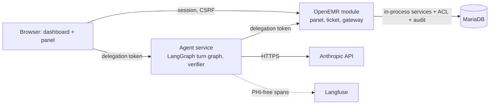
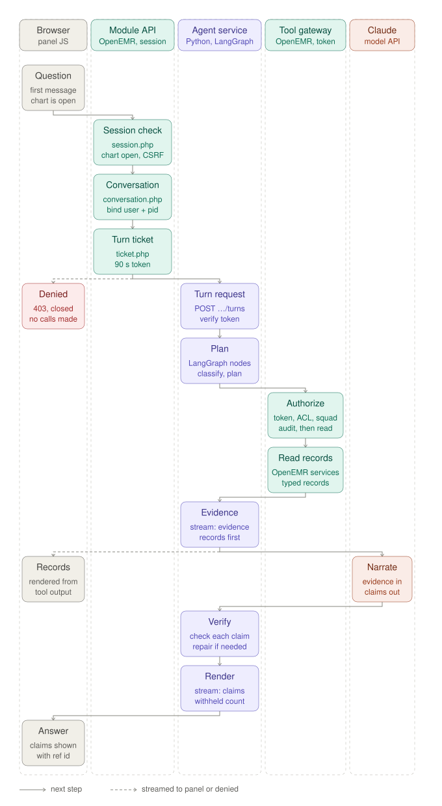

# AgentForge Clinical Co-Pilot

Evaluator README for the challenge submission. System of record:
<https://labs.gauntletai.com/andrebatista/andrebatista-openemr-base-clean>
(branch `main`). OpenEMR's own README is `README.md`; this file covers only
the co-pilot.

## What it is

A read-only pre-visit co-pilot embedded in the OpenEMR patient dashboard. It
answers three questions about the open chart for a primary-care physician
with about 90 seconds before the next visit. Every statement cites a chart
record that opens in place, and a deterministic verifier checks each
statement against the records retrieved in that turn before anything is
displayed. It never diagnoses, recommends, doses, or writes. The use cases
come from `USERS.md`:

- **UC-01** What changed since the last visit: the delta across problems,
  medications, allergies, labs, and notes since the reference encounter.
- **UC-02** Unresolved abnormal labs: flagged results with no later
  same-analyte result and no documented follow-up, stated in those words.
- **UC-03** Chart evidence for a medication: timeline plus what the chart
  documents as a reason, or an explicit "no indication documented".

## Demo video

Early-submission demo, 3–5 minutes, recorded 2026-09-16:
<https://youtu.be/oxm9xqJpiY8>. The script and the proof points it covers are in
`docs/DEMO_SCRIPT.md`.

## Live deployment

- OpenEMR: <https://openemr-137-184-4-22.sslip.io>
- Agent API: <https://openemr-137-184-4-22.sslip.io/copilot-api/> with
  `/copilot-api/health`, `/copilot-api/ready`, and `/copilot-api/metrics`
  (Prometheus text).

Log in as `challenge-admin` (administrator) or as the demo clinician
`audit-physician`. Also seeded: `audit-nurse`, `audit-frontdesk` (Front
Office, denied every clinical section), and `physician`. Passwords are
generated on the host and read only over SSH; they are never committed:

```bash
ssh deployer@137.184.4.22 cat /opt/agentforge/secrets/openemr_admin_password
ssh deployer@137.184.4.22 cat /opt/agentforge/secrets/demo_user_password
```

Open a patient from the synthetic cohort (`pubpid` `AF-*`, defined in
`evals/fixtures/cohort/README.md`). Recommended:

| Patient | pid | Why |
| --- | --- | --- |
| AF-DQ-A2 | 900001 | Happy path: four groups of changes since the visit 90 days ago, six cited items |
| AF-DQ-N | 900018 | A note says atorvastatin was stopped while the list shows it active. No deterministic note-versus-list detector exists, so naming that conflict is model recall (`CONF-NOTE-VS-LIST-N-001`, non-blocking task-success gate) and it was missed in the `a4a5856` run. The conflicts the system states deterministically come from `pack_limitations` (`agent/app/graph/nodes.py`): see AF-DQ-B, where an activity flag and an end date disagree (`CONF-STATUS-B-001`, blocking uncertainty-recall gate) |
| AF-HEAVY | 900023 | Five years, 120 results, 39 notes; bounded retrieval at volume |

The panel at the top of the dashboard offers three starter questions: "What
changed since the last visit?", "Which recent abnormal labs still have no
later result or documented follow-up?", and "What does the chart say about
why each current medication is on the list?". Follow-ups are typed in the
composer or picked from the follow-up chips under each answer (up to three,
written by the model from that turn's records and lexicon-filtered; they
assert nothing). While a turn runs the panel shows a progress line per graph
node; each answer carries its time and a `ref …` correlation id; a transcript
restored after a page reload is labeled "Earlier in this session"; a
conversation idle for 30 minutes is closed at the next ticket.

All data is synthetic; the deployment holds no real patient information. The
dev stack is not to be exposed publicly beyond this demo (`SETUP.md`, "Known
Development-Environment Risks").

## Architecture overview

Details are in `ARCHITECTURE.md` and the decision records under `docs/adr/`.
The module (`interface/modules/custom_modules/oe-module-copilot/`) injects
the panel into the dashboard, binds a conversation server-side to (site,
user, patient), and mints a 90-second HMAC delegation token per turn. The
agent service (`agent/`, Python, FastAPI, LangGraph) runs the turn graph:
authorize, classify, retrieve, narrate with Claude Sonnet 5, verify, one
repair, render. It reaches clinical data only through the module's gateway,
which re-runs the chart's own section ACL, squad, and break-glass checks for
the bound user, writes an audit row, then calls OpenEMR services in process.
The agent holds the model key and nothing else. The first UC-01 turn is a
fixed retrieval plan whose records render before any model call and survive
a model outage. Field-level absences (an allergy with no reaction or
severity, a lab result with no unit or a text value, a note with no author, a
medication with no documented indication, a corrected result) are emitted as
deterministic limitation lines cited to the record, so those states never
depend on the model's wording; when every clinical section is denied the
model is not called at all. Langfuse receives PHI-free spans on the side.

Decisions: ADR-0002 parity authorization; ADR-0003 in-process module
gateway, separate agent service, delegation token; ADR-0004 LangGraph
runtime and Sonnet 5; ADR-0005 conversation state; ADR-0006 deterministic
verification; ADR-0007 Langfuse observability.





*One question, lane by lane. The browser talks only to the session-bound
module API and to the agent; the token-bound tool gateway is reached by the
agent alone. Chart records stream to the panel before the model is called.
Dashed arrows are streamed events or a denial.*

## Repository map

| Path | Content |
| --- | --- |
| `AUDIT.md` | OpenEMR audit: security, architecture, data quality, performance, compliance; detail in `docs/audit/` |
| `USERS.md` | Target user, workflow moment, UC-01..03, capability table CAP-01..08 |
| `ARCHITECTURE.md` | Components, trust boundaries, tools, contracts, failure matrix, known limitations |
| `KEY_METRICS.md` | Success metrics, gaming defenses, release gates, the three alerts |
| `AI_COST_ANALYSIS.md` | Development cost through 2026-09-15, measured runtime cost per turn, projections at 100 / 1K / 10K / 100K users, sensitivity; the per-turn release threshold is $0.0223 (the eval gate since 2026-09-17: PASS at or under, PASS (warn) to $0.0446 with risk acceptance, FAIL above) and the daily budget is $14 warn / $42 page, derived from the 2,000,000-token halt |
| `docs/adr/` | ADR-0001 to ADR-0007 |
| `docs/api-collection/` | Bruno collection: session handshake, use-case turns, failure examples, health |
| `docs/deployment/digitalocean.md` | Deployment runbook, current deployment status, secrets handling |
| `evals/` | Eval suite: `evals/README.md` (design), `cases/` (46 YAML cases in golden, coverage, and holdout tiers), `run.py` (runner, release-gate table, scorecard), `compare.py` (A/B diff of two runs), `error_analysis.py` and `review_ui.py` (manual trace-review journal and its local browser UI), `results/` (versioned run reports), synthetic cohort seeders under `fixtures/cohort/` |
| `docs/operations/` | Alerts runbook, correlation-id walkthrough with a real turn, Langfuse dashboard notes |
| `docs/WEEK2_HANDOFF.md` | Week 2 handoff stub: read-first order, code-versus-prose seams, the `evals/compare.py` baseline, residual risks, the two deferred experiments with their eval protocol |
| `docs/diagrams/` | Chat-flow swimlane diagram (standalone SVG) embedded in this README and `ARCHITECTURE.md` |
| `.gitlab-ci.yml` | GitLab CI: four lint jobs, agent tests plus schema drift, the offline eval subset on every push; a manual `test:evals-live` job for the full suite against the deployment |
| `contracts/schema/` | JSON Schema exported from the agent's Pydantic contracts |
| `infra/` | Terraform, Compose, Caddyfile, deploy and destroy scripts, project OpenEMR image; `infra/digitalocean/runner/` is the CI runner Droplet's own Terraform root |
| `interface/modules/custom_modules/oe-module-copilot/`, `agent/` | The module (panel, ticket, gateway) and the agent service with its tests |

## Running it

Local stack, demo database, audit users, module registration, and cohort
load: `SETUP.md`.

Agent tests (`agent/README.md` documents the lock-first install in a venv:
`pip install -r requirements.lock`, `pip install --no-deps -e .`,
`pip install -c requirements.lock '.[dev]'`, then `pytest`; 96 tests):

```bash
cd agent && .venv/bin/python -m pytest -q
```

Eval suite (`evals/README.md`; every report opens with the `KEY_METRICS.md`
release-gate table, then the golden set, pass rate by category, the holdout
set, and a scorecard):

```bash
# Offline subset (what CI runs on every push); needs no deployment or key
agent/.venv/bin/python evals/run.py --offline-only

# Golden set only (14 deterministic cases, fast smoke check) against the deployment
DEMO_PASSWORD="$(ssh deployer@137.184.4.22 cat /opt/agentforge/secrets/demo_user_password)" \
  agent/.venv/bin/python evals/run.py --golden-only

# Full release run: all 46 cases including the holdout set; exit code follows the blocking gates
DEMO_PASSWORD="..." agent/.venv/bin/python evals/run.py

# Compare two runs; review an error-analysis journal in the browser (local only)
agent/.venv/bin/python evals/compare.py evals/results/<baseline>.json evals/results/<candidate>.json
agent/.venv/bin/python evals/review_ui.py   # http://127.0.0.1:8765/
```

Bruno collection against the deployment (`docs/api-collection/README.md`):

```bash
npm install -g @usebruno/cli
cd docs/api-collection && bru run --env deployed \
  --env-var DEMO_PASSWORD="$(ssh deployer@137.184.4.22 cat /opt/agentforge/secrets/demo_user_password)"
```

Schema drift check, from `agent/`:

```bash
python -m app.contracts.export --check
```

Deployment: `docs/deployment/digitalocean.md` (Terraform plus `deploy.sh`,
`push-secrets.sh`, the `demo-seed` job, `destroy.sh`). GitLab CI runs
whitespace, PHP lint, Caddy and Compose validation, the agent tests, the
schema drift check, and the offline eval subset on every push
(`.gitlab-ci.yml`), on a dedicated project runner Droplet
(`infra/digitalocean/runner/`; `docs/deployment/digitalocean.md`, "CI
Runner"). The manual `test:evals-live` job runs the full suite against the
deployment and keeps the results as a 90-day artifact; it needs the masked CI
variable `DEMO_PASSWORD`.

## Observability

Langfuse Cloud, US host (`us.cloud.langfuse.com` in `agent/app/settings.py`),
receives one trace per turn through the LangGraph callback handler. A
client-side mask replaces every input and output payload with a digest
(type, size, key names), so no prompt, record text, or identifier leaves the
agent (ADR-0007, `agent/app/telemetry.py`). Each gateway call is a
tool-type observation nested under the turn's trace, next to the generation
spans with token counts and cost.

One correlation ID is minted per conversation and extended per turn. The
panel shows it as "ref …" under each answer. The module writes it into the
OpenEMR `log` table events `copilot-session-start`, `copilot-tool-read`,
`copilot-denied`, and `copilot-session-end`
(`oe-module-copilot/src/Gateway/Audit.php`, `public/api/conversation.php`),
and the agent's structured JSON logs carry the same ID.
`/copilot-api/metrics` exposes `copilot_requests_total`,
`copilot_turns_total`, `copilot_denials_total`, `copilot_tool_calls_total`,
`copilot_verifier_rejections_total`, `copilot_tokens_total`, in-flight
turns, and 5-minute p50/p95/p99 turn latency (`agent/app/metrics.py`). The
three PRD runtime alerts are evaluated over that endpoint by
`agent/app/alerts.py` (`alerts_cli.py`, one-shot or `--interval`); thresholds
and responses are in `KEY_METRICS.md` and `docs/operations/alerts.md`.

## Limitations

- **Isolation equals the chart.** OpenEMR authorizes by role and section,
  never by patient, so any clinical role can summarize any chart it could
  open (ADR-0002 §4). The co-pilot adds no care-relationship rule; it works
  on one patient per conversation, has no patient lookup, and audits every
  read.
- **A fail-open helper was found and closed.** The first live role test
  (2026-09-15) showed `AclMain::aclCheckIssue()` returns true for every user
  outside a page context, granting Front Office problems and allergies
  through the gateway. The gateway now reads `issue_types.aco_spec` directly
  and fails closed on a missing spec; the Bruno Front Office turn asserts
  every clinical section is unavailable (ADR-0002, Verification).
- **The verifier checks facts, not sentences** (ADR-0006). Two verified
  claims can be juxtaposed misleadingly; note matching is by string, so
  paraphrase is missed both ways. The advice and inference lexicon is a
  pattern list (`FORBIDDEN` in `agent/app/verifier.py`); it was widened on
  2026-09-16 to paraphrases such as "it would be wise to" and "points
  toward", and the eval scorecard tracks a non-blocking hedge-language
  near-miss rate as a drift canary.
- **Summary paragraph gate.** The model's prose summary is shown only when
  no claim was withheld, it passes the lexicon, and every number in it
  appears in a verified claim; otherwise a count-only summary is shown and
  labeled `summary_basis=deterministic`.
- **Week-1 scope refusals.** No general medical knowledge (no guideline
  source yet), no other patients, no schedule access, no diagnosis, dosing,
  interaction, or discontinuation advice, no writes.
- **No SMART on FHIR.** Integration is bespoke to OpenEMR (ADR-0003); the
  authorization adapter is shaped so a SMART token could feed it later.
- **Deployment.** A single Droplet on a disposable `sslip.io` hostname; one
  failure domain; no scheduled backups (a one-off DO snapshot exists from
  2026-09-18, and `backup.sh`/`restore.sh` are proven end-to-end via the M4
  rehearsal, but nothing runs on a recurring schedule); egress from the
  agent is not restricted to the model and tracer endpoints (risk accepted
  for Week 1, `AUDIT.md` §9).
- From `ARCHITECTURE.md`, "Known Limitations": notes cover the Clinical Notes
  encounter form only (`ClinicalNotesTool` reads `ClinicalNotesService`; no
  SOAP or other encounter form is retrieved); codes and titles are used as written, no terminology
  mapping; labs are proven on seeded rows, not real HL7 feeds; reference
  resolution can pick the wrong candidate and is shown as an interpretation;
  a patient switch within a ticket's 90 seconds completes the in-flight turn
  and denies the next; turns measured at 24 to 27 seconds against an
  8-second design goal (eval runs on 2026-09-16 put model-backed p95 between
  23 and 28 s, `evals/results/`); agent-level token denials leave no OpenEMR
  audit row (counted in `/metrics` only).

## Status as of 2026-09-16

| Item | Status |
| --- | --- |
| Bruno collection against the deployment as `audit-physician` | 21/21 requests passing (2026-09-16) |
| Agent unit tests (`agent/tests/`) | 96 passed (2026-09-17, `pytest -q`) |
| UC-01 turn, follow-up with tool chaining, Langfuse traces | Verified live |
| Eval cases and results (`evals/cases/`, `evals/results/`) | 46 cases (14 golden, 4 holdout; `ISO-FRESH-REPEAT-001` added 2026-09-17, not yet run); eleven reports in `evals/results/`. Latest full run `evals/results/2026-09-17T024919Z-a4a5856.md` (2026-09-17): 45 ran, 44 passed, every blocking gate PASS, Golden set integrity 14/14 for the first time, citations 177/177, model-backed p95 24.1 s, $0.0127 per model-backed turn. The one miss, `CONF-NOTE-VS-LIST-N-001`, is a model-recall check under the non-blocking task-success gate, which still reported PASS at 95%. Two recall checks flip run to run: `MISS-AUTHOR-J-001` (missed at `1ddf824` and `69560f05`) and `CONF-NOTE-VS-LIST-N-001` (missed at `a4a5856`). History: 44/44 at `a7641e9` and 114/116 over a same-commit `--repeat 3` at `1ddf824` (citations 528/528) |
| GitLab CI | Green on the dedicated runner (lints, agent tests, offline evals); manual `test:evals-live` job ran 44/44 against the deployment (`docs/SUBMISSION_CHECKLIST.md`) |
| Load tests at 10 and 50 concurrent users | **Done 2026-09-18.** Both levels contradict the 30 s p95 threshold (45.0 s at 10 users); a `--fault model` control isolated the cause to OpenEMR/MariaDB CPU, not the agent (`docs/audit/evidence/performance/load-test-2026-09-18.md`) |
| Agent-side perf fix (pooled HTTP client, checkpointer WAL mode) | **Done 2026-09-18.** Re-ran the load test: turn p95 at 50 users down 30-45%, 4.5x more tool calls succeeded; OpenEMR/database CPU and chart-open latency unchanged (the concurrent-user ceiling did not move, by design — OpenEMR tuning is out of scope) (`docs/audit/evidence/performance/agent-perf-fix-2026-09-18.md`) |
| Cost measurements and scale projections (`AI_COST_ANALYSIS.md`) | Measured per-turn cost and projections written; per-tier scaling levers now grounded in the load test above |
| Backup and rollback rehearsal | **Done 2026-09-18.** Full clean-deploy/rollback/roll-forward/restore/destroy cycle against a throwaway Droplet, all 7 timed steps passed (`docs/deployment/digitalocean.md` Rehearsal Runbook) |
| Agent egress restriction | **Decided, not built.** Accepted the residual risk for Week 1 (2026-09-18); deferred to Week 2 (`AUDIT.md` §9, `docs/WEEK2_HANDOFF.md`) |
| Owned hostname | Pending |
