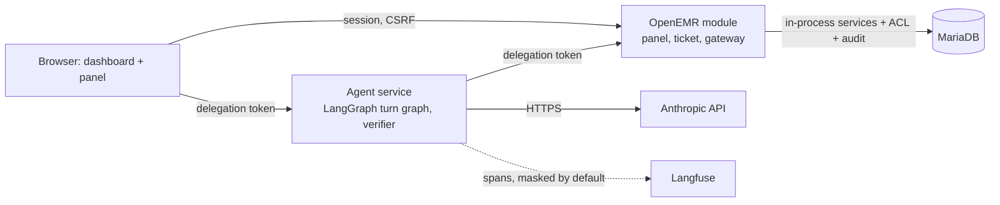

# AgentForge Clinical Co-Pilot

Evaluator README for the challenge submission. System of record:
<https://labs.gauntletai.com/andrebatista/andrebatista-openemr-base-clean>
(branch `main`). OpenEMR's own README is `README.md`; this file covers only
the co-pilot.

## What it is

A read-only pre-visit co-pilot embedded in the OpenEMR patient dashboard. It
answers three questions about the open chart for a primary-care physician
with about 90 seconds before the next visit. Every statement cites a chart
record that opens in place, and a deterministic verifier checks each
statement against the records retrieved in that turn before anything is
displayed. It never diagnoses, recommends, doses, or writes. The use cases
come from `USERS.md`:

- **UC-01** What changed since the last visit: the delta across problems,
  medications, allergies, labs, and notes since the reference encounter.
- **UC-02** Unresolved abnormal labs: flagged results with no later
  same-analyte result and no documented follow-up, stated in those words.
- **UC-03** Chart evidence for a medication: timeline plus what the chart
  documents as a reason, or an explicit "no indication documented".

## Demo video

Early-submission demo, 3–5 minutes, recorded 2026-09-16:
<https://youtu.be/oxm9xqJpiY8>. The script and the proof points it covers are in
`docs/DEMO_SCRIPT.md`.

## Live deployment

- OpenEMR: <https://openemr-137-184-4-22.sslip.io>
- Agent API: <https://openemr-137-184-4-22.sslip.io/copilot-api/> with
  `/copilot-api/health`, `/copilot-api/ready`, and `/copilot-api/metrics`
  (Prometheus text).
- Running: the runtime tree of commit `478f432` (2026-09-20; verification
  runs and image digests are in `README.md`). The agent reports `0.3.0` on
  `/copilot-api/health` and `/copilot-api/ready`; the module is `0.5.0`
  (`Bootstrap::VERSION`, returned as `module_version` by its `session.php`).

Log in as `challenge-admin` (administrator) or as the demo clinician
`audit-physician`. Also seeded: `audit-nurse`, `audit-frontdesk` (Front
Office, denied every clinical section), and `physician`. Passwords are
generated on the host and read only over SSH; they are never committed:

```bash
ssh deployer@137.184.4.22 cat /opt/agentforge/secrets/openemr_admin_password
ssh deployer@137.184.4.22 cat /opt/agentforge/secrets/demo_user_password
```

Open a patient from the synthetic cohort (`pubpid` `AF-*`, defined in
`evals/fixtures/cohort/README.md`). Recommended:

| Patient | pid | Why |
| --- | --- | --- |
| AF-DQ-A2 | 900001 | Happy path: four groups of changes since the visit 90 days ago, six cited items |
| AF-DQ-N | 900018 | A note says atorvastatin was stopped while the list shows it active. No deterministic note-versus-list detector exists, so naming that conflict is model recall (`CONF-NOTE-VS-LIST-N-001`, non-blocking task-success gate) and it was missed in the `a4a5856` run (2026-09-17); the case passed all three attempts of the `0f11642` release run. The conflicts the system states deterministically come from `pack_limitations` (`agent/app/graph/nodes.py`): see AF-DQ-B, where an activity flag and an end date disagree (`CONF-STATUS-B-001`, blocking uncertainty-recall gate) |
| AF-HEAVY | 900023 | Five years, 120 results, 39 notes; bounded retrieval at volume |

The panel at the top of the dashboard prepares the pre-visit brief ("What
changed since the last visit?") as the chart loads, so it is waiting rather
than typed for: a first turn measured p50 9.2 s when this was decided (9.7 s
in the release run) and the moment it serves is 90 seconds long (module
0.5.0, `BriefPolicy`, ADR-0003 amendment). By default
(`COPILOT_BRIEF_ON_OPEN=visit_today`) it prepares one only for a patient
today's schedule shows a visit for, which is the moment it is written for;
`always` prepares one per chart open, and `off` restores
retrieve-only-when-asked. The demo deployment runs `always`. `visit_today`
does work on it — the cohort was re-seeded on 2026-09-20 with a schedule for
that UTC day, and all three walkthrough patients have a visit on it — but
`always` keeps the brief visible for anyone opening the deployment on a later
day, once that schedule has aged out. No mode prepares one for a break-glass
login or for a role denied every clinical section, so `audit-frontdesk` gets
none. The panel also offers three starter questions: that one, "Which
recent abnormal labs still have no later result or documented follow-up?",
and "What does the chart say about why each current medication is on the
list?". Follow-ups are typed in the composer or picked from the follow-up
chips under each answer (up to three, written by the model from that turn's
records and lexicon-filtered; they assert nothing). While a turn runs the
panel shows a progress line per graph node; each answer carries its time and
a `ref …` correlation id; a transcript restored after a page reload is
labeled "Earlier in this session"; a conversation idle for 30 minutes is
closed at the next ticket.

All data is synthetic; the deployment holds no real patient information. The
dev stack is not to be exposed publicly beyond this demo (`SETUP.md`, "Known
Development-Environment Risks").

## Architecture overview

Details are in `ARCHITECTURE.md` and the decision records under `docs/adr/`.
The module (`interface/modules/custom_modules/oe-module-copilot/`) injects
the panel into the dashboard, binds a conversation server-side to (site,
user, patient), mints a 90-second HMAC delegation token per turn, and
decides server-side (`BriefPolicy`) whether the panel starts the UC-01 brief
when a chart opens; that brief takes the same path as a click. The
agent service (`agent/`, Python, FastAPI, LangGraph) runs the turn graph:
authorize, classify, retrieve, narrate with Claude Sonnet 5, verify, one
repair, render. It reaches clinical data only through the module's gateway,
which re-runs the chart's own section ACL, squad, and break-glass checks for
the bound user, writes an audit row, then calls OpenEMR services in process.
The agent holds the model key and nothing else. The first UC-01 turn is a
fixed retrieval plan whose records render before any model call and survive
a model outage. Field-level absences (an allergy with no reaction or
severity, a lab result with no unit or a text value, a note with no author, a
medication with no documented indication, a corrected result) are emitted as
deterministic limitation lines cited to the record, so those states never
depend on the model's wording; when every clinical section is denied the
model is not called at all. Langfuse receives spans on the side: digests
only by code default, full exchange content on the demo deployment, which
holds synthetic patients only (Observability below).

Decisions: ADR-0002 parity authorization; ADR-0003 in-process module
gateway, separate agent service, delegation token; ADR-0004 LangGraph
runtime and Sonnet 5; ADR-0005 conversation state; ADR-0006 deterministic
verification; ADR-0007 Langfuse observability.




*One question, lane by lane. The browser talks only to the session-bound
module API and to the agent; the token-bound tool gateway is reached by the
agent alone. Chart records stream to the panel before the model is called.
Dashed arrows are streamed events or a denial.*

## Repository map

| Path | Content |
| --- | --- |
| `AUDIT.md` | OpenEMR audit: security, architecture, data quality, performance, compliance; detail in `docs/audit/` |
| `USERS.md` | Target user, workflow moment, UC-01..03, capability table CAP-01..08 |
| `ARCHITECTURE.md` | Components, trust boundaries, tools, contracts, failure matrix, known limitations |
| `KEY_METRICS.md` | Success metrics, gaming defenses, release gates, the three alerts |
| `AI_COST_ANALYSIS.md` | Development cost through 2026-09-20, measured runtime cost per turn, projections at 100 / 1K / 10K / 100K users, sensitivity; the per-turn release threshold is $0.0223 (the eval gate since 2026-09-17: PASS at or under, PASS (warn) to $0.0446 with risk acceptance, FAIL above) and the daily budget is $14 warn / $42 page, derived from the 2,000,000-token halt |
| `docs/adr/` | ADR-0001 to ADR-0007 |
| `docs/api-collection/` | Bruno collection: session handshake, use-case turns, failure examples, health |
| `docs/deployment/digitalocean.md` | Deployment runbook, current deployment status, secrets handling |
| `evals/` | Eval suite: `evals/README.md` (design), `cases/` (48 YAML cases in golden, coverage, and holdout tiers), `run.py` (runner, release-gate table, scorecard), `compare.py` (A/B diff of two runs), `error_analysis.py` and `review_ui.py` (manual trace-review journal and its local browser UI), `brief_latency.py` (physician-wait measurement for the brief on chart open), `prompt_ab.py` (fixture A/B of a prompt or setting with the real model, no stack), `load/` (load-test driver), `results/` (versioned run reports), synthetic cohort seeders under `fixtures/cohort/` |
| `docs/operations/` | Alerts runbook, correlation-id walkthrough with a real turn, Langfuse dashboard notes, usage-funnel counters |
| `docs/WEEK2_HANDOFF.md` | Week 2 handoff stub: read-first order, code-versus-prose seams, the `evals/compare.py` baseline, residual risks, the two deferred experiments with their eval protocol |
| `docs/diagrams/` | Chat-flow swimlane diagram (standalone SVG) embedded in this README and `ARCHITECTURE.md` |
| `.gitlab-ci.yml` | GitLab CI: four lint jobs, agent tests plus schema drift, the offline eval subset on every push; `verify:smoke` on every push to `main`, `deploy:production` to the Droplet manual since 2026-09-20 (automatic 2026-09-17 to 2026-09-20); a manual `test:evals-live` job for the full suite against the deployment |
| `contracts/schema/` | JSON Schema exported from the agent's Pydantic contracts |
| `infra/` | Terraform, Compose, Caddyfile, deploy and destroy scripts, project OpenEMR image; `infra/digitalocean/runner/` is the CI runner Droplet's own Terraform root |
| `interface/modules/custom_modules/oe-module-copilot/`, `agent/` | The module (panel, ticket, gateway) and the agent service with its tests |

## Running it

Local stack, demo database, audit users, module registration, and cohort
load: `SETUP.md`.

Agent tests (`agent/README.md` documents the lock-first install in a venv:
`pip install -r requirements.lock`, `pip install --no-deps -e .`,
`pip install -c requirements.lock '.[dev]'`, then `pytest`; 145 tests):

```bash
cd agent && .venv/bin/python -m pytest -q
```

Eval suite (`evals/README.md`; every report opens with the `KEY_METRICS.md`
release-gate table, then the golden set, pass rate by category, the holdout
set, and a scorecard):

```bash
# Offline subset (what CI runs on every push); needs no deployment or key
agent/.venv/bin/python evals/run.py --offline-only

# Golden set only (15 deterministic cases, fast smoke check) against the deployment
DEMO_PASSWORD="$(ssh deployer@137.184.4.22 cat /opt/agentforge/secrets/demo_user_password)" \
  agent/.venv/bin/python evals/run.py --golden-only

# Full release run: all 48 cases including the holdout set; exit code follows the blocking gates
DEMO_PASSWORD="..." agent/.venv/bin/python evals/run.py

# Compare two runs; review an error-analysis journal in the browser (local only)
agent/.venv/bin/python evals/compare.py evals/results/<baseline>.json evals/results/<candidate>.json
agent/.venv/bin/python evals/review_ui.py   # http://127.0.0.1:8765/
```

Bruno collection against the deployment (`docs/api-collection/README.md`):

```bash
npm install -g @usebruno/cli
cd docs/api-collection && bru run --env deployed \
  --env-var DEMO_PASSWORD="$(ssh deployer@137.184.4.22 cat /opt/agentforge/secrets/demo_user_password)"
```

Schema drift check, from `agent/`:

```bash
python -m app.contracts.export --check
```

Deployment: `docs/deployment/digitalocean.md` (Terraform plus `deploy.sh`,
`push-secrets.sh`, the `demo-seed` job, `destroy.sh`). GitLab CI runs
whitespace, PHP lint, Caddy and Compose validation, the agent tests, the
schema drift check, and the offline eval subset on every push
(`.gitlab-ci.yml`), on a dedicated project runner Droplet
(`infra/digitalocean/runner/`; `docs/deployment/digitalocean.md`, "CI
Runner"). `deploy:production` deploys a commit to the Droplet with
`deploy.sh`, then `verify:smoke` checks it; the job ran automatically on
every push to `main` from 2026-09-17 to 2026-09-20 and is manual since, so a
push no longer redeploys by itself. The
manual `test:evals-live` job runs the full suite against the deployment and
keeps the results as a 90-day artifact; it needs the masked CI variable
`DEMO_PASSWORD`.

## Observability

Langfuse Cloud, US host (`us.cloud.langfuse.com` in `agent/app/settings.py`),
receives one trace per turn through the LangGraph callback handler. By code
default (`COPILOT_TRACE_CONTENT` off) a client-side mask replaces every input
and output payload with a digest (type, size, key names), so no prompt,
record text, or identifier leaves the agent, and an exception is reported by
class name only (ADR-0007, `agent/app/telemetry.py`). The demo deployment
sets `COPILOT_TRACE_CONTENT=1` (`infra/digitalocean/runtime/compose.yaml`):
the mask is not installed, and each generation carries its prompt, evidence
pack, and raw output, and each turn its question, rendered answer, and
accepted and rejected claims, so that error analysis can read them. ADR-0007's
2026-09-19 amendment permits that mode only where the tracer is inside the
compliance boundary and states it as an assumption for the hosted project
used here; the deployment holds synthetic patients only, and
`COPILOT_TRACE_CONTENT=0` restores the mask. Each gateway call is a tool-type
observation nested under the turn's trace, next to the generation spans with
token counts and cost.

One correlation ID is minted per conversation and extended per turn. The
panel shows it as "ref …" under each answer. The module writes it into the
OpenEMR `log` table events `copilot-session-start`, `copilot-tool-read`,
`copilot-model-disclosure`, `copilot-denied`, and `copilot-session-end`
(`oe-module-copilot/src/Gateway/Audit.php`, `public/api/conversation.php`),
and the agent's structured JSON logs carry the same ID.
`/copilot-api/metrics` exposes `copilot_requests_total`,
`copilot_turns_total`, `copilot_denials_total`, `copilot_tool_calls_total`,
`copilot_verifier_rejections_total`, `copilot_verification_total`,
`copilot_tokens_total`, in-flight turns, 5-minute p50/p95/p99 turn latency,
and the usage-funnel counters `copilot_panel_events_total` (`chart_open`,
`brief_started`, `drawer_open`) and `copilot_conversation_first_turn_total`
(`agent/app/metrics.py`, `docs/operations/usage-funnel.md`). The three PRD
runtime alerts are evaluated over that endpoint by `agent/app/alerts.py`
(`alerts_cli.py`, one-shot or `--interval`); thresholds and responses are in
`KEY_METRICS.md` and `docs/operations/alerts.md`. On the deployment the
`alerts` Compose service evaluates them every 300 s and posts `warn` and
`page` alerts to Slack through an incoming webhook held as a Docker file
secret (`--webhook-file /run/secrets/slack_alert_webhook`), never on the
command line. Delivery was proven on 2026-09-20 with five fault-injected
turns that paged twice in the channel
(`docs/audit/evidence/observability/alerts-slack-2026-09-20.log`).

## Limitations

- **Isolation equals the chart.** OpenEMR authorizes by role and section,
  never by patient, so any clinical role can summarize any chart it could
  open (ADR-0002 §4). The co-pilot adds no care-relationship rule; it works
  on one patient per conversation, has no patient lookup, and audits every
  read.
- **A fail-open helper was found and closed.** The first live role test
  (2026-09-15) showed `AclMain::aclCheckIssue()` returns true for every user
  outside a page context, granting Front Office problems and allergies
  through the gateway. The gateway now reads `issue_types.aco_spec` directly
  and fails closed on a missing spec; the Bruno Front Office turn asserts
  every clinical section is unavailable (ADR-0002, Verification).
- **The verifier checks facts, not sentences** (ADR-0006). Two verified
  claims can be juxtaposed misleadingly; note matching is by string, so
  paraphrase is missed both ways. The advice and inference lexicon is a
  pattern list (`FORBIDDEN` in `agent/app/verifier.py`); it was widened on
  2026-09-16 to paraphrases such as "it would be wise to" and "points
  toward", and the eval scorecard tracks a non-blocking hedge-language
  near-miss rate as a drift canary.
- **Summary paragraph gate.** The model's prose summary is shown only when
  no claim was withheld, it passes the lexicon, and every date and number in
  it appears in a verified claim; otherwise the first verified claims are
  restated word for word and labeled `summary_basis=deterministic`.
- **Week-1 scope refusals.** No general medical knowledge (no guideline
  source yet), no other patients, no schedule tool (the module's
  `visit_today` check asks only whether the open chart has a visit today), no
  diagnosis, dosing, interaction, or discontinuation advice, no writes.
- **No SMART on FHIR.** Integration is bespoke to OpenEMR (ADR-0003); the
  authorization adapter is shaped so a SMART token could feed it later.
- **Deployment.** A single Droplet on a disposable `sslip.io` hostname; one
  failure domain; no scheduled backups (one-off DO snapshots exist from
  2026-09-18 and 2026-09-20, the later one taken before the `478f432`
  redeploy, and `backup.sh`/`restore.sh` are proven end-to-end via the M4
  rehearsal, but nothing runs on a recurring schedule); egress from the
  agent is not restricted to the model and tracer endpoints (risk accepted
  for Week 1, `AUDIT.md` §9).
- **Demo-host settings that are not the code defaults.** The Droplet's
  Compose file sets `COPILOT_BRIEF_ON_OPEN=always` (code default
  `visit_today`), `COPILOT_TRACE_CONTENT=1` (code default off, see
  Observability), and `COPILOT_FAULT_INJECTION=1` (code default off; the
  Bruno failure examples and the alert proof depend on it). A fault-injected
  tool call counts toward the tool-failure alert, so an eval run against this
  host can page.
- **Brief on chart open spends before anyone asks.** A brief nobody reads
  still costs a model-backed turn (about $0.011 at the suite's average; a
  brief-specific cost is not measured) and writes its `copilot-tool-read`
  and `copilot-model-disclosure` audit rows. The funnel counters
  `brief_started` against `drawer_open` are the measure, and no real-session
  numbers exist yet. A brief read minutes after it was prepared is stale and
  carries its own timestamp; a reload inside the brief's 10-25 s window can
  pay for a second one, which a 60-second per-tab guard narrows but does not
  close; a restored transcript shows the brief as a question the physician
  never typed (ADR-0003 amendment,
  `docs/audit/evidence/performance/brief-on-open-2026-09-20.md`).
- **Every container runs UTC.** `visit_today` takes "today" from PHP's day,
  which on UTC rolls over in the middle of the afternoon for a site in the
  Americas. Setting the clinic timezone on some containers only was tried on
  2026-09-19, put two clocks in one `datetime` column, broke conversation
  resume, and was reverted the same night (`c37b9e6`); conversations were
  truncated and the cohort re-seeded, and roughly three hours of OpenEMR
  audit rows stamped about seven hours early were kept rather than deleted.
  A real clinic needs `TZ` on every container that writes a date plus a
  migration of existing rows (`docs/deployment/digitalocean.md`, "Clocks").
- From `ARCHITECTURE.md`, "Known Limitations": notes cover the Clinical Notes
  encounter form only (`ClinicalNotesTool` reads `ClinicalNotesService`; no
  SOAP or other encounter form is retrieved); codes and titles are used as written, no terminology
  mapping; labs are proven on seeded rows, not real HL7 feeds; reference
  resolution can pick the wrong candidate and is shown as an interpretation;
  a patient switch within a ticket's 90 seconds completes the in-flight turn
  and denies the next; turn latency is still above the 8-second design goal
  (model-backed p50 8.2 s and p95 15.8 s in the release run, p95 20.0 s in
  the pass at the deployed tree; eval runs on 2026-09-16 put p95 between 23
  and 28 s, `evals/results/`); agent-level token denials leave no OpenEMR
  audit row (counted in `/metrics` only).

## Status as of 2026-09-20

| Item | Status |
| --- | --- |
| Bruno collection against the deployment as `audit-physician` | 21/21 requests passing (2026-09-16). The collection has had 22 requests since 2026-09-19 (`1 Session/06 Brief on chart open.bru`); no run that includes the 22nd is recorded |
| Agent unit tests (`agent/tests/`) | 145 passed (2026-09-20, `pytest -q`) |
| UC-01 turn, follow-up with tool chaining, Langfuse traces | Verified live |
| Eval cases and results (`evals/cases/`, `evals/results/`) | 48 cases (15 golden, 4 holdout, the rest behavioral coverage). Latest full run `evals/results/2026-09-20T064022Z-4d2a9fd.md` (2026-09-20, one attempt per case at the deployed runtime tree): 48 of 48 passed, every blocking gate PASS, golden 15/15, holdout 4/4, citations 206/206, model-backed p95 20.0 s, $0.0113 per turn, no 5xx. Release run `evals/results/2026-09-20T051146Z-0f11642.md` (2026-09-20, three attempts per case while `c37b9e6` was deployed; four runtime commits were deployed after it, listed in `README.md`): 123 of 124 attempts passed, every blocking gate PASS, golden 29/29 attempts, citations 615/615, model-backed p95 15.8 s, $0.0104 per turn, no 5xx. The one miss, `CONF-DUP-NAMES-C2-001`, is a holdout hedging flip that passed the other two attempts. Against the early-submission baseline (`…-0f11642-vs-a4a5856.md`): p95 24.1 s to 15.8 s, task success 95% to 100%, cost $0.0127 to $0.0104. History: `2026-09-20T041411Z-6c787bd.md` is the run that caught the timezone regression three times of three, and `2026-09-17T024919Z-a4a5856.md` is the early-submission baseline (44/45). |
| GitLab CI | Green on the dedicated runner. Pipeline 24351 on `4985e52d` (ref `week1-final`, 2026-09-20): all seven jobs green — four lints, agent tests, offline evals, and the manual `test:evals-live` job 79057, the full live suite against the deployment in 761 s, during which no runtime alert fired (`docs/SUBMISSION_CHECKLIST.md`). Its report is a CI artifact, not a file under `evals/results/`. The tag `week1-final` now sits one docs-only commit later, at `ebaae17`. Earlier: the same job ran 44/44 on 2026-09-16 |
| Load tests at 10 and 50 concurrent users | **Done 2026-09-18.** Both levels contradict the 30 s p95 threshold (45.0 s at 10 users); a `--fault model` control isolated the cause to OpenEMR/MariaDB CPU, not the agent (`docs/audit/evidence/performance/load-test-2026-09-18.md`) |
| Agent-side perf fix (pooled HTTP client, checkpointer WAL mode) | **Done 2026-09-18.** Re-ran the load test: turn p95 at 50 users down 30-45%, 4.5x more tool calls succeeded; OpenEMR/database CPU and chart-open latency unchanged (the concurrent-user ceiling did not move, by design — OpenEMR tuning is out of scope) (`docs/audit/evidence/performance/agent-perf-fix-2026-09-18.md`) |
| Uncontended per-turn latency (`max_plan_rounds` 3 -> 1) | **Done 2026-09-18.** Model-backed p95 27.5 s -> 18.0 s (-35%), follow-up p95 -57%, cost/turn -23%, 46/46 eval cases (up from 45/46), no quality regression. A separate attempt to route `plan` to Haiku 4.5 was not adopted — cost went up 16.5% (prompt-cache fragmentation across models) and it introduced a real recall miss (`docs/audit/evidence/performance/model-experiments-2026-09-18.md`) |
| Batched tool gateway (one request per retrieval batch, `b40d456`) | **Done 2026-09-19.** On a rehearsal Droplet at 10 users: chart-open p95 12.3 s -> 5.6 s, turn p95 27.8 s -> 24.8 s, 100% of turns complete, 0 of 80 tool calls unavailable. The ceiling is still OpenEMR and MariaDB CPU: at 15 users 37% of tool calls were unavailable (`docs/audit/evidence/performance/batched-gateway-2026-09-19.md`) |
| Follow-up latency and summary quality (2026-09-19) | **Done.** Narrate output cap 1,800 -> 3,200 tokens; the plan call is skipped when the question is one of the agent's own fixed questions (`KNOWN_PLANS`; a model-written chip still goes through plan, and the saving is not yet measured live); follow-ups run at `low` effort: live suite follow-up p50 8.1 s -> 7.2 s, p95 12.3 s -> 11.9 s, cost per turn $0.0116 -> $0.0111, 48/48 (`docs/audit/evidence/performance/followup-effort-2026-09-19.md`, `known-plans-2026-09-19.md`). Summary gate matches dates and numbers structurally and the fallback restates verified claims (ADR-0006 amendment); physician-facing summary prompt (`docs/audit/evidence/quality/narrative-quality-2026-09-19.md`) |
| Brief on chart open (module 0.5.0, `BriefPolicy`) | **Done 2026-09-19.** Code default `visit_today`; the demo Droplet runs `always`. Physician wait measured on the deployment over 12 briefs on four charts (`evals/brief_latency.py`): the brief is ready p50 13.4 s, p95 17.5 s after the chart opens, so opening the drawer 10 s in leaves a wait of p50 3.4 s, p95 7.5 s, against 12.7 s and 16.9 s when the turn starts at the click. The reading lag is a parameter, not an observation, and this is not a gate (`docs/audit/evidence/performance/brief-latency-2026-09-19.md`) |
| Model-disclosure audit rows | **Done 2026-09-19.** The module writes a `copilot-model-disclosure` row (provider, model id, tool names, record count, never content) before returning records that will go to the model, one per retrieval batch, and answers every tool in the batch `unavailable` if the row cannot be written; that branch has not been exercised live (`docs/audit/evidence/compliance/04-model-disclosure-rows-2026-09-19.md`) |
| Runtime alert delivery to Slack | **Done 2026-09-20.** Five fault-injected turns paged twice in the channel. Proving it found two defects, both fixed and regression-tested: since the batched-gateway change `copilot_tool_calls_total` had not counted fault-injected or invalid-parameter tool failures, so the tool-failure alert could not see them (`dbf5372`), and Slack rejected a payload without `text` (`0471178`) (`docs/audit/evidence/observability/alerts-slack-2026-09-20.log`, `docs/operations/alerts.md`) |
| Cost measurements and scale projections (`AI_COST_ANALYSIS.md`) | Measured per-turn cost and projections written; per-tier scaling levers now grounded in the load test above |
| Backup and rollback rehearsal | **Done 2026-09-18.** Full clean-deploy/rollback/roll-forward/restore/destroy cycle against a throwaway Droplet, all 7 timed steps passed (`docs/deployment/digitalocean.md` Rehearsal Runbook) |
| Agent egress restriction | **Decided, not built.** Accepted the residual risk for Week 1 (2026-09-18); deferred to Week 2 (`AUDIT.md` §9, `docs/WEEK2_HANDOFF.md`) |
| Owned hostname | Not done for Week 1; the deployment stays on the disposable `sslip.io` hostname (`docs/deployment/digitalocean.md`) |
