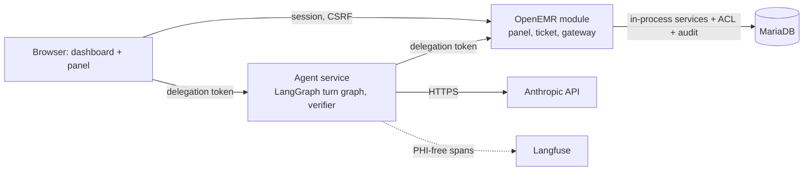

# AgentForge Clinical Co-Pilot

Evaluator README for the challenge submission. System of record:
<https://labs.gauntletai.com/andrebatista/andrebatista-openemr-base-clean>
(branch `main`). OpenEMR's own README is `README.md`; this file covers only
the co-pilot.

## What it is

A read-only pre-visit co-pilot embedded in the OpenEMR patient dashboard. It
answers three questions about the open chart for a primary-care physician
with about 90 seconds before the next visit. Every statement cites a chart
record that opens in place, and a deterministic verifier checks each
statement against the records retrieved in that turn before anything is
displayed. It never diagnoses, recommends, doses, or writes. The use cases
come from `USERS.md`:

- **UC-01** What changed since the last visit: the delta across problems,
  medications, allergies, labs, and notes since the reference encounter.
- **UC-02** Unresolved abnormal labs: flagged results with no later
  same-analyte result and no documented follow-up, stated in those words.
- **UC-03** Chart evidence for a medication: timeline plus what the chart
  documents as a reason, or an explicit "no indication documented".

## Live deployment

- OpenEMR: <https://openemr-137-184-4-22.sslip.io>
- Agent API: <https://openemr-137-184-4-22.sslip.io/copilot-api/> with
  `/copilot-api/health`, `/copilot-api/ready`, and `/copilot-api/metrics`
  (Prometheus text).

Log in as `challenge-admin` (administrator) or as the demo clinician
`audit-physician`. Also seeded: `audit-nurse`, `audit-frontdesk` (Front
Office, denied every clinical section), and `physician`. Passwords are
generated on the host and read only over SSH; they are never committed:

```bash
ssh deployer@137.184.4.22 cat /opt/agentforge/secrets/openemr_admin_password
ssh deployer@137.184.4.22 cat /opt/agentforge/secrets/demo_user_password
```

Open a patient from the synthetic cohort (`pubpid` `AF-*`, defined in
`evals/fixtures/cohort/README.md`). Recommended:

| Patient | pid | Why |
| --- | --- | --- |
| AF-DQ-A2 | 900001 | Happy path: four groups of changes since the visit 90 days ago, six cited items |
| AF-DQ-N | 900018 | A note says atorvastatin was stopped while the list shows it active; the answer cites both |
| AF-HEAVY | 900023 | Five years, 120 results, 39 notes; bounded retrieval at volume |

The panel at the top of the dashboard offers three starter questions: "What
changed since the last visit?", "Which recent abnormal labs still have no
later result or documented follow-up?", and "What does the chart say about
why each current medication is on the list?". Follow-ups are typed in the
composer.

All data is synthetic; the deployment holds no real patient information. The
dev stack is not to be exposed publicly beyond this demo (`SETUP.md`, "Known
Development-Environment Risks").

## Architecture overview

Details are in `ARCHITECTURE.md` and the decision records under `docs/adr/`.
The module (`interface/modules/custom_modules/oe-module-copilot/`) injects
the panel into the dashboard, binds a conversation server-side to (site,
user, patient), and mints a 90-second HMAC delegation token per turn. The
agent service (`agent/`, Python, FastAPI, LangGraph) runs the turn graph:
authorize, classify, retrieve, narrate with Claude Sonnet 5, verify, one
repair, render. It reaches clinical data only through the module's gateway,
which re-runs the chart's own section ACL, squad, and break-glass checks for
the bound user, writes an audit row, then calls OpenEMR services in process.
The agent holds the model key and nothing else. The first UC-01 turn is a
fixed retrieval plan whose records render before any model call and survive
a model outage. Langfuse receives PHI-free spans on the side.

Decisions: ADR-0002 parity authorization; ADR-0003 in-process module
gateway, separate agent service, delegation token; ADR-0004 LangGraph
runtime and Sonnet 5; ADR-0005 conversation state; ADR-0006 deterministic
verification; ADR-0007 Langfuse observability.



## Repository map

| Path | Content |
| --- | --- |
| `AUDIT.md` | OpenEMR audit: security, architecture, data quality, performance, compliance; detail in `docs/audit/` |
| `USERS.md` | Target user, workflow moment, UC-01..03, capability table CAP-01..08 |
| `ARCHITECTURE.md` | Components, trust boundaries, tools, contracts, failure matrix, known limitations |
| `KEY_METRICS.md` | Success metrics, gaming defenses, release gates, the three alerts |
| `AI_COST_ANALYSIS.md` | Cost analysis; measurements and projections are still TODO |
| `docs/adr/` | ADR-0001 to ADR-0007 |
| `docs/api-collection/` | Bruno collection: session handshake, use-case turns, failure examples, health |
| `docs/deployment/digitalocean.md` | Deployment runbook, current deployment status, secrets handling |
| `evals/` | Eval design (`evals/README.md`) and the synthetic cohort seeders under `evals/fixtures/cohort/` |
| `contracts/schema/` | JSON Schema exported from the agent's Pydantic contracts |
| `infra/` | Terraform, Compose, Caddyfile, deploy and destroy scripts, project OpenEMR image |
| `interface/modules/custom_modules/oe-module-copilot/`, `agent/` | The module (panel, ticket, gateway) and the agent service with its tests |

## Running it

Local stack, demo database, audit users, module registration, and cohort
load: `SETUP.md`.

Agent tests (`agent/README.md` documents `pip install -e '.[dev]'` in a
venv, then `pytest`):

```bash
cd agent && .venv/bin/python -m pytest -q
```

Bruno collection against the deployment (`docs/api-collection/README.md`):

```bash
npm install -g @usebruno/cli
cd docs/api-collection && bru run --env deployed \
  --env-var DEMO_PASSWORD="$(ssh deployer@137.184.4.22 cat /opt/agentforge/secrets/demo_user_password)"
```

Schema drift check, from `agent/`:

```bash
python -m app.contracts.export --check
```

Deployment: `docs/deployment/digitalocean.md` (Terraform plus `deploy.sh`,
`push-secrets.sh`, the `demo-seed` job, `destroy.sh`). GitLab CI runs
whitespace, PHP lint, Caddy and Compose validation, the agent tests, the
schema drift check, and the offline eval subset (`.gitlab-ci.yml`).

## Observability

Langfuse Cloud, US host (`us.cloud.langfuse.com` in `agent/app/settings.py`),
receives one trace per turn through the LangGraph callback handler. A
client-side mask replaces every input and output payload with a digest
(type, size, key names), so no prompt, record text, or identifier leaves the
agent (ADR-0007, `agent/app/telemetry.py`).

One correlation ID is minted per conversation and extended per turn. The
panel shows it as "ref …" under each answer. The module writes it into the
OpenEMR `log` table events `copilot-session-start`, `copilot-tool-read`,
`copilot-denied`, and `copilot-session-end`
(`oe-module-copilot/src/Gateway/Audit.php`, `public/api/conversation.php`),
and the agent's structured JSON logs carry the same ID.
`/copilot-api/metrics` exposes `copilot_requests_total`,
`copilot_turns_total`, `copilot_denials_total`, `copilot_tool_calls_total`,
`copilot_verifier_rejections_total`, `copilot_tokens_total`, in-flight
turns, and 5-minute p50/p95/p99 turn latency (`agent/app/metrics.py`).

## Limitations

- **Isolation equals the chart.** OpenEMR authorizes by role and section,
  never by patient, so any clinical role can summarize any chart it could
  open (ADR-0002 §4). The co-pilot adds no care-relationship rule; it works
  on one patient per conversation, has no patient lookup, and audits every
  read.
- **A fail-open helper was found and closed.** The first live role test
  (2026-09-15) showed `AclMain::aclCheckIssue()` returns true for every user
  outside a page context, granting Front Office problems and allergies
  through the gateway. The gateway now reads `issue_types.aco_spec` directly
  and fails closed on a missing spec; the Bruno Front Office turn asserts
  every clinical section is unavailable (ADR-0002, Verification).
- **The verifier checks facts, not sentences** (ADR-0006). Two verified
  claims can be juxtaposed misleadingly; note matching is by string, so
  paraphrase is missed both ways.
- **Summary paragraph gate.** The model's prose summary is shown only when
  no claim was withheld, it passes the lexicon, and every number in it
  appears in a verified claim; otherwise a count-only summary is shown and
  labeled `summary_basis=deterministic`.
- **Week-1 scope refusals.** No general medical knowledge (no guideline
  source yet), no other patients, no schedule access, no diagnosis, dosing,
  interaction, or discontinuation advice, no writes.
- **No SMART on FHIR.** Integration is bespoke to OpenEMR (ADR-0003); the
  authorization adapter is shaped so a SMART token could feed it later.
- **Deployment.** A single Droplet on a disposable `sslip.io` hostname; one
  failure domain; no backups; egress from the agent is not yet restricted to
  the model and tracer endpoints.
- From `ARCHITECTURE.md`, "Known Limitations": notes cover Clinical Notes
  and SOAP forms only; codes and titles are used as written, no terminology
  mapping; labs are proven on seeded rows, not real HL7 feeds; reference
  resolution can pick the wrong candidate and is shown as an interpretation;
  a patient switch within a ticket's 90 seconds completes the in-flight turn
  and denies the next; turns measured at 24 to 27 seconds against an
  8-second design goal; agent-level token denials leave no OpenEMR audit row
  (counted in `/metrics` only).

## Status as of 2026-09-15

| Item | Status |
| --- | --- |
| Bruno collection against the deployment as `audit-physician` | 21/21 requests passing |
| Agent unit tests (`agent/tests/`) | 25 passed |
| UC-01 turn, follow-up with tool chaining, Langfuse traces | Verified live |
| Eval cases and results (`evals/cases/`, `evals/results/`) | Pending; format defined in `evals/README.md` |
| Load tests at 10 and 50 concurrent users | Pending (target 2026-09-19) |
| Cost measurements and scale projections (`AI_COST_ANALYSIS.md`) | Pending |
| Owned hostname, backup and rollback rehearsal, agent egress restriction | Pending |
