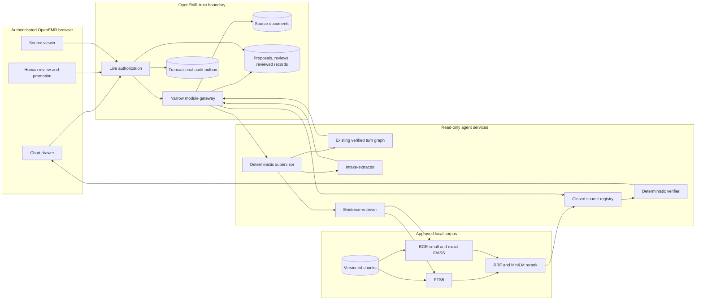

# Week 2 Clinical Co-Pilot architecture

This document is the evaluator-oriented synthesis of the accepted Week 2
design. It does not introduce new decisions. Normative behavior lives in
[ADR-0008 through ADR-0015](docs/adr/README.md), the linked specifications,
[USERS.md](USERS.md), [KEY_METRICS.md](KEY_METRICS.md), and
[requirements traceability](docs/REQUIREMENTS_TRACEABILITY.md). If code and a
normative decision conflict, implementation stops until a superseding ADR is
accepted.

Status language is deliberate: **observed** means exercised Week 1 behavior,
**implemented** means code and local verification exist, and **planned** means
the accepted control still lacks its checkpoint evidence.

## 1. User moment and UC-05/UC-06 scope

The user is a high-volume primary-care physician preparing for the patient
whose chart is already open. The existing UC-01 through UC-03 workflow remains
the chart-bound brief and follow-up path. Week 2 adds:

- UC-05: explicitly upload a lab report or intake form, inspect every proposed
  fact against the exact printed region, and promote only a complete human
  review; and
- UC-06: explicitly request exact evidence from the approved local guideline
  corpus without asking the co-pilot to decide patient applicability.

The source document, proposed fact, review decision, clinical record fact,
patient-record claim, and guideline-evidence claim are different domain
objects. [CONTEXT.md](CONTEXT.md) fixes those terms.

## 2. Mandatory core, extensions, and explicit non-goals

The mandatory core is two document types, the intake-extractor and
evidence-retriever workers, one deterministic supervisor, the approved
eight-topic USPSTF corpus, source-resolvable review UI, and the blocking release
gate. The mandatory implementation preserves the existing turn graph and
deterministic verifier.

The core excludes a critic model, third document type, trend widget, open-web
search, patient-specific guideline applicability, diagnosis or treatment
advice, autonomous writes, native-list reconciliation, schedule-wide searches,
Redis, a distributed queue, multi-host availability, and non-synthetic use.
These exclusions are boundaries, not backlog shortcuts.

## 3. Observed Week 1 baseline and unresolved risks

Observed Week 1 behavior authenticates through OpenEMR, binds a conversation
to the active patient, retrieves records only through the module gateway,
verifies claims deterministically, opens native chart sources, degrades on tool
or model failure, and carries one correlation ID. The retained release corpus
contains 48 cases: 15 golden and 33 coverage cases, including four holdouts.

The implemented Week 2 seams export strict version-2 schemas, validate shared
Python/PHP fixtures, compose the two bounded workers with a deterministic
supervisor, support authorized upload/review/promotion and source-review UI,
and enforce baseline comparison over 90 retained cases. The document path now
also has a durable module job, signed internal worker gateway, separate
extractor process, deterministic render/OCR adapters, and strict persistence.
Before decrypting a queued source, the module reconstructs the uploader's live
active-user, patient, ACL, squad, break-glass, site, and patient binding; the
queue row is scope data, never a durable authorization grant. PDF page and
document raster budgets plus aggregate model-request bounds fail closed before
unbounded processing or provider calls.
The Week 2 chat/source resolver is still not constructed by the live FastAPI
turn path: `document_ready` remains false and citation source reads safely
return 503. Deployed and protected-branch evidence also remain release work.

Unresolved risks remain explicit: OpenEMR parity authorization is not a new
care-relationship policy; the ordinary binary download failure path must be
fixed or unreachable before document release; one host is one failure domain;
reviewed records do not populate native lists; unrestricted agent egress blocks
non-synthetic deployment; and clinician-proxy validation remains open.

## 4. Component and trust-boundary diagram

Only the authenticated UI and module own write authority. The agent, model,
supervisor, and workers cannot promote, amend, or withdraw records.

## 5. Document upload, extraction, review, and promotion sequence

1. The chart UI asks the module for a patient-bound upload intent. The module
   derives patient identity from the live chart and checks operation-specific
   authorization.
2. The module content-sniffs and bounds the file, stores original bytes as an
   OpenEMR document, and records an idempotent immutable mapping. Same-intent
   replay returns the mapping; a new intent with identical bytes warns.
3. A typed event gives the supervisor only an opaque source reference. Before
   decrypting it, the internal worker gateway rebuilds the uploader's live
   authorization and audits the authorized read. The intake-extractor then
   performs deterministic 200-DPI render/OCR within page, document, and model
   request budgets, and may use one bounded region-level vision retry.
The extractor runs each lease in a disposable subprocess and terminates it at
the module's 95-second lease boundary, preventing a hung thread or native
child from continuing after the job has timed out.
4. The worker persists one immutable extraction version with proposed facts,
   exact field evidence, and typed limitations. Extraction ends at review.
5. The physician approves, corrects, or rejects every promotable field. Review
   decisions append and supersede; confidence never accepts a field.
6. An explicit UI command reauthorizes, rechecks source integrity and review
   completeness, and transactionally creates one immutable Observation-shaped
   lab report or QuestionnaireResponse-shaped intake record plus provenance and
   audit event.
7. Only a later authorized turn may read that promoted record as a
   patient-record source.

The normative types and routes are in
[the document-record contract](docs/specs/week2-document-record-contracts.md)
and ADR-0008, ADR-0009, and ADR-0011.

## 6. Guideline corpus, retrieval, reranking, and freshness sequence

The local corpus contains the eight approved USPSTF topics. A candidate refresh
retains publisher metadata, exact source and chunk hashes, rights basis,
parser/chunker version, embedding identity, and index build identity. Activation
is an atomic pointer swap after validation; failed refresh leaves the prior
version active. A corpus older than 14 days yields a limitation unless it has
explicit current demo re-approval.

An explicit permitted request produces one strict local evidence query. FTS5
and pinned BGE-small exact FAISS each return 20 candidates. Reciprocal-rank
fusion with k=60 keeps 20; pinned MiniLM ONNX reranks them to at most five exact
chunks. The total deadline is two seconds. No web, model-memory, stale-corpus,
or unreranked fallback exists. ADR-0010 is normative.

## 7. Deterministic supervisor route table and typed handoffs

| Typed event | Preconditions | Route | Terminal behavior |
| --- | --- | --- | --- |
| `document_uploaded` | Authorized immutable source reference | Intake-extractor only | Extraction reference or typed limitation |
| `reprocess_requested` | Authorized source and version budget | Intake-extractor only | New immutable extraction version or limitation |
| `chat_turn` | Current chart authorization | Existing patient turn graph | Verified patient lane or limitation |
| Explicit guideline `chat_turn` | Permitted intent and valid local query | Patient turn graph plus evidence-retriever | Join before verification; lane-local failure |
| Ambiguous or prohibited intent | No authority escalation | Chart-only path or refusal | No evidence-worker dispatch |

The supervisor makes no model call. Handoffs contain identities, versions,
reason codes, deadlines, attempts, statuses, limitations, retryability, and
timings—never documents, OCR, values, questions, prompts, excerpts, or images.
ADR-0013 defines retries, cancellation, follow-up freshness, and telemetry.

## 8. Source, claim, citation, verification, and UI-lane contracts

The closed registry has exactly `openemr`, `document`, and `guideline`
handlers. Resolvers receive a server-held turn binding and only resolve sources
authorized for that turn. Final claims are either patient-record claims or
guideline-evidence claims. Resolver-authored citations—not model links—carry
the immutable identity, field or chunk, exact value or quote, integrity
version, and source location.

The verifier validates schema, class/scheme compatibility, source resolution,
current authorization and versions, typed facts, safety language, and generated
citations in that order. Retrieval scores and confidence are never authority.
The UI renders patient and guideline lanes separately and always labels the
guideline lane: “Guideline evidence for physician review; patient applicability
was not determined.” [The claim/citation contract](docs/specs/week2-claim-citation-verification-contracts.md),
[source-review interaction contract](docs/specs/week2-source-review-interaction-contract.md),
ADR-0006, and ADR-0012 are normative.

## 9. Persistence, idempotency, authorization, audit, retention, and failure behavior

OpenEMR module storage separates upload mappings, extraction versions,
proposed facts, reviews, promoted records, and the transactional outbox.
Upload, source read, review, promotion, amendment, and withdrawal each perform
a fresh live policy check. Deterministic idempotency keys make replay return the
existing result; records and review history are append-only.

Failure is explicit and local. Missing authorization, stale versions, source
mismatch, integrity failure, unavailable dependencies, or incomplete review
returns a denial or typed limitation without raw fallback content. Independent
verified claims survive another lane's failure. Transient renders and crops are
planned for deletion at completion or by the one-hour crash sweeper;
conversation/checkpoint retention is 24 hours after close; extraction versions
are capped at three per source.

## 10. Eval corpus, baseline comparison, candidate-matched CI, and mutation proof

All 48 Week 1 cases are retained. The versioned corpus now contains 90 cases,
including 55 golden cases and two new coverage holdouts. Fifty is a floor.
Every golden case declares applicable
Boolean rubrics; over half the additions are negative, adversarial, degraded,
or boundary cases.

The implemented comparator requires matching manifests and identity hashes,
rolls repeated attempts into one case verdict, blocks missing or unmeasured
rubrics, enforces 100% golden and safety categories, applies declared category
thresholds, and blocks drops greater than five absolute percentage points.
Exactly five points is not the PRD regression condition, but any new
zero-tolerance safety failure still blocks.

The repository's required candidate CI selects the candidate runtime, checks
its exact commit and immutable image identity, executes the full corpus
including holdouts, and compares against an immutable owner-approved baseline.
The external protected environment, approved full baseline, and release proof
that injects a temporary safety regression, records red, removes it, and
records green with unchanged inputs are not present locally. ADR-0015 and
[the eval-gate specification](docs/specs/week2-eval-corpus-and-regression-gate.md)
are normative.

## 11. Deployment, readiness, privacy, latency, cost, capacity, and rollback

The planned candidate runs on one DigitalOcean c-4 with isolated OpenEMR,
MariaDB, chat/supervisor, extraction, retrieval, alerts, and Caddy services.
Core readiness covers authorization, state, gateway, schemas, and verification;
document, guideline, tracer, and alert readiness report separate degradation.

Ordinary telemetry contains bounded identifiers, reason codes, versions,
counts, timings, and outcomes only. Patient-bearing access remains in OpenEMR
audit. Content tracing and fault injection are off in release configuration.
Extraction concurrency is one; retrieval concurrency is two. Chat retains its
existing gate, extraction targets p95 at or below 90 seconds with a 95-second
cap and 0.10-dollar p95 cost with a 0.15-dollar block, and retrieval targets
p95 at or below 1.5 seconds with a two-second cap. One durable UTC-day ledger
warns at 14 dollars and refuses new model spend at 20 dollars. ADR-0014 and
[KEY_METRICS.md](KEY_METRICS.md) define the gates and rollback evidence.

## 12. Capability-to-use-case and PRD traceability

| Capabilities | Use cases | Week 2 obligation |
| --- | --- | --- |
| CAP-01–CAP-08 | UC-01–UC-03, UC-06 | Preserve the chart-bound verified workflow and Week 1 regressions |
| CAP-09 | UC-05 | Patient-bound two-type upload and strict extraction |
| CAP-10 | UC-05 | Human review, promotion, amendments, and read-back |
| CAP-11 | UC-06 | Approved hybrid retrieval and local reranking |
| CAP-12 | UC-05, UC-06 | Deterministic supervisor and bounded handoffs |
| CAP-13 | UC-01–UC-03, UC-05, UC-06 | Closed sources, citations, and review UI |
| CAP-14 | All supported use cases | PHI-free inspectability and safe degradation |

The full capability table remains in [USERS.md](USERS.md), and PRD status and
evidence remain in
[docs/REQUIREMENTS_TRACEABILITY.md](docs/REQUIREMENTS_TRACEABILITY.md). A row
is not verified until its accessible evidence exists.

## 13. Checkpoint order, evidence, tradeoffs, and residual risk

Implementation order is C0 contracts/gate foundation; C1 persistence and
authorization; C2 secure upload/source access; C3 extraction; C4 human review
and source UI; C5 guideline retrieval (parallel after C0); C6 supervisor and
evidence-lane integration; C7 operations; and C8 release proof. The detailed
acceptance boundaries are in
[the integrated implementation plan](docs/specs/week2-integrated-implementation-plan.md).

C0 through C6 have repository seams and local positive,
negative/adversarial, privacy, and documentation evidence; C7 and C8 are
partial. The remaining implementation and release evidence includes production extraction/source-view adapters,
live browser and deployed flow checks, protected-branch configuration, an
owner-approved full baseline, candidate mutation proof, and clean deploy,
load, and rollback measurements. This sequencing trades feature speed for
inspectable trust boundaries and kept the independent post-C0 branches safe to
implement in parallel.

Residual risks do not become hidden completion claims: one host can fail,
reviewed records are module-owned rather than native-list entries, the corpus
is finite, synthetic fixtures do not establish clinical safety, the public
demo must remain synthetic, and a larger release corpus increases runtime and
model spend.
