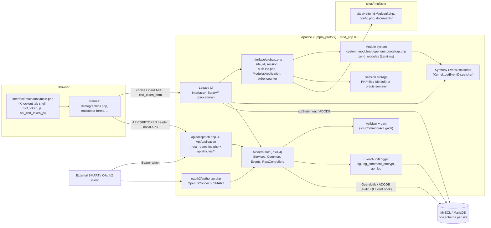
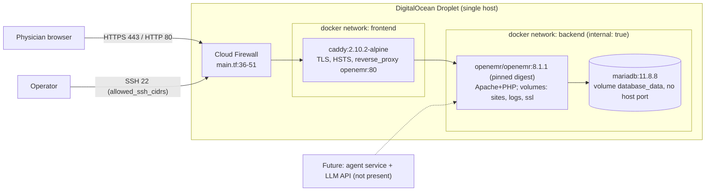
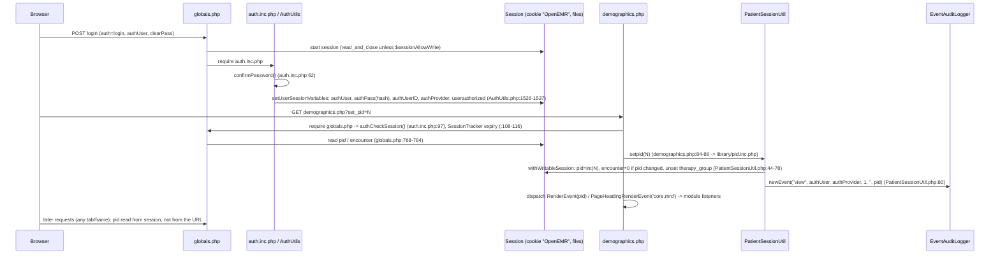

# Architecture Audit

| Field | Value |
| --- | --- |
| Date | 2026-09-14 |
| Commit | `fc95374` |
| Environment | Local `docker/development-easy` stack (read-only inspection) plus static code review; DigitalOcean runtime reviewed from `infra/digitalocean` only |
| Evidence | Code references (`path:line`) inline; sanitized live output in [`evidence/architecture/live-readonly-observations.txt`](evidence/architecture/live-readonly-observations.txt) |
| Labels | **OBSERVED** = seen in code or command output (cited). **INFERRED** = reasoning from observed facts, not tested live. |

No credentials, session IDs, tokens, or patient values appear in this document.
The only live actions were `docker ps`, `docker exec` config inspection, and one
read-only `SELECT` on `modules`/`globals`.

---

## 1. System diagrams

### 1.1 Application components (OBSERVED, from code)

Key citations:

| Component | Evidence (OBSERVED) |
| --- | --- |
| Request bootstrap | `interface/globals.php:266` (session read-only flag), `:272-323` (site_id), `:326` (`OE_SITE_DIR`), `:725-727` (auth include), `:748` (`ModulesApplication`), `:768-784` (encounter/pid), `:849` (`logHttpRequest`) |
| Site DB config | `library/sqlconf.php:17,26` requires `$OE_SITE_DIR/sqlconf.php`; two sites present in container (`default`, `docker-leader`) |
| Event dispatcher | `src/Core/Kernel.php:226`; modules receive it in bootstrap (`oe-module-dashboard-context/openemr.bootstrap.php`) |
| Module loader | `src/Core/ModulesApplication.php:132-164` (reads `modules` table, `include`s bootstrap), `:86-107` (blocks scripts of disabled modules) |
| REST/FHIR | `apis/dispatch.php` -> `src/RestControllers/ApiApplication.php:76-103` (listeners: Exception, Telemetry, ApiResponseLogger, SessionCleanup, SiteSetup, CORS, OAuth2Authorization, Authorization, RoutesExtension, ViewRenderer) |
| Audit logger | `src/Common/Logging/EventAuditLogger.php:187` `newEvent`, `:405` `auditSQLEvent` (called from `library/ADODB_mysqli_log.php:50`), `:642` `recordLogItem`, `:700` `logHttpRequest` |
| Session storage | `src/Common/Http/HttpSessionFactory.php:87-104` (predis-sentinel only if `SESSION_STORAGE_MODE`), live: `SESSION_STORAGE_MODE` unset, `session.save_handler=files` |

### 1.2 Deployment topology (OBSERVED from `infra/digitalocean`; runtime confirmed in the 2026-09-14 cloud window)

Evidence: `infra/digitalocean/runtime/compose.yaml` (services `database`, `openemr`, `caddy`; `networks.backend.internal: true`); `runtime/Caddyfile` (`reverse_proxy openemr:80`); `docs/adr/0001-ephemeral-single-droplet-baseline.md`.
INFERRED: Caddy→OpenEMR hop is plain HTTP on the Docker network; the upstream image contains no project module code, so a co-pilot module requires a project image or bind mount (see ARCH-LOW-008).

Cloud window confirmation (2026-09-14): the containers, networks (`backend internal=true`), published ports (Caddy 80/443 only), and the absence of project code in the image were observed on a live Droplet (`evidence/security/cloud-runtime-2026-09-14.md`).

*Status 2026-09-16:* the diagram above is the audit-date baseline. Since 2026-09-15 the Droplet runs a project image (`agentforge/openemr:local`: the pinned 8.1.1 base plus the co-pilot module, `infra/image/openemr.Dockerfile`), an agent service on the `frontend` network only with file secrets, and a deny-by-default `Caddyfile` that routes `/copilot-api/*` to the agent and 404s everything outside the OpenEMR application paths (`infra/digitalocean/runtime/compose.yaml`, `Caddyfile`; probe `evidence/security/cloud-probe-2026-09-15-allowlist.txt`). The Caddy→OpenEMR and app→DB hops are still plaintext on the host.

---

## 2. Active user and active patient context trace

### 2.1 Sequence (OBSERVED unless marked)

### 2.2 Session keys

| Key | Set at (OBSERVED) | Read by (OBSERVED) | Notes |
| --- | --- | --- | --- |
| `site_id` | `interface/globals.php:320` | `:326-329` builds `OE_SITE_DIR` | Mismatch between session site and `?site=` clears session (`:305-316`) |
| `authUser`, `authPass`, `authUserID`, `authProvider`, `userauthorized` | `src/Common/Auth/AuthUtils.php:1530-1537` | `AuthUtils::authCheckSession` (`:838-860`) re-validates hash against `users_secure` every request; `AclMain::aclCheckCore` uses `authUser` (`src/Common/Acl/AclMain.php:166-172`) | ACL is keyed by **username**, not ID |
| `pid` | `PatientSessionUtil::setPid` (`src/Common/Session/PatientSessionUtil.php:44-80`); also `globals.php:770-774` sets `pid` from `$_GET['pid']`/`$_POST['pid']` **if session pid is empty** | `PatientSessionUtil::getPid` (`:28-32`); `globals.php:776,784` exposes as `$pid` / `OEGlobalsBag` | One value per login session |
| `encounter` | `EncounterSessionUtil::setEncounter` (`src/Common/Session/EncounterSessionUtil.php`), reset to 0 on patient change (`PatientSessionUtil.php:67`) | `EncounterSessionUtil::getEncounter`, `globals.php:768` | |
| `csrf_private_key` | `CsrfUtils::setupCsrfKey` (`src/Common/Csrf/CsrfUtils.php:35`) | `collectCsrfToken` = HMAC-SHA256(subject, key) truncated to 40 chars (`:49-56`); subjects `default` and `api` | Token is per-session, not per-request |

Session mechanics (OBSERVED): cookie name `OpenEMR` (`src/Common/Session/SessionUtil.php:81`); core cookie `SameSite=Strict`, `HttpOnly=false` (`src/Common/Session/SessionConfigurationBuilder.php:25,88`); pages are `read_and_close` by default (`globals.php:265-266`, `ReadAndCloseNativeSessionStorage.php:57-98`) and writes reopen the session (`SessionUtil.php:145-179`). Inactivity timeout `timeout=7200` s in the dev DB (evidence file §3).

### 2.3 How services and pages consume context

| Consumer | Pattern (OBSERVED) |
| --- | --- |
| Legacy pages | Global `$pid` / `$encounter` from `globals.php:776-784`; ACL checks inline, e.g. `demographics.php:1095-1098` (`aclCheckIssue('allergy'|'medical_problem'|'medication')`, `aclCheckCore('patients','rx')`), `:1384` (`patients/notes`), `:1477` (`patients/lab`) |
| Module AJAX | `UserContextController.php:29-39`: reads `authUserID` from session, verifies `csrf_token_form` |
| `src/Services/*` | Receive `pid`/`puuid` as **parameters**; do not read session context (see §4) |
| Local REST API | `LocalApiAuthorizationController.php:42-112`: session cookie + `APICSRFTOKEN` header (subject `api`); resolves user from `authUserID`; sets `skipAuthorization=true`; not bound to session `pid` |
| OAuth2/SMART API | `BearerTokenAuthorizationStrategy.php:220-230` (patient role binds own uuid), `:433-450` (EHR launch context `patient` bound only if `checkUserHasAccessToPatient`, which always returns `true`, `:479-485`) |

INFERRED: Because `pid` is a single session value, two tabs/windows of the same login cannot hold two different active patients; the last `set_pid` wins for every subsequent request. Not tested live (see open questions).

---

## 3. Extension points for an embedded chat panel

### 3.1 Render/menu events

| Event (constant → name) | Dispatched at (OBSERVED) | Payload | Suitability |
| --- | --- | --- | --- |
| `PatientDemographics\RenderEvent::EVENT_SECTION_LIST_RENDER_TOP` `patientDemographics.render.section.top` | `demographics.php:1075` | `getPid()` | Good: top of dashboard card list, patient-scoped |
| `...::EVENT_SECTION_LIST_RENDER_BEFORE` / `_AFTER` | `demographics.php:1354`, `:1533` | `getPid()` | Good; already used by SMART launch card (`SmartLaunchController.php:47-94`, registered `demographics.php:100`) |
| `...::EVENT_RENDER_POST_PAGELOAD` `patientDemographics.render.post_page_load` | `demographics.php:2079` | `getPid()` | For JS bootstrapping after the dashboard loads |
| `UserInterface\PageHeadingRenderEvent::EVENT_PAGE_HEADING_RENDER` | `src/OeUI/OemrUI.php:155-158`; demographics page id `core.mrd` (`demographics.php:366`) | `getPageId()`, `appendTitleNavContent()`, actions | Good for a "Co-Pilot" button in the chart header (dashboard-context uses it) |
| `Patient\Summary\Card\RenderEvent` `patientSummaryCard.render` | `demographics.php:1385-1562` per card | card id | Append to existing cards |
| `Main\Tabs\RenderEvent::EVENT_BODY_RENDER_PRE/NAV/POST` | `interface/main/tabs/main.php:465,519,567` | none | Global (non-patient) shell; telehealth injects scripts at `POST` (`oe-module-comlink-telehealth/src/Bootstrap.php:214`) — a persistent side panel would live here |
| `Core\ScriptFilterEvent` / `StyleFilterEvent` | `src/Core/Header.php:104` | script list | Inject module JS/CSS into pages |
| `Menu\MenuEvent::MENU_UPDATE` | `src/Menu/MenuEvent.php:28` | menu tree | Admin/config screen |
| `RestApiExtend\RestApiCreateEvent` `restConfig.route_map.create` | `src/Events/RestApiExtend/RestApiCreateEvent.php:10` | route maps (standard, FHIR, portal) | Module-defined REST routes (inherit OAuth2/local-API auth) |

### 3.2 Custom module lifecycle (OBSERVED)

1. Module folder `interface/modules/custom_modules/<name>/` with `openemr.bootstrap.php`, optional `ModuleManagerListener.php`, `moduleConfig.php`, `info.txt`, `sql/`.
2. Admin registers/installs/enables via Module Manager (Laminas `Installer` module): `InstModuleTable::register` inserts into `modules` (`interface/modules/zend_modules/module/Installer/src/Installer/Model/InstModuleTable.php:228-293`); lifecycle callbacks in `ModuleManagerListener` (`install`, `enable`, `disable`, `unregister`, ... lines 80-244).
3. On **every** request through `globals.php`, `ModulesApplication::bootstrapCustomModules` selects `mod_active=1` rows and `include`s each bootstrap (`ModulesApplication.php:141-163,179-192`). Exceptions are caught and only `error_log`ged (`:189-191`); an unreadable bootstrap auto-disables the module (`:155`).
4. Bootstrap registers namespace via `ModulesClassLoader` and subscribes listeners (`oe-module-dashboard-context/openemr.bootstrap.php`; `src/Bootstrap.php:52-86`).
5. Direct HTTP access to scripts under a disabled module's folder throws `AccessDeniedException` → 401 (`ModulesApplication.php:86-107`, `globals.php:756-760`).

### 3.3 Module-owned HTTP endpoints (reference: `oe-module-dashboard-context`)

| Concern | Existing pattern (OBSERVED) |
| --- | --- |
| Entry | `public/ajax.php:14` `require_once globals.php` → full auth (`authCheckSession`, timeout), site, module ACL path check, `logHttpRequest` |
| Identity | `UserContextController.php:29-30` reads `authUserID` from session (never from request) |
| CSRF | `UserContextController.php:39` `CsrfUtils::verifyCsrfToken($_POST['csrf_token_form'] ?? $_GET[...])`; admin endpoint adds `AclMain::aclCheckCore('admin','super'|'users')` (`AdminController.php:43,52`) |
| Patient context | Not used by this module; a co-pilot endpoint must read `PatientSessionUtil::getPid()` server-side |
| Session locking | Endpoint is `read_and_close` unless it sets `$sessionAllowWrite` (INFERRED from `globals.php:265`), so a long request does not block other frames |

Alternative (OBSERVED): module JS may call the local REST/FHIR API with header `APICSRFTOKEN` (`main.php:134` exposes `api_csrf_token_js`); authorization then comes only from per-route ACL checks.

---

## 4. Data-access options for agent tools

### 4.1 Service inventory for UC-01 (OBSERVED)

`acl refs` = count of `AclMain`/`aclCheck` in the file.

| Service | Source tables | acl refs | Notes |
| --- | --- | --- | --- |
| `PatientService` | `patient_data`, `patient_history` (`PatientService.php:45-46`) | 0 | |
| `EncounterService` | `form_encounter`, `users`, `facility` (`:51-54`) | 3 | `sensitivities` and `encounters/date_a` checks only inside an update path (`:450-455`); reads unchecked |
| `ConditionService` | `lists` type `medical_problem` (`:27`, `:224`) | 0 | |
| `AllergyIntoleranceService` | `lists` type `allergy` (`:27`, `:101`) | 0 | |
| `PrescriptionService` | UNION of `prescriptions` (+`drugs`) and `lists`/`lists_medication` (`:28-29`, `:88`, `:203-206`) | 0 | Meds live in two sources |
| `PatientIssuesService` / `MedicationPatientIssueService` | `lists`, `lists_medication` (`PatientIssuesService.php:31,188-206`; `MedicationPatientIssueService.php:19`) | 0 | |
| `ProcedureService` | `procedure_order`, `procedure_report`, `procedure_result`, `procedure_specimen` (`:32-39`) | 0 | |
| `ObservationLabService` | `procedure_result`, `procedure_order_code` (`:28,68-111`) | 0 | Labs |
| `VitalsService` | `form_vitals` (`:40`) | 0 | |
| `ClinicalNotesService` | `form_clinical_notes` (`:25`) | 0 | Only the "Clinical Notes" form; SOAP/LBF/other encounter forms are separate tables |
| `MessageService` | `pnotes` (`:48-116`) | 0 | Patient messages ("notes" card uses `patients/notes` ACL) |
| `DocumentService` | `documents`, `categories` (`:29,105`) | 0 | Binary documents |
| `FormService` | `forms`, `registry` | 2 | `aclCheckCore` on form `aco_spec` (`:132-137`) |
| FHIR `FhirObservationService` | aggregates social history, vitals, laboratory, form observations, SDOH, ... (`:64-73`) | — | |
| FHIR `FhirDocumentReferenceService` | `FhirClinicalNotesService` + patient documents + advance directives (`:46-50`) | — | |

Conclusion (OBSERVED): services do not enforce ACL; enforcement is in callers — UI pages (`demographics.php:1095-1098,1384,1477`) and REST route closures (`apis/routes/_rest_routes_fhir_r4_us_core_3_1_0.inc.php:470-497`, `RestConfig::request_authorization_check` → `AclMain::aclCheckCore`, `src/RestControllers/Config/RestConfig.php:180-194`).

### 4.2 Comparison

Scores 1 (poor) – 5 (strong). INFERRED scoring based on the observations above.

| Criterion | (a) In-process services via module gateway | (b1) Local REST/FHIR (`APICSRFTOKEN`, session) | (b2) OAuth2/SMART EHR launch (`patient/*.read`) | (c) Direct SQL |
| --- | --- | --- | --- | --- |
| Authorization fidelity | **3** – session identity is authoritative (`authCheckSession` each request); gateway must itself apply ACLs (services have none) and bind to session `pid` | **3** – route ACLs (`patients/med`, etc.) applied; scope checks skipped (`AuthorizationListener.php:154-157`); not bound to active patient | **4** – `patient/` scope context binds requests to launch patient (`HttpRestRouteHandler.php:64-66`, `BearerTokenAuthorizationStrategy.php:433-450`); but `checkUserHasAccessToPatient` always `true`; confidential/launch clients need admin approval (`ClientEntity.php:35`) | **1** – bypasses all ACL, sensitivity, deleted/activity semantics; violates AGENTS.md invariant |
| UC-01 completeness | **4** – all tables reachable incl. `form_clinical_notes`, `pnotes`, `lists_medication`; can compute "since last encounter" with typed rows | **3** – standard API lacks some resources; FHIR mappings normalize but may drop OpenEMR-specific fields | **3** – same as FHIR; US Core profiles; notes via DocumentReference | **5** raw, but semantics must be re-implemented |
| Latency / coupling | **4** latency (no HTTP hop, no JSON/FHIR mapping); tight coupling to internal PHP APIs, runs inside Apache worker | **3** extra HTTP + FHIR mapping; loopback call from PHP or browser | **2** token dance + FHIR mapping per call; separate service holds tokens | **5** latency; worst coupling to schema |
| Maintainability | **3** internal service signatures change between releases | **4** versioned public contract | **4** standards-based, but OpenEMR SMART config/approval flow adds ops | **1** |
| Audit trail | Writes a `view` on `setpid`; `http-request` event per endpoint call (`globals.php:849`, `EventAuditLogger.php:700-736`); SELECT auditing off in dev (`audit_events_query` empty) → gateway must log tool reads explicitly | `api_log_option=2` stores response bodies (PHI) in `api_log` (`ApiResponseLoggerListener.php:56-85`) | Same as b1 | None unless `audit_events_query` on |
| **Total** | **18** | **16** | **17** | **13** (disqualified) |

Recommendation (INFERRED): use (a) — a thin, typed clinical-data gateway inside a custom module that calls `src/Services` read methods, re-applies the same ACLs the chart UI uses per data type, binds to session `site_id`/`authUser`/`pid`, and emits explicit audit events. Keep (b2) as the documented alternative if the agent service must run outside PHP with its own credentials.

---

## 5. Trust boundaries and failure domains

### 5.1 Trust boundaries

| # | Boundary | Crossing | Controls present (OBSERVED) | Gaps (INFERRED unless cited) |
| --- | --- | --- | --- | --- |
| TB1 | Internet → Caddy | HTTPS | Firewall 80/443 open, 22 CIDR-limited (`main.tf:36-51`); HSTS, nosniff (`Caddyfile`) | No WAF/rate limiting |
| TB2 | Caddy → Apache/PHP | HTTP on Docker network | `frontend` network only | Cookie `cookie_secure=false` default (`SessionConfigurationBuilder.php:26`) |
| TB3 | Browser JS → PHP endpoint | Session cookie + CSRF token | `authCheckSession`, expiry, CSRF HMAC | Cookie readable by JS (`HttpOnly=false`, `:88`) → any XSS in rendered model output can hijack a session |
| TB4 | PHP → MySQL | ADODB/Doctrine with site credentials | Internal network (`backend internal:true`) | Single DB user has full schema rights (INFERRED) |
| TB5 | User → patient record | ACL (gacl) | Per-section ACL (`AclMain.php:166`), encounter `sensitivities`, `squads` (`demographics.php:1069`) | No per-patient/care-team restriction; `restrict_user_facility` off; SMART patient check stub returns `true` |
| TB6 | OAuth2 client → API | Bearer token + scopes | `scope_check`, patient binding | `user/` scopes are not patient-bound |
| TB7 | Module code → core | `include` of bootstrap in every request | Enabled-module gate | Module runs with full process privileges; errors swallowed |
| TB8 (future) | Gateway → agent service → LLM | PHI in prompts | none yet | Must be designed (BAA, redaction, prompt-injection) |

### 5.2 Failure domains

| Domain | Blast radius (INFERRED from observed topology) | Co-pilot implication |
| --- | --- | --- |
| Single Droplet | All components down together | `/ready` must reflect OpenEMR + DB; no HA |
| MariaDB | All OpenEMR pages and tools fail | Tools return "source unavailable", never "no records" |
| Apache prefork pool (`MaxRequestWorkers 250`, `max_execution_time=60`) | Long synchronous LLM calls in PHP consume workers and hit 60 s limit | Do not run model calls in the PHP request; bound tool calls to a few seconds |
| PHP file sessions | Session store local to container; lost on container recreate unless volume | Conversation state must not live in PHP session |
| Module bootstrap | Exception in bootstrap is swallowed; chart still renders without panel | UI must show explicit "Co-Pilot unavailable" rather than silently absent |
| Audit logging | Audit writes are in-request DB inserts | If DB degraded, both data and audit fail together |
| External LLM / agent service (future) | Independent of chart | Chart must remain usable; panel degrades |

---

## 6. Findings

### `ARCH-HIGH-001` Active patient is a single mutable session value shared by every tab and frame

- **Status:** Open
- **Severity:** High
- **Observed evidence:** `pid` stored once per session (`PatientSessionUtil.php:28-32,44-80`); changed by any `demographics.php?set_pid=` load (`demographics.php:84-86`); `globals.php:770-774` accepts `pid` from GET/POST when session pid is empty; `encounter` reset on patient change (`PatientSessionUtil.php:67`).
- **Affected assets and users:** Physicians with multiple chart tabs/windows; every co-pilot request.
- **Failure scenario:** Physician opens patient A's co-pilot, opens patient B in another tab; a follow-up in A's panel is answered server-side against session `pid` = B.
- **Impact:** Wrong-patient disclosure and wrong-patient clinical summary.
- **Likelihood and assumptions:** Likely in a 20-patient day. INFERRED; multi-tab behavior not live-tested.
- **Recommendation:** Issue a server-side conversation record bound to (`site_id`, `authUserID`, `pid`) at panel render; every request carries the conversation ID and the gateway rejects if session `pid` ≠ bound `pid`.
- **Verification:** Two-tab Selenium test: switch patient in tab 2, send follow-up in tab 1, expect denial with explicit "patient context changed".
- **Architecture consequence:** Patient context lock is a gateway invariant, not a UI convention; model/agent never receives a `pid` it could change.
- **Co-pilot response status (2026-09-16):** Implemented. Conversations are bound server-side to (site, user, pid) at start (`ConversationRepository`); each per-turn ticket re-reads the session pid and closes the conversation with 409 `patient_context_changed` on a mismatch (`public/api/ticket.php`); tool schemas reject any patient argument (`extra="forbid"`, `AUTH-FORGED-PID-001`). `AUTH-SWITCH-001` (golden) covers the switch within one session and passes live. The two-tab Selenium test has not been run.

### `ARCH-HIGH-002` Clinical services do not enforce ACL; authorization lives in callers

- **Status:** Open
- **Severity:** High
- **Observed evidence:** Zero `AclMain` references in `PatientService`, `ConditionService`, `AllergyIntoleranceService`, `PrescriptionService`, `ProcedureService`, `ClinicalNotesService`, `ObservationLabService`, `VitalsService`, `MessageService`, `DocumentService`; UI checks in `demographics.php:1095-1098,1384,1477`; API checks in route closures (`_rest_routes_fhir_r4_us_core_3_1_0.inc.php:470-497`).
- **Affected assets and users:** All PHI reachable by agent tools.
- **Failure scenario:** A gateway tool calls `ConditionService`/`ClinicalNotesService` directly for a user whose role lacks `patients/med` or `patients/notes`; data returned.
- **Impact:** Privilege escalation through the co-pilot.
- **Likelihood and assumptions:** Certain if tools call services naively.
- **Recommendation:** Define a per-tool ACL matrix mirroring the chart (e.g. problems/allergies/meds → `aclCheckIssue(type)`; prescriptions → `patients/rx`; notes → `patients/notes`; labs → `patients/lab`; encounters → `encounters` + `sensitivities`), check before each service call, and deny-by-default.
- **Verification:** Negative tests per tool with a restricted ACL user; confirm no service call/LLM call happens on denial.
- **Architecture consequence:** The gateway owns authorization; services are treated as unauthenticated data access.
- **Co-pilot response status (2026-09-16):** Implemented. `ContextBuilder::sectionMatrix()` computes the per-tool matrix (demographics, encounters/notes, issue types via `issue_types.aco_spec`, `patients/rx`, `patients/lab`) and fails closed on a missing spec; `public/gateway/tools.php` denies and audits before any service call. The recommended `aclCheckIssue()` turned out to fail open in the session-less gateway request (found live 2026-09-15, commit `2dc51a0`), which is why the gateway reads `aco_spec` directly. `bin/acl_matrix.php` prints the effective matrix; `AUTH-FRONTDESK-001` (golden) asserts every clinical section `unavailable`, zero claims, and `model_calls_max: 0`, passing live.

### `ARCH-HIGH-003` No patient-level (care-relationship) authorization exists in OpenEMR

- **Status:** Open
- **Severity:** High
- **Observed evidence:** `BearerTokenAuthorizationStrategy::checkUserHasAccessToPatient` returns `true` unconditionally (`BearerTokenAuthorizationStrategy.php:479-485`); local API marks `skipAuthorization` (`LocalApiAuthorizationController.php:111`, `AuthorizationListener.php:154-157`); `restrict_user_facility` empty (evidence §3); ACL is section-based (`AclMain.php:166-190`).
- **Affected assets and users:** All patients in a site.
- **Failure scenario:** Any user with `patients/med` can point the co-pilot (or API) at any patient.
- **Impact:** Co-pilot cannot claim "only patients you care for"; its isolation equals OpenEMR's.
- **Likelihood and assumptions:** Structural; applies to demo and real use.
- **Recommendation:** Limit tools to the session-bound patient (no patient search/lookup tool), re-run the chart's section ACLs and squad check per tool, audit every access, and state the limitation that isolation equals the chart's. This track's recommendation was adopted as **parity** in `docs/adr/0002-patient-scope-authorization.md` after the owner reviewed a stricter care-relationship policy (schedule, encounter provider, care team) and deferred it as out of proportion for the timeline; that policy is recorded there as the deferred alternative.
- **Verification:** Attempt tool call with a `pid` different from session; expect denial (`AF-ACL-UNSCHED` requested while another chart is open). `AF-ACL-OTHER` allowed for `audit-physician` with the chart open, audited, limitation text present. `AF-ACL-SQUAD` denied. No tool or model call on any denial.
- **Architecture consequence:** The only patient selector is OpenEMR's own chart open (`setpid` → `view` audit), never agent input, and the chart open is a request that the gateway's relationship policy must still grant.
- **Co-pilot response status (2026-09-16):** Implemented as parity (ADR-0002). The verification cases listed above exist and pass live: `AUTH-UNSCHED-DIRECT-001`, `AUTH-PARITY-OTHER-001` (allowed, audited), `AUTH-SQUAD-001` (denied at start), run `2026-09-16T073141Z-1ddf824`. The limitation text and the deferred care-relationship policy are unchanged.

### `ARCH-MEDIUM-004` UC-01 data is fragmented across heterogeneous tables

- **Status:** Open
- **Severity:** Medium
- **Observed evidence:** Meds: `prescriptions` UNION `lists`/`lists_medication` (`PrescriptionService.php:88,203-206`); problems/allergies: `lists` by type; notes: `form_clinical_notes` (`ClinicalNotesService.php:25`), `pnotes` (`MessageService.php:48`), other encounter forms, `documents`; labs: `procedure_result` (`ObservationLabService.php:28`) vs vitals `form_vitals`.
- **Affected assets and users:** Answer completeness for UC-01.
- **Failure scenario:** A "since last visit" summary queries only `prescriptions` and misses a medication entered as a list issue, or reports "no new notes" when a SOAP form exists.
- **Impact:** False reassurance by omission.
- **Likelihood and assumptions:** Likely with mixed data entry. Actual distribution to be measured by the data-quality audit.
- **Recommendation:** One tool per source family with declared coverage; responses list which sources were queried and which note/form types are not supported.
- **Verification:** Seed demo patient with meds in both sources and a non-clinical-notes form; eval expects both meds and an explicit limitation.
- **Architecture consequence:** Tool contracts include a `coverage` field consumed by the verifier to produce limitations.
- **Co-pilot response status (2026-09-16):** Partly implemented. One tool per source family exists (medications keep `lists` and `prescriptions` as separate provenances; problems and allergies from `lists`; labs via `ProcedureService::search()`). The notes tool covers `form_clinical_notes` only and reports `counts.form_types_covered = 1`; there is no `coverage` field in `ToolResponse` and no limitation line naming unsupported form types (SOAP/LBF), so a SOAP-only note is not surfaced as a gap. The synthetic cohort's notes are `form_clinical_notes` rows, so the evals do not exercise this.

### `ARCH-MEDIUM-005` Audit trail will not record agent reads by default; API path duplicates PHI into `api_log`

- **Status:** Open
- **Severity:** Medium
- **Observed evidence:** `audit_events_query` empty (SELECTs not audited, `EventAuditLogger.php:439-444`); `enable_auditlog=1`, `audit_events_http-request=1` logs script path + query string + session pid (`EventAuditLogger.php:700-736`, called `globals.php:849`); `api_log_option=2` stores response bodies (`ApiResponseLoggerListener.php:56-85`).
- **Affected assets and users:** Compliance review, incident response.
- **Failure scenario:** After an incident, logs show only an HTTP hit on the module endpoint, not which records were sent to the LLM; or, if using REST, full FHIR bundles persist in `api_log`.
- **Impact:** Unreviewable disclosures or PHI sprawl.
- **Likelihood and assumptions:** Certain with current settings.
- **Recommendation:** Gateway calls `EventAuditLogger::newEvent` per tool with user, pid, tool name, record IDs (no values); avoid REST path or set `api_log_option` accordingly; never put PHI in module endpoint query strings (they are logged).
- **Verification:** Run a co-pilot request; query `log` for the expected events; confirm no clinical values in `comments`.
- **Architecture consequence:** Agent-specific audit events are a gateway deliverable; POST bodies only.
- **Co-pilot response status (2026-09-16):** Implemented. `Gateway/Audit.php` writes `copilot-tool-read` (tool name, window, whether a term/analyte filter was used, no values) through `EventAuditLogger::newEvent()` before the tool returns data, and the tool answers `unavailable/audit_unavailable` if the insert fails (`public/gateway/tools.php`); `copilot-denied`, `copilot-session-start`, and `copilot-session-end` are also written. Module endpoints are POST with JSON bodies. Verified in the deployment's `log` table on 2026-09-15 (commit `2dc51a0`); no eval queries the `log` table automatically. REST/`api_log` is not on the data path.

### `ARCH-MEDIUM-006` PHP request model is unsuitable for LLM orchestration

- **Status:** Open
- **Severity:** Medium
- **Observed evidence:** `mpm_prefork_module`, `MaxRequestWorkers 250`, `max_execution_time = 60`, file sessions (evidence §2); `ReadAndCloseNativeSessionStorage.php:57-98`.
- **Affected assets and users:** Chart responsiveness for all users.
- **Failure scenario:** Multi-turn requests with several model calls run 20–60 s inside Apache workers; at 50 concurrent users workers are tied up and requests hit the 60 s limit.
- **Impact:** Chart slowdown and truncated responses.
- **Likelihood and assumptions:** INFERRED; to be quantified by the performance audit.
- **Recommendation:** PHP gateway handles only auth, context binding and bounded tool calls; model orchestration runs in a separate service called with a short-lived, server-minted delegation token scoped to (user, site, pid, conversation).
- **Verification:** Load test with the performance audit; measure worker utilization.
- **Architecture consequence:** Confirms the hypothesis' separate agent service; adds a delegation-token contract the gateway validates on every tool callback.
- **Co-pilot response status (2026-09-16):** Implemented. Orchestration runs in a separate FastAPI/LangGraph service (`agent/`, ADR-0004) called with a per-turn HMAC delegation token that carries no user or patient (`DelegationToken.php`, `agent/app/delegation.py`); the PHP side handles session, binding, ticket, and bounded tool calls only. The turn wall clock is 45 s in the agent, outside Apache. The load test that would measure worker utilization has not been run (target 2026-09-19).

### `ARCH-MEDIUM-007` Module failures are silent

- **Status:** Open
- **Severity:** Medium
- **Observed evidence:** `ModulesApplication.php:189-191` catches `\Throwable` and only `error_log`s; missing bootstrap auto-disables module (`:155`); listeners in dashboard-context catch and log (`Bootstrap.php` render methods).
- **Affected assets and users:** Physicians expecting the panel.
- **Failure scenario:** Deployment ships a broken bootstrap; chart loads without the panel and no alert fires.
- **Impact:** Silent loss of feature; physician assumes no insights.
- **Likelihood and assumptions:** Moderate during a one-week build.
- **Recommendation:** Keep bootstrap trivial; expose a module health endpoint included in `/ready`; render an explicit unavailable state.
- **Verification:** Break bootstrap intentionally in dev; confirm readiness fails and UI shows the state.
- **Architecture consequence:** Observability covers module-load success, not just request metrics.
- **Co-pilot response status (2026-09-16):** Partly implemented. A panel render failure prints an explicit "Co-Pilot unavailable" card instead of nothing (`src/Bootstrap.php`), the panel shows named error states for every API failure (`copilot.js`), and the agent's `/ready` includes a gateway ping over the internal network. A failure inside `openemr.bootstrap.php` itself is still swallowed by `ModulesApplication` (OpenEMR unchanged), and no test breaks the bootstrap deliberately.

### `ARCH-LOW-008` Custom modules are not registered; deployment image contains no project code

- **Status:** Open
- **Severity:** Low
- **Observed evidence:** `modules` table contains only 5 Laminas modules (evidence §3); runtime uses upstream `openemr/openemr:8.1.1` with only `sites`, logs and ssl volumes (`runtime/compose.yaml`).
- **Affected assets and users:** Deployment reproducibility.
- **Failure scenario:** Module code exists in repo but is absent or disabled in the deployed container.
- **Impact:** Demo failure.
- **Likelihood and assumptions:** Certain without a build step.
- **Recommendation:** Build a pinned project image including the module; script module registration/enabling as part of deploy.
- **Verification:** Smoke test asserts module row `mod_active=1` and panel render.
- **Architecture consequence:** Deployment ADR must be updated to a project image.
- **Co-pilot response status (2026-09-16):** Implemented. `infra/image/openemr.Dockerfile` builds the pinned 8.1.1 base plus the module only (root `.dockerignore` excludes everything else); the one-shot `copilot-setup` Compose job runs `bin/register_module.php`; verified on the Droplet 2026-09-15 (module registered, panel rendered for `audit-physician`, commit `06d1855`). ADR-0001 names this as its revisit trigger.

### `ARCH-LOW-009` Core session cookie is JavaScript-readable

- **Status:** Open (cross-reference to security audit)
- **Severity:** Low (architecture); security audit may rate higher
- **Observed evidence:** `SessionConfigurationBuilder.php:88` `setCookieHttpOnly(false)` for core session.
- **Affected assets and users:** All logged-in users.
- **Failure scenario:** Model output containing injected markup rendered as HTML runs script and reads the session cookie.
- **Impact:** Session hijack and PHI access.
- **Likelihood and assumptions:** Depends on panel rendering; notes are untrusted input.
- **Recommendation:** Render all model/tool text via text nodes; strict allow-list for citations; CSP for module assets.
- **Verification:** Eval with prompt-injection note containing ``; assert no execution.
- **Architecture consequence:** Panel renderer is a security boundary.
- **Co-pilot response status (2026-09-16):** Text-node rendering implemented (`copilot.js`); `INJ-NOTE-O-001` passes live at the response-text level. A CSP for module assets is not implemented, and no browser test asserts non-execution (see `security.md` SEC-MED-003 status).

### `ARCH-INFO-010` Minor code observations

- **Status:** Informational
- **Severity:** Informational
- **Observed evidence:** `library/ajax/set_pt.php:26` uses `in_array("set_pid", $_GET, true)`, which tests values, not keys — INFERRED that this branch rarely/never runs. `apis/dispatch.php:43` returns `$e->getMessage()` in 500 responses.
- **Affected assets and users:** Any module that changes patient context through `set_pt.php`; unauthenticated API callers who receive 500 bodies.
- **Failure scenario:** A module assumes `set_pt.php?set_pid=` switched the session patient when it did not, and a later request runs against the previous patient. Separately, an API error body reveals SQL or file paths.
- **Impact:** Context confusion (low, given the gateway binds conversations itself); minor information disclosure.
- **Likelihood and assumptions:** Low. The co-pilot does not use `set_pt.php`, and REST/FHIR are disabled on the deployment.
- **Recommendation:** None for OpenEMR (documented, not fixed). The gateway sets patient context only through the bound conversation and returns generic error envelopes with a correlation ID.
- **Verification:** Gateway error responses in tests contain no exception text; grep the module for `set_pt.php` returns nothing.
- **Architecture consequence:** Do not rely on `set_pt.php` to change patient context; gateway error envelopes must be generic.

---

## Top 3 architecture consequences for the co-pilot

1. **The gateway, not OpenEMR services, is the authorization boundary.** Services have no ACL and OpenEMR has no patient-level access control (ARCH-HIGH-002/003). Every tool runs a deny-by-default ACL check matching the chart's checks and reads only the session-bound patient. The agent can never pick a patient.
2. **Bind each conversation to (site, user, patient) on the server and reject drift.** Session `pid` is global to the login and changes when any tab opens a chart (ARCH-HIGH-001). The panel gets a server-minted conversation/delegation token, and each turn and tool callback revalidates it against the live session.
3. **Use in-process services behind a thin module endpoint. Keep the model outside PHP. Audit explicitly.** Option (a) scored highest for fidelity, completeness and latency. The prefork/60 s runtime rules out LLM orchestration in Apache (ARCH-MEDIUM-006). Default audit settings won't capture reads (ARCH-MEDIUM-005), so the gateway writes its own audit events and each tool declares its source coverage (ARCH-MEDIUM-004).

## Open questions requiring live testing

| # | Question | Suggested test |
| --- | --- | --- |
| Q1 | Does opening patient B in a second tab change `pid` for requests from patient A's already-rendered frame? | Selenium two-tab flow; log session `pid` in a dev-only endpoint |
| Q2 | Does output from `EVENT_RENDER_POST_PAGELOAD` (`demographics.php:2079`) run correctly inside the tab iframe, and does script injected at `EVENT_BODY_RENDER_POST` keep working across tab switches? | Register a no-op listener in a scratch module (dev only) |
| Q3 | Exact ACLs for a "physician" role in demo gacl data (`patients/med`, `notes`, `lab`, `rx`, `sensitivities`)? | Read-only gacl query + `aclCheckCore` probe per role |
| Q4 | Latency of each service read for a data-rich demo patient | Performance audit, single-user, after load test window |
| Q5 | Does the local API (`APICSRFTOKEN`) run scope or ACL checks for FHIR routes using `FhirGenericRestController::addAclRestrictions`? | Call `/apis/default/fhir/Observation` with a restricted user |
| Q6 | Does SMART EHR launch work end-to-end with `oauth_ehr_launch_authorization_flow_skip=1`, and does the client need admin approval? | Register a demo client in dev |
| Q7 | Is `sites/*/documents` or module `public/` reachable through Caddy in the DO runtime, and is TLS/secure cookie set? | Deployed smoke test |
| Q8 | Behavior of `audit_events_query` on overhead and log volume if enabled | Performance + compliance audits |
| Q9 | Does the `docker-leader` site share the DB with `default`? | Inspect site config keys (no values) |

*Status 2026-09-16:* Q3 answered: `bin/acl_matrix.php` prints the effective per-user matrix; on the deployment `audit-frontdesk` resolves to demographics only (commit `2dc51a0`). Q4 answered by `evidence/performance/cohort-measurements.md`. Q7 answered for the allowlisted edge: `sites/default/documents/` and the module's gateway and CLI paths return 404 (`cloud-probe-2026-09-15-allowlist.txt`); the `Secure` cookie flag is still absent. Q2 partly answered: the panel renders from `EVENT_SECTION_LIST_RENDER_TOP` inside the dashboard on the deployment (`src/Bootstrap.php`); the tab-shell injection path was not used. Q1, Q5, Q6, Q8, Q9 remain open.
