# Week 2 integrated implementation and evidence plan

- **Status:** Owner-directed final planning handoff; implementation not started
- **Date:** 2026-09-21
- **Scope:** Mandatory Week 2 core only
- **Normative decisions:** ADR-0008 through ADR-0015 and the Week 2 contracts
  in this directory
- **User scope:** `USERS.md` UC-01 through UC-03, UC-05, and UC-06; UC-04
  remains the deferred schedule sweep

## 1. Outcome

The accepted decisions form one coherent, achievable Week 2 plan. The system
adds two bounded capabilities to the existing chart-bound co-pilot without
changing its clinical authority:

1. a separate document job turns a patient-bound lab PDF or intake form into
   source-linked proposals, then waits for explicit physician review and a
   narrow module-owned promotion command; and
2. an explicit chat request may retrieve exact evidence from a finite approved
   guideline corpus, while patient and guideline evidence remain separate
   through deterministic verification and rendering.

The supervisor is deterministic. The two workers cannot authorize, promote,
verify, or render clinical claims. The model and agent service remain unable to
write. Every implemented capability retains the Week 1 authorization,
patient-isolation, source-attribution, safe-failure, PHI-handling, and
observability invariants.

The critic agent, third document type, trend widget, contextual-retrieval
enhancements, schedule sweep, native-list writes, and non-synthetic deployment
are not part of the mandatory core.

## 2. Integrated architecture

```mermaid
flowchart LR
  UI[OpenEMR patient-bound UI] --> AUTH[Module authorization and audit]
  AUTH --> SOURCE[Immutable OpenEMR source document]
  SOURCE --> JOB[Separate extraction job]
  JOB --> EXTRACT[Intake-extractor worker]
  EXTRACT --> PROPOSALS[Immutable proposed facts and field evidence]
  PROPOSALS --> REVIEW[Physician review queue]
  REVIEW --> PROMOTE[UI-only promotion transaction]
  PROMOTE --> RECORDS[Immutable module-owned reviewed records]
  RECORDS -. later authorized read .-> PATIENT[Patient-record evidence branch]

  CHAT[Typed chat event] --> SUP[Deterministic supervisor]
  SUP --> PATIENT
  SUP --> RETRIEVE[Evidence-retriever worker]
  RETRIEVE --> GUIDE[Exact active-corpus chunks or limitation]
  PATIENT --> JOIN[Bounded join]
  GUIDE --> JOIN
  JOIN --> VERIFY[Closed source registry and deterministic verifier]
  VERIFY --> PUI[Separate patient and guideline UI lanes]
```

The dotted edge is deliberately later in time. Extraction completion never
feeds the same run's answer. Only a current promoted record, reauthorized and
read through the module gateway, may support a patient-record claim.

### Trust and ownership boundaries

| Boundary | Owns | Cannot do |
| --- | --- | --- |
| OpenEMR module UI and gateway | Live user/patient binding, document bytes, module tables, review/promotion commands, source resolution, OpenEMR audit | Delegate patient choice to a model; expose raw rows or documents without reauthorization |
| Deterministic supervisor in the chat service | Route table, deadlines, cancellation, typed handoff identities, branch join | Make a clinical judgment, inspect raw handoff content, promote data, verify a claim |
| Intake-extractor worker | Bounded preprocessing/OCR/vision extraction into strict proposals and field evidence | Answer chat, retrieve guidelines, approve confidence, promote a record |
| Evidence-retriever worker | One bounded local query over the active approved corpus | Read raw patient documents or unrestricted chart text, search the web, infer applicability |
| Existing turn graph and verifier | Authorized patient retrieval, closed source resolution, claim verification, withholding, final response contract | Query the database, accept proposed facts, let a worker/model bypass verification |
| Operations and CI | PHI-free route/latency/cost/outcome telemetry, candidate-matched release evidence | Store raw document, OCR, prompt, answer, value, excerpt, or patient identifier in ordinary telemetry |

## 3. Cross-decision reconciliation

| Apparent conflict | Locked resolution |
| --- | --- |
| Week 1 says the co-pilot is read-only; Week 2 requires derived records in OpenEMR. | The model, agent, supervisor, and workers remain read-only. A physician's explicit UI command may create an immutable module-owned reviewed record through one authorized, audited, idempotent transaction. Native clinical lists, orders, and procedure results are never written. |
| The PRD sketches `attach_and_extract(patient_id, file_path, doc_type)`; Week 1 forbids patient identifiers in model/tool parameters. | Implement an equivalent patient-bound UI/job command. The module derives patient and source identity from the authenticated open chart and server state; handoffs carry opaque versioned references, never a model-supplied patient ID or file path. |
| The required worker is named `intake-extractor`, but two document types are mandatory. | Keep the PRD-visible worker name. Its closed `doc_type` union is `lab_pdf \| intake_form`; it is not intake-only. |
| Week 1 `SourceRef.id` is an integer although prose reserved `document:` and `guideline:` URI schemes. | Do not overload the legacy structure. Introduce the ADR-0012 discriminated source/citation unions and closed resolver registry, while retaining an adapter for existing OpenEMR records. Unknown classes fail closed. |
| The PRD asks when the final answer is ready; extraction may take 95 seconds while chat has a 45-second cap. | Extraction is a durable separate job ending at review. Chat never waits for it. The supervisor marks an answer ready only after the participating read-only chat branches join and deterministic verification completes. |
| The answer model receives retrieved evidence, but guideline evidence must not become patient advice. | The model may format only verified exact excerpts. The UI renders a separate guideline lane with the fixed no-applicability boundary; no model-authored cross-lane clinical synthesis is allowed. |
| The PRD requires extraction confidence in observability, while raw clinical content is forbidden in telemetry. | Record bounded confidence buckets/counts and stage outcomes only. Field values, OCR, coordinates tied to content, images, prompts, excerpts, questions, and answers remain in protected stores and never enter ordinary telemetry or handoffs. |
| The current tracer failure makes readiness fail, despite telemetry being non-blocking. | Week 2 uses capability-scoped readiness. Core authorization/state/gateway/contracts/verifier may block core readiness; tracer and alert failures report degraded observability without blocking clinical responses. |
| The current demo enables content traces and fault injection. | Both are off by default and prohibited outside an explicitly synthetic test/demo. Release evidence includes the effective configuration. |
| The existing live eval job is manual, allowed to fail, and may test stale production. | It is not the Week 2 gate. Required GitLab jobs are automatic, non-optional, and run the full release corpus against a candidate-matched runtime before protected-branch acceptance. |
| “50-case golden set” could be read as an exact total. | Fifty is the minimum golden tier. Retain all 48 Week 1 cases and add at least 35 new golden cases, yielding at least 50 golden and 83 total release-corpus cases. |
| A separate critic appears in the deliverables list, while the PRD calls it extension work. | The mandatory core uses the existing deterministic verifier to reject uncited or unsafe claims. A model critic remains an extension and cannot become an authorization or verification authority. |
| The PRD scenario mentions front-desk upload, while the physician owns clinical review. | Any live user satisfying patient-document/category ACL, squad, active-chart, and non-break-glass checks may perform the explicit upload. Only a user satisfying the separate review and target-write policy may review or promote; upload authority never implies promotion authority. |

The Week 1 unrestricted-egress finding remains an explicitly accepted
synthetic-demo residual. Introducing an SNI proxy during the core sprint would
add an unbenchmarked single point of failure. It is required before any
non-synthetic deployment, not for this synthetic-only Week 2 release. The
standard OpenEMR binary-download path that can log decrypted bytes is different:
it must be fixed or unreachable from every Week 2 path before document work may
ship.

No ADR-0016 is required for this integration: the final review introduces no
new durable architecture choice beyond ADR-0008 through ADR-0015. This document
orders and reconciles those decisions. `CONTEXT.md` adds only the missing
canonical term **evidence lane**; all other required Week 2 domain terms were
already recorded while the component decisions were made.

## 4. Capability and PRD traceability

`USERS.md` remains the source of truth for product scope. This table is the
handoff view; implementation must keep the canonical capability table there in
sync.

| Capability | Use case | Week 2 PRD obligation | Normative decision/evidence |
| --- | --- | --- | --- |
| CAP-01 chart-bound multi-turn | UC-01, UC-02, UC-03, UC-06 | Integrate the Week 2 flow into the deployed co-pilot | ADR-0002 through ADR-0006; existing isolation and conversation evals remain green |
| CAP-02 dynamic Week 1 tool chaining | UC-01, UC-02, UC-03 | Preserve the working chart workflow while adding workers | Existing turn graph; worker routing does not widen model-selected tools |
| CAP-03 carried reference window | UC-01, UC-02 | Preserve the pre-visit workflow | Existing window and follow-up evals remain green |
| CAP-04 conversational reference resolution | UC-02, UC-03 | Preserve grounded follow-ups | Existing resolver behavior and ambiguity failures remain green |
| CAP-05 exact source opening | UC-01, UC-02, UC-03, UC-05, UC-06 | Machine-readable citations and click-to-source UI | ADR-0012 and source-review interaction contract; native, document, and guideline resolver tests |
| CAP-06 explicit limitation states | UC-01, UC-02, UC-03, UC-05, UC-06 | Refusals and missing-data behavior | ADR-0006, ADR-0009 through ADR-0013; negative golden cases |
| CAP-07 deterministic verification | UC-01, UC-02, UC-03, UC-05, UC-06 | Reject uncited/unsafe claims; Boolean factual consistency | ADR-0006 and ADR-0012; no model grader in the blocking path |
| CAP-08 deterministic model fallback | UC-01 | Preserve safe behavior during model failure | Existing model-outage golden cases remain green |
| CAP-09 document upload/extraction | UC-05 | Requirements 1–2; lab PDF and intake form with strict schemas and source links | ADR-0008, ADR-0009, ADR-0011; two positive round trips plus negative matrix |
| CAP-10 human review/promotion | UC-05 | Store derived facts as appropriate OpenEMR records with integrity | ADR-0008 and ADR-0011; authorization, provenance, transaction, replay, amendment tests |
| CAP-11 hybrid retrieval/reranking | UC-06 | Requirement 3; sparse+dense retrieval plus equivalent reranker | ADR-0010; committed 160-chunk/32-query benchmark and active-corpus checks |
| CAP-12 deterministic supervisor/handoffs | UC-05, UC-06 | Requirement 4; supervisor plus two workers with logged handoffs | ADR-0013; route table, handoff schema, deadline/cancellation, injection tests |
| CAP-13 closed source registry/review UI | UC-01, UC-02, UC-03, UC-05, UC-06 | Requirement 5; citation shape, PDF overlay, click-to-source | ADR-0012 and interaction contract; authorization/hash/source-focus tests |
| CAP-14 PHI-free inspectability/degradation | UC-01, UC-02, UC-03, UC-05, UC-06 | Requirement 7; tool order, latency, tokens, cost, hits, confidence, eval outcome, no raw PHI | ADR-0014; canary scans, correlation reconstruction, readiness and lane-failure evidence |
| Release control, not a user capability | All | Requirement 6; 50-case Boolean set and regression-blocking CI | ADR-0015; at least 50 golden/83 total, approved baseline, required GitLab gate, red/green mutation proof |

## 5. Implementation checkpoints

Work proceeds in this order. A checkpoint is not complete until its positive,
negative/adversarial, contract, privacy, and documentation evidence is
accessible. Later checkpoints may not paper over a failed earlier boundary.

### C0 — Freeze architecture, contracts, fixtures, and gate mechanics

Write `W2_ARCHITECTURE.md` from section 7 below. Export the strict document,
handoff, source, citation, claim, review, and promotion schemas. Add the new
synthetic document/corpus fixtures and case manifest, implement Boolean rubric
validation and baseline comparison, and preserve the current 48-case green
baseline.

**Acceptance:** schema drift check; cross-runtime fixture validation; manifest
shows all retained cases plus at least 35 planned new golden IDs and rubric
applicability; comparator unit tests cover thresholds, greater-than-five-point
math, missing cases, hash mismatches, and safety zero tolerance; no feature is
marked implemented.

### C1 — Establish module persistence, authorization, and audit boundaries

Add module migrations and repositories for source mappings, extraction
versions, proposed facts, reviews, promoted records, and the transactional
outbox. Add separate live authorization policies for upload, source read,
review, promotion, amendment, and withdrawal.

**Acceptance:** clean install/upgrade/rollback rehearsal; transaction and
idempotency tests; patient switch, role, squad, break-glass, stale-version,
wrong-operation, and agent/model write-denial tests; one bounded audit/outbox
record per accepted or denied action; privacy-canary scan.

### C2 — Secure source upload and document access

Implement the patient-bound two-type upload UI and idempotent OpenEMR document
mapping. Implement authorized immutable source/page access for later extraction
and review. Fix or make unreachable the standard binary-download failure path
that can log decrypted bytes.

**Acceptance:** same-intent replay creates one mapping; new intent with same
bytes produces an explicit duplicate warning; file/type/size/page limits;
malware/error handling; unauthorized and source/hash mismatch denial; no
document bytes or decrypted fragments in responses, logs, traces, or audit
comments; direct invocation outside the open-chart flow fails closed.

### C3 — Build the intake-extractor worker and durable job lifecycle

Implement deterministic rendering/OCR, strict lab/intake extraction, bounded
region retry, proposal/evidence persistence, terminal limitations,
cancellation, and extraction capability readiness. Handoffs carry only opaque
references and bounded metadata.

**Acceptance:** both positive schema round trips; malformed, rotated,
low-quality, ambiguous, conflicting, missing, injected-text, timeout, outage,
duplicate-terminal, and cancellation cases; 95-second hard cap and 90-second
p95 target; no confidence-based acceptance; no extraction-to-answer path;
PHI-free route/handoff/latency/cost evidence.

### C4 — Build physician review, promotion, and document source review

Implement append-only approve/correct/reject decisions, gated promotion,
amendment/withdrawal, reviewed-record read-back, and the in-place PDF viewer
with page/bounding-box focus and printed-versus-reviewed values.

**Acceptance:** lab and intake review/promotion/read-back round trips;
correction and rejection; partial extraction; stale review; retry before and
after commit; injected partial transaction failure; one target only; current
review/source/hash authorization at click time; keyboard/small-screen/source-
focus UI tests; chat/supervisor/worker attempts to invoke writes are denied.

### C5 — Build the approved corpus, index, and evidence-retriever worker

Commit the eight-topic publisher-versioned corpus process, heading-aware
chunks, FTS5 and pinned BGE-small exact FAISS retrieval, RRF, and pinned local
MiniLM ONNX reranking. Expose one strict local query contract and at most five
exact active-corpus chunks.

**Acceptance:** the committed 160-chunk/32-query quality/resource benchmark;
keyword-only, semantic-only, rerank-order, filter, no-result, stale, wrong-
corpus, hash, unavailable-index, timeout, and injection cases; two-second hard
deadline and 1.5-second p95 target; no web/model-memory/RRF-only fallback;
query/handoff telemetry contains no raw patient text.

### C6 — Integrate the deterministic supervisor, source registry, verifier, and UI lanes

Add the closed route table, typed handoffs, parallel patient/guideline branch
join, discriminated source/citation/claim unions, source resolvers, verifier
rules, and separate patient/guideline rendering. Every follow-up reauthorizes
and re-resolves current versions.

**Acceptance:** every event/route/transition and malformed handoff; prompt-
injection resistance; bounded retries/deadlines/cancellation; one terminal
status; patient-only, guideline-only, mixed, and one-lane-failure responses;
unknown/wrong/stale source rejection; exact-quote verification; no
applicability conclusion or cross-lane synthesis; all 48 Week 1 cases remain
green.

### C7 — Make operations and deployment enforce the accepted budgets

Move the candidate environment to one DigitalOcean `c-4` with isolated
OpenEMR, MariaDB, chat/supervisor, extraction, retrieval, alerts, and Caddy
services. Implement capability readiness, PHI-free defaults, durable combined
cost reservation/settlement, cleanup and retention sweepers, storage/version
caps, and extraction/retrieval concurrency limits.

**Acceptance:** clean deploy and rollback; core versus optional readiness fault
matrix; restart-safe `$14` warning/`$20` refusal; all token classes accounted;
one-hour transient cleanup and 24-hour closed-conversation cleanup; three-
version/storage refusal; cold/warm and mixed-load p50/p95, CPU, RSS, disk,
error, and cost report; content tracing and fault injection off in release
configuration.

### C8 — Enforce the release gate and capture release evidence

Run the complete candidate-matched release corpus, including holdouts, through
automatic required GitLab jobs. Protect the target branch and retain sanitized
machine/human artifacts. Inject one temporary grader-style regression and
prove the same-baseline red then restored green path.

**Acceptance:** at least 50 golden and 83 total cases; every required Boolean
rubric and safety category green; approved immutable baseline; no missing or
incomparable case; latency/cost/privacy gates green; protected branch refuses
the red mutation; deployed smoke/source-review workflow, trace reconstruction,
cost/latency report, setup/runbook, requirement traceability, and demo script
all point to the candidate commit.

## 6. Implementation-ticket handoff

Create implementation tickets directly from the checkpoints, preserving these
dependencies and acceptance boundaries:

| Ticket title | Depends on | Ends when |
| --- | --- | --- |
| Freeze Week 2 architecture, schemas, fixtures, and comparator | None | C0 passes |
| Add reviewed-document persistence, authorization, and audit | C0 | C1 passes |
| Add secure patient-bound document upload and source access | C1 | C2 passes |
| Implement the bounded intake-extractor job | C2 | C3 passes |
| Implement physician review, promotion, and PDF source review | C3 | C4 passes |
| Build and benchmark the bounded guideline retriever | C0; may run parallel with C1–C4 | C5 passes |
| Integrate deterministic routing, sources, verification, and evidence lanes | C4 and C5 | C6 passes |
| Enforce Week 2 operational budgets on the candidate deployment | C6 | C7 passes |
| Prove the candidate-matched release gate and package evidence | C7 | C8 passes |

Each ticket must link its governing ADR/specification, list the affected
`USERS.md` capabilities, add its positive and negative golden cases before or
with implementation, update traceability, and report tested/not-tested/residual
risk. A ticket may split into smaller engineering tasks without introducing a
new architecture choice.

## 7. `W2_ARCHITECTURE.md` authoring contract

`W2_ARCHITECTURE.md` is a synthesis and evaluator guide, not a new decision
venue. It must use the accepted vocabulary in `CONTEXT.md`, distinguish
observed Week 1 behavior from planned Week 2 controls until evidence exists,
and link rather than silently restate normative contracts.

Write these sections in order:

1. user moment and UC-05/UC-06 scope;
2. mandatory core, extensions, and explicit non-goals;
3. observed Week 1 baseline and unresolved risks;
4. component and trust-boundary diagram;
5. document upload/extraction/review/promotion sequence;
6. guideline corpus, retrieval, reranking, and freshness sequence;
7. deterministic supervisor route table and typed handoffs;
8. source, claim, citation, verification, and UI-lane contracts;
9. persistence, idempotency, authorization, audit, retention, and failure
   behavior;
10. eval corpus, baseline comparison, candidate-matched CI, and mutation proof;
11. deployment, readiness, privacy, latency, cost, capacity, and rollback;
12. capability-to-use-case and PRD traceability;
13. checkpoint implementation order, evidence, tradeoffs, and residual risk.

The architecture document must explicitly point to ADR-0008 through ADR-0015,
all Week 2 specifications, `USERS.md`, `KEY_METRICS.md`, and
`REQUIREMENTS_TRACEABILITY.md`. If implementation discovers a conflict with a
normative decision, it stops and records a superseding ADR; the architecture
document or implementation ticket may not choose a different behavior by
implication.

## 8. Completion and residual risk

This planning handoff is complete when its user/capability and requirement
tables are checked in, the final Wayfinder decision is recorded, and no open
planning ticket or fog remains. That completion does not mean Week 2 is
implemented.

Known residuals carried into implementation are explicit rather than
architectural unknowns: patient isolation remains parity with OpenEMR;
non-synthetic clinical validation and HIPAA claims are out of scope; the
clinician-proxy interview is still open; one host remains one failure domain;
unrestricted agent egress remains accepted for the synthetic demo; reviewed
records do not populate native OpenEMR lists; the active guideline corpus is
finite and requires approved refresh; and the planned 83-or-more-case suite
will increase release time and model spend. Each is either bounded by the
accepted contracts or requires a later destination rather than an
implementation-time architecture choice.
